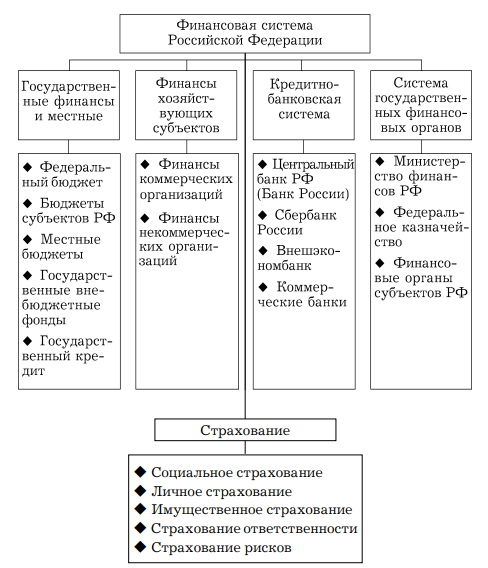

1. [Финансы](#finance)
2. [ФИНАНСОВЫЕ РЫНКИ](#financial_markets)
3. [ИНВЕСТИЦИИ](#invesments)
4. [Деньги, кредит, банки](#money_credit_banks)
5. [БАНКОВСКОЕ ДЕЛО](#banking)

# Финансы

## 1. Сущность финансов, их роль в экономике и социальной сфере.

Финансы — совокупность денег, активов и ресурсов, которые есть у государства, компаний и физических лиц.

Финансы — это все деньги и денежные ресурсы, которыми обладают государства, компании и люди. 
Они играют важную роль в экономической системе, обеспечивая потоки денежных средств и финансовые операции. 
Понимание сути финансов и их признаков помогает эффективно их использовать.

Несколько характеристик финансов:

1. Финансы — это всегда про наличие денежных средств и других активов. Например, финансами могут быть наличные деньги, 
   счета в банке, акции, недвижимость и другие ценности.
2. Финансовые ресурсы постоянно перемещаются в экономике. Когда мы получаем зарплату, совершаем покупки, платим 
   налоги или инвестируем деньги, мы участвуем в финансовых потоках.
3. Одной из основных целей управления финансами является их приумножение. Люди и организации стремятся инвестировать 
   свои деньги и активы таким образом, чтобы их становилось больше и их стоимость увеличивалась.

Финансы выполняют различные функции в экономике. Они обеспечивают финансирование проектов и бизнесов, 
управление рисками, распределение ресурсов и поддержку экономического развития.

Допустим, у вас есть накопления в банке и вы решаете инвестировать их в акции компании. 
Финансы здесь — ваши деньги и акции. Потоки денежных средств возникают, когда вы покупаете акции и получаете дивиденды. 
Если стоимость акций увеличивается, ваши финансы приумножаются.

Функции финансов
Финансы выполняют несколько важных функций, которые оказывают значительное влияние на экономическую систему 
и общество в целом.Рассмотрим основные функции финансов.

1. Распределительная функция. Финансы играют ключевую роль в распределении ресурсов в обществе. С помощью финансов 
   доходы и блага распределяются между различными субъектами экономики. Финансовые инструменты, такие как налоги, 
   социальные пособия и государственные расходы, используются для обеспечения социальной справедливости и снижения неравенства.
2. Контрольная функция. Речь идёт о механизмах аудита, финансового контроля и учёта. Эти механизмы помогают 
   выявлять финансовые несоответствия, мошенничество и неэффективное использование ресурсов. Контроль финансовых 
   процессов способствует улучшению прозрачности, ответственности и эффективности.
3. Регулирующая функция. Финансы выполняют функцию регулирования экономической системы. Государственная финансовая 
   политика и нормативные акты регулируют финансовые операции, деятельность финансовых институтов и финансовые рынки. 
   Регулирование направлено на обеспечение стабильности, защиту прав потребителей, предотвращение финансовых кризисов 
   и поддержку экономического роста.
4. Стабилизирующая функция. Финансы выполняют функцию стабилизации экономической системы и смягчения колебаний. 
   Они предоставляют механизмы для управления экономическими циклами, поддержания финансовой устойчивости и минимизации 
   рисков. Например, фискальная политика и монетарная политика используются для регулирования спроса, инфляции, 
   безработицы и других макроэкономических показателей.

Финансы в социальной сфере позволяют перераспеределять средства незащищенным слоям населения путем сбора налогов и пошлин

https://skillbox.ru/media/management/chto-takoe-finansy-i-kakie-funktsii-oni-vypolnyayut/ 

---
## 2. Финансовая система, характеристика ее сфер и звеньев.

Финансовая система — это совокупность взаимосвязанных и взаимодействующих сфер и звеньев финансовых отношений, 
посредством которых осуществляется распределение, формирование и использование фондов денежных средств.

В финансовую систему включаются финансовые учреждения страны, обслуживающие денежное обращение и регулирование 
финансовой деятельности.

Финансы являются носителями распределительных отношений, и это распределение происходит, прежде всего, между 
различными хозяйствующими субъектами. Поэтому в общей совокупности финансов, образующих финансовую систему, 
можно выделить следующие крупные сферы:
    1. государственные (федеральные финансы и финансы субъектов РФ) и местные (муниципальные) финансы;
    2. финансы организаций (хозяйствующих субъектов);
    3. страхование;
    4. кредитно-банковская система (совокупность банков и иных кредитных учреждений страны);
    5. система государственных финансовых органов.

https://be5.biz/ekonomika/f027/2.html

---
## 3. Финансовая политика государства: содержание, значение, проблемы реализации в России

Финансовая политика государства — это совокупность мероприятий и решений, направленных на управление финансами 
страны с целью достижения экономических и социальных целей. Она включает в себя формирование бюджета, 
налоговую политику, государственные расходы, долговую политику и регулирование финансовых рынков.

### Содержание финансовой политики

1. Бюджетная политика:
   - Формирование и исполнение государственного бюджета.
   - Определение структуры доходов и расходов.
   - Учет дефицита или профицита бюджета.

2. Налоговая политика:
   - Установление налоговых ставок и сборов.
   - Оптимизация налоговой системы для стимулирования экономического роста.
   - Борьба с уклонением от уплаты налогов.

3. Государственные расходы:
   - Распределение средств на социальные нужды, инфраструктуру, образование и здравоохранение.
   - Инвестиции в развитие экономики.

4. Долговая политика:
   - Управление государственным долгом.
   - Эмиссия государственных облигаций и других долговых инструментов.

5. Регулирование финансовых рынков:
   - Поддержание стабильности финансовой системы.
   - Контроль за банковской системой и другими финансовыми институтами.

### Значение финансовой политики

- Экономическая стабильность: Обеспечение устойчивого экономического роста, контроль инфляции и безработицы.
- Социальное обеспечение: Финансирование социальных программ, что способствует улучшению уровня жизни населения.
- Инвестиционный климат: Создание условий для привлечения инвестиций, как внутренних, так и иностранных.
- Развитие инфраструктуры: Инвестиции в транспорт, энергетику и другие ключевые сферы для поддержки экономического роста.

### Проблемы реализации финансовой политики в России

1. Дефицит бюджета: Часто наблюдается дефицит бюджета, что может привести к увеличению 
    государственного долга и необходимости заимствований.
2. Налоговая нагрузка: Высокая налоговая нагрузка на бизнес может сдерживать его развитие 
    и приводить к уклонению от уплаты налогов.
3. Коррупция: Проблемы с коррупцией могут негативно сказаться на эффективности расходования бюджетных средств.
4. Зависимость от сырьевых ресурсов: Экономика России сильно зависит от экспорта нефти и газа, 
    что делает ее уязвимой к колебаниям мировых цен на сырьевые товары.
5. Неравномерное распределение ресурсов: Существуют значительные различия в уровне финансирования 
    между регионами, что приводит к социальному неравенству.
6. Низкий уровень инвестиций: Недостаток инвестиций в инновационные технологии и модернизацию 
    производства ограничивает экономический рост.

### Заключение

Финансовая политика государства играет ключевую роль в управлении экономикой и социальной сферой. 
Для эффективной реализации финансовой политики в России необходимо преодолеть существующие проблемы, 
оптимизировать налоговую систему, улучшить управление государственными расходами и повысить 
прозрачность бюджетного процесса.

---
## 4. Бюджетный процесс, его участники, стадии бюджетного процесса.

Бюджетный процесс — это система мероприятий, связанных с подготовкой, рассмотрением, 
утверждением, исполнением и контролем исполнения государственного бюджета. Он охватывает все этапы 
взаимодействия между различными государственными органами и участниками в процессе формирования и 
использования бюджетных средств.

### Участники бюджетного процесса

1. Исполнительные органы власти:
   - Правительство: Разрабатывает проект бюджета и отвечает за его исполнение.
   - Министерства и ведомства: Готовят свои предложения по расходам и доходам, формируют сметы расходов.

2. Законодательные органы власти:
   - Парламент (Государственная Дума и Совет Федерации в России): Рассматривает, обсуждает и утверждает проект бюджета.

3. Контрольные органы:
   - Счетная палата: Осуществляет контроль за исполнением бюджета и проводит аудиты.
   - Другие контрольные органы: Могут включать внутренние аудиторы и антикоррупционные структуры.

4. Местные органы власти:
   - Участвуют в формировании и исполнении местных бюджетов, которые являются частью общего бюджетного процесса.

5. Граждане и общественные организации:
   - Могут участвовать в обсуждении бюджета через открытые заседания и общественные слушания.

### Стадии бюджетного процесса

1. Подготовка бюджета:
   - На этой стадии разрабатывается проект бюджета. Исполнительные органы власти собирают данные о доходах и расходах, 
     разрабатывают программы финансирования и представляют свои предложения.

2. Рассмотрение и утверждение бюджета:
   - Проект бюджета представляется в парламент, где проходит обсуждение. Депутаты могут вносить изменения и поправки. 
     После обсуждения проект бюджета голосуется и утверждается.

3. Исполнение бюджета:
   - После утверждения бюджета начинается его исполнение. Исполнительные органы власти осуществляют расходы 
     согласно утвержденным статьям бюджета, а также собирают доходы (налоги, сборы и т.д.).

4. Контроль исполнения бюджета:
   - На этой стадии осуществляется мониторинг исполнения бюджета. Контрольные органы проверяют, как исполняется 
     бюджет, соответствие фактических расходов и доходов плановым показателям.

5. Отчетность:
   - По завершении бюджетного года исполнительные органы подготавливают отчет о выполнении бюджета, который 
     включает информацию о фактических доходах и расходах. Этот отчет также проходит рассмотрение в парламенте и контрольных органах.

6. Аудит:
   - Проводится независимый аудит исполнения бюджета для оценки эффективности использования бюджетных средств и 
     выявления возможных нарушений.

### Заключение

Бюджетный процесс является важным инструментом государственного управления, обеспечивающим планирование, 
распределение и контроль за использованием финансовых ресурсов. Эффективность бюджетного процесса напрямую 
влияет на экономическое развитие страны и уровень жизни населения.

---
## 5. Значение государственных внебюджетных фондов в финансовой системе России.

Государственные внебюджетные фонды (ГВФ) играют важную роль в финансовой системе России, 
обеспечивая финансирование различных социальных программ и услуг. Они функционируют параллельно 
с федеральным и местными бюджетами и имеют свои специфические цели и задачи. Вот основные аспекты их значения:

### 1. Социальная защита населения
ГВФ, такие как Пенсионный фонд России (ПФР) и Фонд социального страхования (ФСС), обеспечивают финансирование 
социальных выплат, включая пенсии, пособия по временной нетрудоспособности, материнский капитал и другие виды 
социальной помощи. Это позволяет поддерживать уровень жизни граждан и защищать уязвимые группы населения.

### 2. Стабилизация бюджета
Внебюджетные фонды помогают снизить нагрузку на федеральный и местные бюджеты, так как они аккумулируют 
средства для финансирования социальных программ. Это позволяет более эффективно распределять бюджетные 
ресурсы и избегать дефицита бюджета.

### 3. Долгосрочное планирование
ГВФ позволяют более эффективно планировать долгосрочные расходы на социальные нужды, такие как пенсионное 
обеспечение. Это важно в условиях демографических изменений, таких как старение населения, что требует 
адаптации систем социального обеспечения.

### 4. Привлечение дополнительных ресурсов
Некоторые внебюджетные фонды могут привлекать дополнительные финансовые ресурсы через инвестиции или 
другие механизмы, что способствует увеличению общего объема финансирования социальных программ.

### 5. Контроль и прозрачность
Государственные внебюджетные фонды подлежат контролю со стороны государственных органов, что обеспечивает
определенный уровень прозрачности в использовании средств. Это важно для повышения доверия граждан к государственным институтам.

### 6. Регулирование рынка труда
Фонды социального страхования играют ключевую роль в регулировании рынка труда, обеспечивая защиту 
работников от рисков потери трудоспособности, безработицы и других социальных рисков. Это способствует 
созданию более стабильной социальной среды.

### 7. Инвестиции в развитие
Некоторые внебюджетные фонды могут направлять средства на развитие инфраструктуры и социальных программ, 
что способствует экономическому росту и улучшению качества жизни.

### Заключение
Государственные внебюджетные фонды являются важным элементом финансовой системы России, способствуя 
социальной стабильности и обеспечивая защиту граждан. Их эффективное функционирование позволяет государству 
более гибко реагировать на изменения в экономической и социальной сферах, а также улучшать 
качество предоставляемых услуг населению.

---
## 6. Финансы коммерческих организаций: содержание, принципы, особенности функционирования в разных отраслях.

Финансы коммерческих организаций представляют собой систему финансовых отношений, возникающих в 
процессе формирования, распределения и использования денежных средств в рамках бизнеса. Они играют 
ключевую роль в обеспечении устойчивости и эффективности функционирования компаний. Рассмотрим содержание, 
принципы и особенности функционирования финансов коммерческих организаций в разных отраслях.

### Содержание финансов коммерческих организаций

1. Финансовые ресурсы: Это денежные средства, которые организация использует для своей деятельности. 
    Они могут быть собственными (капитал) или привлеченными (кредиты, займы).
2. Финансовое планирование: Процесс составления бюджетов, прогнозирования доходов и расходов, а также 
    определения необходимых финансовых ресурсов для достижения целей организации.
3. Управление капиталом: Оптимизация структуры капитала, управление активами и пассивами для обеспечения 
    ликвидности и рентабельности.
4. Финансовый учет и отчетность: Система сбора, обработки и представления информации о финансовом состоянии и 
    результатах деятельности организации.
5. Инвестиционная деятельность: Привлечение и использование средств для приобретения активов, 
    направленных на получение прибыли.
6. Управление рисками: Идентификация, оценка и минимизация финансовых рисков, связанных с деятельностью организации.

### Принципы финансов коммерческих организаций

1. Принцип самофинансирования: Предполагает использование собственных средств для финансирования деятельности, 
    что снижает зависимость от внешних источников.
2. Принцип ликвидности: Обеспечение способности организации выполнять свои обязательства в срок, что 
    требует наличия достаточных денежных средств и ликвидных активов.
3. Принцип рентабельности: Стремление к максимизации прибыли при оптимизации затрат и 
    эффективном использовании ресурсов.
4. Принцип устойчивости: Обеспечение финансовой стабильности и минимизация рисков банкротства.
5. Принцип прозрачности: Обязанность предоставлять достоверную информацию о финансовом состоянии и 
    результатах деятельности для заинтересованных сторон.

### Особенности функционирования в разных отраслях

1. Промышленность:
   - Высокие капитальные затраты на оборудование и технологии.
   - Долгосрочные инвестиции с длительным сроком окупаемости.
   - Необходимость управления большими объемами производственных запасов.

2. Торговля:
   - Низкие капитальные затраты по сравнению с производством.
   - Высокая оборачиваемость капитала.
   - Важность управления товарными запасами и дебиторской задолженностью.

3. Услуги:
   - Зависимость от квалификации работников.
   - Низкие материальные затраты, но высокая доля затрат на оплату труда.
   - Финансовое планирование основано на прогнозировании спроса на услуги.

4. Строительство:
   - Долгие циклы финансирования и высокая степень риска.
   - Необходимость управления проектами и контролем затрат.
   - Зависимость от внешних факторов (экономическая ситуация, законодательство).

5. IT-сектор:
   - Высокие затраты на исследования и разработки.
   - Быстрая смена технологий и необходимость постоянных инвестиций.
   - Возможности для масштабируемости бизнеса с минимальными затратами.

### Заключение

Финансы коммерческих организаций являются важным инструментом для достижения их стратегических целей. 
Понимание принципов и особенностей функционирования финансов в различных отраслях позволяет организациям 
эффективно управлять своими ресурсами, минимизировать риски и обеспечивать устойчивый рост.

---
## 7. Финансы некоммерческих организаций: содержание, принципы, особенности функционирования.

Финансы некоммерческих организаций (НКО) представляют собой систему финансовых отношений, возникающих 
в процессе формирования, распределения и использования денежных средств для достижения социальных, культурных, 
образовательных и других некоммерческих целей. НКО играют важную роль в обществе, осуществляя различные 
программы и проекты, направленные на решение социальных проблем. Рассмотрим содержание, принципы и 
особенности функционирования финансов некоммерческих организаций.

### Содержание финансов некоммерческих организаций

1. Финансовые ресурсы: НКО формируют свои финансовые ресурсы из различных источников, включая:
   - Пожертвования физических и юридических лиц.
   - Гранты от государственных и международных фондов.
   - Доходы от платных услуг и мероприятий.
   - Членские взносы.

2. Бюджетирование: Процесс планирования финансовых ресурсов для реализации программ и проектов. 
    Бюджет НКО включает статьи доходов и расходов, а также прогнозирование финансовых потоков.
3. Учет и отчетность: Ведение учета финансовых операций и составление отчетов о деятельности организации. 
    НКО обязаны предоставлять прозрачные и достоверные финансовые отчеты своим донорам, членам и контролирующим органам.
4. Управление финансами: Включает в себя планирование, контроль и анализ финансовых ресурсов для 
    обеспечения эффективного выполнения миссии организации.
5. Финансовая устойчивость: Обеспечение стабильности и способности НКО выполнять свои обязательства и 
    достигать целей в долгосрочной перспективе.

### Принципы финансов некоммерческих организаций

1. Принцип целевого использования средств: Финансовые ресурсы должны использоваться строго в соответствии с 
    целями и задачами, установленными уставом организации и условиями финансирования.
2. Принцип прозрачности: НКО обязаны предоставлять открытые и доступные отчеты о своих финансах, чтобы обеспечить
    доверие со стороны доноров, членов и общества.
3. Принцип ответственности: Руководство НКО несет ответственность за управление финансами, включая соблюдение 
    законодательства и этических норм.
4. Принцип устойчивости: НКО должны стремиться к финансовой устойчивости, минимизируя зависимость от одного 
    источника финансирования и diversifying свои доходы.
5. Принцип вовлеченности: Участие членов организации и заинтересованных сторон в процессе принятия финансовых 
    решений способствует более эффективному управлению ресурсами.

### Особенности функционирования в некоммерческом секторе

1. Отсутствие прибыли: Основная цель НКО — не получение прибыли, а достижение социальных, культурных или 
    образовательных целей. Это определяет подход к финансированию и распределению ресурсов.
2. Зависимость от внешних источников финансирования: НКО часто зависят от пожертвований, грантов и субсидий, 
    что делает их уязвимыми к изменениям в экономической ситуации и политике финансирования.
3. Социальная ответственность: НКО должны учитывать интересы общества и действовать в его интересах, что 
    требует высокой степени прозрачности и отчетности.
4. Гибкость в управлении: НКО могут быстро адаптироваться к изменениям в потребностях общества, однако это 
    требует эффективного управления финансами и ресурсами.
5. Международное сотрудничество: Многие НКО работают на международном уровне, что требует знания 
    законодательства разных стран и умения привлекать финансирование из различных источников.

### Заключение

Финансы некоммерческих организаций играют ключевую роль в обеспечении их устойчивости и эффективности в
 достижении поставленных целей. Понимание принципов и особенностей функционирования финансов НКО 
 позволяет им более эффективно управлять своими ресурсами, привлекать финансирование и реализовывать 
 социально значимые проекты.

---
## 8. Финансовый механизм государственных и муниципальных учреждений.

Финансовый механизм государственных и муниципальных учреждений представляет собой систему финансовых 
отношений, обеспечивающих функционирование и развитие этих учреждений в рамках государственной политики. 
Он включает в себя формирование, распределение и использование финансовых ресурсов для достижения целей, 
установленных законодательством и стратегическими планами. Рассмотрим основные компоненты и 
принципы этого механизма.

### Основные компоненты финансового механизма

1. Бюджетное финансирование:
   - Государственный и муниципальный бюджеты: Основным источником финансирования государственных и муниципальных 
       учреждений являются бюджеты различных уровней (федеральный, региональный, местный). Бюджет формируется на 
       основе прогнозирования доходов и расходов, а также определения приоритетов государственной политики.
   - Субсидии и дотации: Государственные и муниципальные учреждения могут получать субсидии и дотации для 
       реализации конкретных программ или проектов.

2. Финансовое планирование:
   - Бюджетное планирование: Установление бюджетов на предстоящий период с учетом потребностей учреждений 
       и доступных финансовых ресурсов.
   - Прогнозирование доходов и расходов: Оценка будущих финансовых потоков для обеспечения 
       устойчивого функционирования учреждений.

3. Учет и отчетность:
   - Бухгалтерский учет: Ведение учета всех финансовых операций, включая доходы, расходы и обязательства.
   - Финансовая отчетность: Подготовка отчетов о выполнении бюджета, использовании средств и финансовом 
       состоянии учреждения. Отчеты подаются в контролирующие органы и публикуются для общественности.

4. Контроль и аудит:
   - Внутренний контроль: Система мероприятий, направленных на обеспечение законности и целесообразности 
       использования бюджетных средств.
   - Внешний аудит: Проведение независимой проверки финансовой отчетности и деятельности учреждения 
       со стороны контролирующих органов.

5. Финансовые отношения с другими субъектами:
   - Государственные закупки: Процедуры приобретения товаров, работ и услуг для нужд учреждения, 
       регулируемые законодательством о государственных закупках.
   - Партнерство с частным сектором: Взаимодействие с частными компаниями для реализации совместных 
       проектов или предоставления услуг.

### Принципы функционирования финансового механизма

1. Принцип законности: Все финансовые операции должны соответствовать законодательству, включая бюджетный 
    кодекс и другие нормативные акты.
2. Принцип целевого использования средств: Бюджетные средства должны использоваться строго по назначению, 
    в соответствии с утвержденными программами и проектами.
3. Принцип прозрачности: Финансовая деятельность государственных и муниципальных учреждений должна быть 
    открытой для общественности, что способствует повышению доверия граждан.
4. Принцип ответственности: Руководители учреждений несут ответственность за правильное использование 
    бюджетных средств и выполнение поставленных задач.
5. Принцип эффективности: Финансовые ресурсы должны использоваться рационально и эффективно для 
    достижения максимальных результатов при минимальных затратах.

### Особенности функционирования

1. Зависимость от бюджетного финансирования: Государственные и муниципальные учреждения в значительной 
    степени зависят от бюджетных средств, что может ограничивать их гибкость в управлении финансами.
2. Социальная направленность: Основная задача государственных и муниципальных учреждений — удовлетворение 
    социальных потребностей населения, что требует особого подхода к планированию и использованию финансов.
3. Регулирование со стороны государства: Финансовая деятельность государственных и муниципальных 
    учреждений находится под строгим контролем со стороны государственных органов, что обеспечивает соблюдение 
    законности и целевого использования средств.
4. Инновации и развитие: В условиях изменения экономической ситуации государственные и муниципальные 
    учреждения должны адаптироваться к новым вызовам, внедряя инновационные подходы в управлении финансами.

### Заключение

Финансовый механизм государственных и муниципальных учреждений играет ключевую роль в 
обеспечении их устойчивости и эффективности. Понимание его компонентов, принципов и 
особенностей позволяет более эффективно управлять ресурсами, реализовывать социально 
значимые проекты и достигать поставленных целей в рамках государственной политики.

---
## 9. Функции корпоративных финансов и основные принципы их организации.

Корпоративные финансы - это область экономики, которая занимается управлением финансами компаний. 
Основные функции корпоративных финансов включают:

1. Управление капиталом: Корпоративные финансы занимаются привлечением капитала для финансирования 
    деятельности компании. Это может включать выпуск акций, облигаций, получение кредитов от банков
    или других финансовых институтов.
2. Инвестирование: Корпоративные финансы также занимаются выбором инвестиционных проектов, которые 
    могут принести наибольшую прибыль для компании. Они анализируют потенциальную доходность инвестиций, 
    риски и возможные альтернативы.
3. Финансовое планирование: Корпоративные финансы разрабатывают планы для управления денежными 
    потоками компании. Это включает в себя прогнозирование будущих доходов и расходов, а также 
    определение потребности в финансировании.
4. Управление рисками: Корпоративные финансы помогают компаниям управлять рисками, связанными с их 
    деятельностью. Это может включать страхование, хеджирование рисков и другие методы снижения рисков.

Основные принципы организации корпоративных финансов включают:

1. Эффективность: Компании должны стремиться к максимальной эффективности использования своих ресурсов. 
    Это означает, что они должны выбирать проекты, которые приносят наибольшую прибыль при минимальных затратах.
2. Рациональность: Компании должны принимать рациональные решения, основанные на анализе данных и 
    информации. Это включает в себя анализ рынка, конкурентов и внутренних факторов компании.
3. Прозрачность: Компании должны предоставлять прозрачную информацию о своей финансовой деятельности. 
    Это помогает инвесторам и другим заинтересованным сторонам оценить финансовое состояние компании и 
    принять обоснованные решения.
4. Ответственность: Компании должны соблюдать законодательство и этические нормы при управлении своими финансами. 
    Это включает в себя соблюдение налоговых обязательств, защиту прав акционеров и других заинтересованных сторон.

---
## 10. Содержание, назначение, состав государственных и муниципальных финансов. Формы организации государственных и муниципальных финансов.

Государственные и муниципальные финансы представляют собой важные элементы финансовой системы страны, 
обеспечивающие функционирование государственных и местных органов власти, а также реализацию социальных 
и экономических программ. Рассмотрим их содержание, назначение, состав и формы организации.

### Содержание государственных и муниципальных финансов

1. Государственные финансы:
   - Это совокупность финансовых ресурсов, которые формируются в результате деятельности государственных 
       органов на различных уровнях (федеральном, региональном, местном) и используются для 
       выполнения функций государства.
   - Включают в себя бюджетные средства, налоги, сборы, государственные заимствования и другие 
       источники финансирования.
2. Муниципальные финансы:
   - Это часть финансовой системы, которая относится к финансам местных органов власти и используется для 
       удовлетворения потребностей населения на уровне муниципалитетов.
   - Включают в себя местные бюджеты, доходы от местных налогов и сборов, а также дотации из вышестоящих бюджетов.

### Назначение государственных и муниципальных финансов

1. Обеспечение функций государства:
   - Финансовые ресурсы используются для финансирования государственных программ, обеспечения национальной 
        безопасности, здравоохранения, образования, социального обеспечения и других сфер.
2. Регулирование экономических процессов:
   - Через бюджетную политику государственные и муниципальные финансы влияют на экономическую стабильность, 
        уровень занятости и развитие инфраструктуры.
3. Социальная поддержка населения:
   - Финансирование социальных программ и услуг, направленных на улучшение качества жизни граждан, 
        включая помощь малоимущим, пенсионерам и другим уязвимым группам.

### Состав государственных и муниципальных финансов

1. Бюджетные средства:
   - Основной элемент, включающий доходы и расходы бюджета на различных уровнях. Бюджеты формируются 
        на основе прогнозирования доходов и определения приоритетов расходов.
2. Налоги и сборы:
   - Основные источники доходов для государственного и муниципального бюджетов. Налоги могут быть 
        прямыми (например, подоходный налог) и косвенными (например, налог на добавленную стоимость).
3. Государственные заимствования:
   - Заемные средства (облигации, кредиты), которые могут использоваться для финансирования дефицита 
        бюджета или реализации крупных инвестиционных проектов.
4. Субсидии и дотации:
   - Финансовая поддержка со стороны государства или регионов для финансирования конкретных 
        программ или помощи местным бюджетам.
5. Доходы от собственности:
   - Средства, получаемые от использования государственной и муниципальной собственности (аренда, продажа активов).

### Формы организации государственных и муниципальных финансов

1. Бюджетная система:
   - Структурированная система формирования, распределения и использования бюджетных средств на 
        разных уровнях власти (федеральный, региональный, местный). Включает в себя бюджетный процесс, 
        бюджетное планирование и исполнение бюджета.
2. Казначейская система:
   - Организация управления государственными финансами через казначейства, которые осуществляют 
        контроль за поступлениями и расходами бюджетных средств.
3. Финансовые учреждения:
   - Государственные банки и другие финансовые организации, которые могут участвовать в 
        кредитовании проектов и программ, а также в управлении государственными активами.
4. Государственные программы и проекты:
   - Реализация конкретных программ через целевое финансирование из бюджета с использованием 
        различных форм организации (государственно-частное партнерство, гранты и субсидии).
5. Контрольные органы:
   - Институты внешнего контроля (например, Счетная палата), которые осуществляют аудит и контроль 
        за использованием государственных и муниципальных финансов.

### Заключение

Государственные и муниципальные финансы являются основой для реализации государственной политики 
и обеспечения социально-экономического развития общества. Понимание их содержания, назначения, 
состава иформ организации позволяет более эффективно управлять финансовыми ресурсами на всех уровнях власти.

---
## 11. Бюджетная система Российской Федерации, ее структура, принципы, правовые основы построения и функционирования.

Бюджетная система Российской Федерации представляет собой совокупность бюджетов различных уровней 
власти, а также бюджетных отношений, регулирующих процесс формирования, исполнения и контроля за 
исполнением бюджетов. Она играет ключевую роль в финансовом обеспечении государственной политики и 
социально-экономического развития страны.

### Структура бюджетной системы Российской Федерации

Бюджетная система РФ включает в себя следующие уровни:

1. Федеральный бюджет:
   - Бюджет, который формируется на уровне федерального правительства и используется для финансирования 
        задач, относящихся к полномочиям федеральных органов власти.
2. Региональные бюджеты:
   - Бюджеты субъектов Российской Федерации (республик, краев, областей, городов федерального 
        значения и автономных округов). Они финансируют расходы, связанные с полномочиями региональных властей.
3. Местные бюджеты:
   - Бюджеты муниципальных образований (городских и сельских поселений), которые обеспечивают 
        финансирование местных нужд и услуг.

### Принципы бюджетной системы

Бюджетная система Российской Федерации основывается на следующих принципах:

1. Принцип единства:
   - Бюджетная система должна быть единой и целостной, что обеспечивает согласованность и 
        взаимосвязь всех уровней бюджетов.
2. Принцип полноты:
   - Все доходы и расходы должны быть отражены в бюджетах, что позволяет обеспечить 
        прозрачность и учет всех финансовых потоков.
3. Принцип сбалансированности:
   - Бюджеты должны быть сбалансированными, то есть расходы не должны превышать доходы 
        (за исключением случаев, когда предусмотрены заимствования).
4. Принцип открытости и доступности:
   - Информация о бюджетах должна быть доступна для граждан, что способствует общественному 
        контролю и повышает ответственность властей.
5. Принцип целевого использования средств:
   - Бюджетные средства должны использоваться строго по назначению, согласно установленным целям и задачам.
6. Принцип ответственности:
   - Ответственность за формирование и исполнение бюджета несут соответствующие органы власти.

### Правовые основы построения и функционирования бюджетной системы

Правовые основы бюджетной системы Российской Федерации определяются рядом нормативных актов:

1. Бюджетный кодекс Российской Федерации:
   - Основной закон, регулирующий бюджетные отношения в стране. Он устанавливает правила формирования, 
        исполнения и контроля за исполнением бюджета на всех уровнях.
2. Федеральные законы:
   - Законы о федеральном бюджете, законы о бюджетах субъектов федерации и местных бюджетах. Эти законы 
        принимаются ежегодно и определяют основные параметры бюджета на соответствующий год.
3. Указы Президента и постановления Правительства:
   - Нормативные акты, регулирующие отдельные аспекты бюджетной политики и управления финансами.
4. Местные нормативные акты:
   - Регламенты и решения органов местного самоуправления, касающиеся местных бюджетов.

### Заключение

Бюджетная система Российской Федерации является важным инструментом финансового управления, 
обеспечивающим реализацию государственной политики и социально-экономического развития страны. 
Ее структура, принципы и правовые основы способствуют эффективному распределению ресурсов и 
обеспечению прозрачности в использовании бюджетных средств.

---
## 12. Федеральный бюджет, его назначение. Доходы, расходы, источники финансирования дефицита федерального бюджета.

Федеральный бюджет Российской Федерации — это основной финансовый документ, который формируется на 
уровне федерального правительства и предназначен для обеспечения выполнения государственных функций 
и реализации государственной политики. Он отражает доходы и расходы, которые необходимы для 
финансирования различных программ и мероприятий на федеральном уровне.

### Назначение федерального бюджета

1. Финансирование государственных программ: Обеспечение средств для реализации федеральных программ в 
    сферах здравоохранения, образования, обороны, безопасности и социальной политики.
2. Регулирование экономики: Использование бюджетных средств для стимулирования экономического роста, 
    поддержания занятости и управления инфляцией.
3. Социальные выплаты: Обеспечение финансирования социальных гарантий, таких как пенсии, пособия и субсидии.
4. Поддержка регионов: Перераспределение финансовых ресурсов между регионами для устранения диспропорций в развитии.
5. Государственный долг: Обслуживание и погашение государственного долга.

### Доходы федерального бюджета

Доходы федерального бюджета формируются из различных источников, включая:

1. Налоговые доходы:
   - Налог на добавленную стоимость (НДС)
   - Налог на прибыль организаций
   - Акцизы
   - Налог на доходы физических лиц (НДФЛ)
   - Налог на имущество

2. Неналоговые доходы:
   - Поступления от государственной собственности (аренда, продажа)
   - Штрафы и санкции
   - Доходы от услуг, предоставляемых государственными органами

3. Безвозмездные поступления:
   - Дотации и субсидии от иностранных государств или международных организаций.

### Расходы федерального бюджета

Расходы федерального бюджета делятся на несколько категорий:

1. Общие расходы:
   - Заработная плата работников государственных учреждений.
   - Расходы на содержание федеральных органов власти.

2. Социальные расходы:
   - Платежи по пенсиям и пособиям.
   - Финансирование программ здравоохранения, образования и социальной защиты.

3. Экономические расходы:
   - Инвестиции в инфраструктуру (транспорт, энергетика).
   - Поддержка отраслей экономики (сельское хозяйство, промышленность).

4. Оборонные расходы:
   - Финансирование вооруженных сил и обеспечения национальной безопасности.

5. Расходы на обслуживание государственного долга:
   - Выплата процентов по займам и погашение долговых обязательств.

### Источники финансирования дефицита федерального бюджета

Если расходы превышают доходы, возникает дефицит бюджета. Для его финансирования могут 
использоваться следующие источники:

1. Займы на внутреннем рынке:
   - Выпуск государственных облигаций (ГКО, ОФЗ), которые покупаются инвесторами 
        (банками, компаниями, частными лицами).
2. Займы на внешнем рынке:
   - Заимствования у иностранных государств или международных финансовых организаций.
3. Использование резервов:
   - Привлечение средств из фондов (например, Резервный фонд или Фонд национального благосостояния), 
        если такие существуют.
4. Сокращение расходов:
   - Оптимизация бюджетных расходов путем пересмотра статей бюджета.
5. Увеличение налоговых поступлений:
   - Повышение налогов или улучшение сборов налогов.

### Заключение

Федеральный бюджет является ключевым инструментом финансового управления в стране, 
обеспечивая выполнение государственных функций и реализацию социальных программ. Эффективное 
управление доходами и расходами бюджета имеет важное значение для стабильности экономики и 
благосостояния граждан.

---
## 13. Бюджеты субъектов Российской Федерации, их назначение. Доходы, расходы, источники финансирования дефицита бюджетов субъектов Российской Федерации.

Бюджеты субъектов Российской Федерации — это финансовые планы, которые разрабатываются и 
исполняются на уровне регионов (областей, республик, краёв, городов федерального значения 
и автономных округов). Они играют важную роль в обеспечении финансовой самостоятельности 
регионов и реализации государственной политики на местах.

### Назначение бюджетов субъектов Российской Федерации

1. Финансирование местных нужд: Обеспечение финансирования социальных, экономических и культурных программ, 
    необходимых для улучшения качества жизни населения.
2. Реализация региональной политики: Поддержка инициатив и программ, направленных на развитие конкретного 
    региона, включая инфраструктуру, образование и здравоохранение.
3. Стимулирование экономического развития: Использование бюджетных средств для привлечения 
    инвестиций и создания новых рабочих мест.
4. Социальная поддержка населения: Обеспечение выплат пособий, субсидий и других социальных гарантий для граждан.
5. Управление ресурсами: Эффективное распределение финансовых ресурсов для достижения целей развития региона.

### Доходы бюджетов субъектов Российской Федерации

Доходы бюджетов субъектов формируются из различных источников:

1. Налоговые доходы:
   - Налог на доходы физических лиц (НДФЛ)
   - Налог на имущество организаций
   - Акцизы на определенные товары (например, алкоголь, табак)
   - Региональные налоги (например, транспортный налог)

2. Неналоговые доходы:
   - Поступления от аренды и продажи государственного имущества
   - Штрафы и пени
   - Доходы от оказания государственных услуг

3. Безвозмездные поступления:
   - Дотации и субсидии из федерального бюджета
   - Поступления из других бюджетов (например, местных).

### Расходы бюджетов субъектов Российской Федерации

Расходы бюджетов субъектов могут быть разделены на несколько категорий:

1. Социальные расходы:
   - Образование (финансирование школ, вузов)
   - Здравоохранение (больницы, поликлиники)
   - Социальная защита (пенсии, пособия)
2. Экономические расходы:
   - Инвестиции в инфраструктуру (дороги, мосты)
   - Поддержка местного производства и предпринимательства
3. Административные расходы:
   - Заработная плата работников государственных учреждений
   - Расходы на содержание органов власти
4. Капитальные расходы:
   - Строительство и реконструкция объектов государственной собственности
5. Расходы на обслуживание государственного долга:
   - Выплата процентов по займам и погашение долговых обязательств.

### Источники финансирования дефицита бюджетов субъектов Российской Федерации

Если расходы превышают доходы, возникает дефицит бюджета. 
Для его финансирования могут использоваться следующие источники:

1. Займы на внутреннем рынке:
   - Выпуск облигаций субъекта Российской Федерации, которые могут быть приобретены инвесторами.
2. Займы на внешнем рынке:
   - Заимствования у банков или международных организаций.
3. Перераспределение средств:
   - Оптимизация расходов за счет пересмотра статей бюджета.
4. Использование резервных фондов:
   - Привлечение средств из фондов, созданных для покрытия дефицита.
5. Увеличение налоговых поступлений:
   - Повышение налоговых ставок или улучшение сборов налогов.

### Заключение

Бюджеты субъектов Российской Федерации являются важным инструментом для обеспечения 
финансовой устойчивости и развития регионов. Эффективное управление доходами и расходами 
на уровне субъектов позволяет реализовывать социальные программы, развивать экономику и 
повышать качество жизни населения.

---
## 14. Местные бюджеты, их назначение. Доходы, расходы, источники финансирования дефицита местных бюджетов.

Местные бюджеты представляют собой финансовые планы, которые разрабатываются и исполняются на уровне 
муниципальных образований (городов, районов, поселков и т.д.). Они играют ключевую роль в обеспечении 
финансирования местных нужд и реализации социальной, экономической и инфраструктурной политики на местах.

### Назначение местных бюджетов

1. Финансирование местных нужд: Обеспечение финансирования социальных, культурных и инфраструктурных 
    программ, необходимых для улучшения качества жизни населения.
2. Развитие инфраструктуры: Поддержка проектов по строительству и ремонту дорог, мостов, общественных 
    зданий, освещения и других объектов.
3. Социальная поддержка населения: Обеспечение финансирования социальных программ, включая образование, 
    здравоохранение, жилищные субсидии и помощь нуждающимся.
4. Стимулирование местной экономики: Поддержка местного бизнеса, создание новых рабочих мест и привлечение инвестиций.
5. Управление ресурсами: Эффективное распределение финансовых ресурсов для достижения целей развития муниципалитета.

### Доходы местных бюджетов

Доходы местных бюджетов формируются из различных источников:

1. Налоговые доходы:
   - Налог на доходы физических лиц (НДФЛ), который часто делится между федеральным, региональным и местным уровнями.
   - Местные налоги (например, земельный налог, налог на имущество физических лиц).
   - Акцизы на определенные товары (в некоторых случаях).

2. Неналоговые доходы:
   - Поступления от аренды и продажи муниципального имущества.
   - Штрафы и пени за нарушение местных норм и правил.
   - Доходы от оказания муниципальных услуг (например, услуги ЖКХ).

3. Безвозмездные поступления:
   - Дотации и субсидии из регионального и федерального бюджетов.
   - Поступления от других муниципальных образований.

### Расходы местных бюджетов

Расходы местных бюджетов могут быть разделены на несколько категорий:

1. Социальные расходы:
   - Финансирование образования (школы, детские сады).
   - Здравоохранение (больницы, поликлиники).
   - Социальная защита (пособия, помощь малоимущим).

2. Экономические расходы:
   - Поддержка местного производства и предпринимательства.
   - Инвестиции в развитие инфраструктуры (дороги, транспорт).

3. Административные расходы:
   - Заработная плата работников местных органов власти.
   - Расходы на содержание муниципальных учреждений.

4. Капитальные расходы:
   - Строительство и реконструкция объектов муниципальной собственности.

5. Расходы на обслуживание государственного долга:
   - Выплата процентов по займам и погашение долговых обязательств.

### Источники финансирования дефицита местных бюджетов

Если расходы превышают доходы, возникает дефицит бюджета. Для его финансирования могут использоваться следующие источники:

1. Займы на внутреннем рынке:
   - Выпуск облигаций муниципалитета или заимствования у банков.
2. Займы на внешнем рынке:
   - Заимствования у международных организаций или иностранных банков.
3. Перераспределение средств:
   - Оптимизация расходов за счет пересмотра статей бюджета или сокращения несущественных затрат.
4. Использование резервных фондов:
   - Привлечение средств из созданных резервов для покрытия временного дефицита.
5. Увеличение налоговых поступлений:
   - Повышение налоговых ставок или улучшение сборов налогов через более эффективное администрирование.

### Заключение

Местные бюджеты являются важным инструментом для обеспечения финансовой устойчивости и 
развития муниципальных образований. Эффективное управление доходами и расходами на уровне 
местного самоуправления позволяет реализовывать социальные программы, развивать экономику 
и повышать качество жизни населения.

---
## 15. Содержание, формы и виды государственных и муниципальных заимствований.

Государственные и муниципальные заимствования представляют собой механизм, с помощью которого 
государственные и местные органы власти привлекают финансовые ресурсы для финансирования своих
расходов. Заимствования могут быть как внутренними, так и внешними, и имеют различные формы и виды. 
Рассмотрим их подробнее.

### Содержание государственных и муниципальных заимствований

Государственные и муниципальные заимствования включают в себя:

1. Привлечение финансовых ресурсов: Заимствования позволяют государству и муниципалитетам получать 
    средства для финансирования дефицита бюджета, реализации инвестиционных проектов и 
    выполнения социальных обязательств.

2. Обязанности по возврату: Заимствования подразумевают обязательства по возврату полученных 
    средств в установленный срок, а также выплату процентов (или других вознаграждений) за 
    использование этих средств.

3. Регулирование долговой политики: Заимствования являются частью долговой политики государства 
    или муниципального образования и должны соответствовать установленным лимитам и правилам.

### Формы государственных и муниципальных заимствований

1. Облигации:
   - Государственные облигации: Выпускаются федеральным правительством для привлечения средств 
        на финансирование бюджетных расходов.
   - Муниципальные облигации: Выпускаются местными органами власти для финансирования 
        проектов на уровне муниципалитета.

2. Кредиты:
   - Банковские кредиты: Заемные средства, полученные от коммерческих банков или других финансовых учреждений.
   - Международные кредиты: Заемные средства, полученные от международных финансовых организаций 
        (например, Всемирного банка, Международного валютного фонда).

3. Займы:
   - Внутренние займы: Привлечение средств на внутреннем рынке через размещение долговых обязательств или прямые займы.
   - Внешние займы: Привлечение средств на международном рынке капитала.

4. Лизинг: Финансирование приобретения оборудования или недвижимости через лизинговые компании с последующим выкупом.

5. Государственные гарантии: Обеспечение обязательств третьих лиц (например, частных компаний) 
    по займам или кредитам, что позволяет привлечь дополнительные средства.

### Виды государственных и муниципальных заимствований

1. По срокам заимствования:
   - Краткосрочные заимствования: Обычно на срок до одного года.
   - Среднесрочные заимствования: На срок от одного до пяти лет.
   - Долгосрочные заимствования: На срок более пяти лет.

2. По источникам привлечения:
   - Внутренние заимствования: Средства, привлеченные из внутренних источников (внутренний рынок).
   - Внешние заимствования: Средства, привлеченные из внешних источников (международные рынки).

3. По целям использования:
   - Инвестиционные заимствования: Используются для финансирования капитальных вложений в инфраструктуру, проекты развития и т.д.
   - Текущие заимствования: Используются для покрытия текущих расходов бюджета, таких как зарплаты, социальные пособия и др.

4. По способу размещения:
   - Публичные размещения: Облигации или займы, предлагаемые широкой публике.
   - Приватные размещения: Облигации или займы, предлагаемые ограниченному кругу инвесторов.

---
## 16. Государственный и муниципальный долг: понятие, структура. Организация управления государственным и муниципальным долгом в Российской Федерации.

### Понятие государственного и муниципального долга

Государственный долг — это сумма обязательств государства по займам, которые оно взяло для 
финансирования своих расходов. Он включает в себя как внутренние, так и внешние заимствования, 
а также долговые обязательства перед кредиторами.

Муниципальный долг — это сумма обязательств местных органов власти по займам, которые они взяли 
для финансирования своих расходов и реализации проектов на уровне муниципалитета. Как и в случае 
с государственным долгом, он может быть внутренним или внешним.

### Структура государственного и муниципального долга

1. По видам обязательств:
   - Облигации: Долговые ценные бумаги, выпущенные государством или муниципалитетами.
   - Кредиты: Заемные средства от банков и других финансовых учреждений.
   - Займы: Средства, полученные от международных организаций или других государств.

2. По срокам заимствования:
   - Краткосрочный долг: Обязательства, которые должны быть погашены в течение одного года.
   - Среднесрочный долг: Обязательства со сроком погашения от одного до пяти лет.
   - Долгосрочный долг: Обязательства со сроком погашения более пяти лет.

3. По источникам финансирования:
   - Внутренний долг: Заимствования, привлеченные на внутреннем рынке.
   - Внешний долг: Заимствования, привлеченные на международных рынках.

4. По целям использования:
   - Инвестиционный долг: Средства, привлеченные для финансирования капитальных вложений и инфраструктурных проектов.
   - Текущий долг: Средства, используемые для покрытия текущих расходов бюджета.

### Организация управления государственным и муниципальным долгом в Российской Федерации

Управление государственным и муниципальным долгом в России осуществляется на нескольких уровнях и включает в себя следующие аспекты:

1. Федеральный уровень:
   - Министерство финансов Российской Федерации отвечает за управление государственным долгом. Оно разрабатывает 
        стратегию долговой политики, осуществляет эмиссию государственных облигаций и контролирует 
        выполнение бюджетных обязательств.
   - Управление государственной задолженностью включает в себя мониторинг состояния долга, 
        управление рисками и планирование новых заимствований.

2. Региональный уровень:
   - Органы исполнительной власти субъектов Российской Федерации управляют региональным долгом. 
        Они разрабатывают свои стратегии долговой политики, контролируют выполнение бюджетов 
        и обеспечивают прозрачность заимствований.
   - Муниципальные образования также имеют свои финансовые органы, которые отвечают за управление местным долгом.

3. Законодательное регулирование:
   - Управление долгом регулируется различными законодательными актами, включая Бюджетный кодекс Российской Федерации, 
        который устанавливает правила заимствований, ограничения по размеру долга и требования к отчетности.

4. Мониторинг и отчетность:
   - Ведется постоянный мониторинг состояния государственного и муниципального долга с целью оценки его 
        устойчивости и рисков. Регулярная отчетность перед правительством и обществом способствует повышению прозрачности в управлении долгом.

5. Финансовые инструменты:
   - Используются различные финансовые инструменты для управления долгом, включая реструктуризацию долга, 
        выпуск новых облигаций для погашения старых обязательств (рефинансирование) и применение 
        механизмов хеджирования рисков.

### Заключение

Государственный и муниципальный долг являются важными инструментами финансовой политики, позволяющими 
финансировать необходимые расходы и проекты. Эффективное управление этими долгами требует комплексного 
подхода, включающего планирование, мониторинг и контроль за состоянием долговых обязательств на всех 
уровнях власти.

---
## 17. Пенсионный фонд Российской Федерации, его назначение. Доходы и расходы Пенсионного фонда Российской Федерации.

### Пенсионный фонд Российской Федерации: назначение, доходы и расходы

Пенсионный фонд Российской Федерации (ПФР) — это государственный внебюджетный фонд, который 
осуществляет пенсионное обеспечение граждан, а также финансирует и контролирует систему обязательного 
пенсионного страхования в России. ПФР играет ключевую роль в обеспечении социальной защиты 
населения, особенно пожилых людей.

#### Назначение Пенсионного фонда

1. Обеспечение пенсионных выплат:
   - ПФР отвечает за выплату пенсий по старости, инвалидности и в случае потери кормильца.
   - Он также управляет средствами, накопленными в рамках системы обязательного пенсионного страхования.
2. Контроль за пенсионной системой:
   - Фонд осуществляет контроль за деятельностью негосударственных пенсионных фондов (НПФ) и других 
        участников пенсионной системы.
3. Сбор взносов на пенсионное страхование:
   - ПФР собирает страховые взносы от работодателей и работников, которые направляются на финансирование пенсий.
4. Информирование граждан:
   - ПФР предоставляет информацию гражданам о состоянии их пенсионных накоплений, условиях выхода на пенсию 
        и других аспектах пенсионного обеспечения.

#### Доходы Пенсионного фонда

Основные источники доходов Пенсионного фонда включают:

1. Страховые взносы:
   - Основная часть доходов формируется за счет обязательных страховых взносов, которые уплачиваются 
        работодателями и индивидуальными предпринимателями. Взносы составляют определенный процент 
        от заработной платы работников.
2. Инвестиционные доходы:
   - ПФР инвестирует временно свободные средства в различные финансовые инструменты, такие как 
        государственные облигации, корпоративные ценные бумаги и другие активы. Инвестиционные 
        доходы также составляют значительную часть доходов фонда.
3. Государственное финансирование:
   - В случае дефицита бюджета ПФР может получать дополнительные средства из федерального бюджета для обеспечения выплат.
4. Прочие доходы:
   - Это могут быть доходы от штрафов, пени и других неналоговых поступлений.

#### Расходы Пенсионного фонда

Основные статьи расходов Пенсионного фонда включают:

1. Выплата пенсий:
   - Основная часть расходов направляется на выплату пенсий по старости, инвалидности и в случае потери кормильца.
2. Социальные выплаты:
   - ПФР также финансирует различные социальные программы, такие как выплаты по уходу за инвалидами и детьми-инвалидами.
3. Административные расходы:
   - Средства расходуются на содержание аппарата управления, включая зарплаты сотрудников, 
        аренду офисов и другие административные расходы.
4. Расходы на информационные технологии:
   - Вложения в развитие информационных систем и технологий для повышения эффективности работы фонда.
5. Программы по повышению финансовой грамотности:
   - Расходы на информирование граждан о пенсионной системе и повышении их финансовой грамотности.

### Заключение

Пенсионный фонд Российской Федерации играет важную роль в обеспечении социальной защиты граждан и 
функционировании пенсионной системы страны. Эффективное управление доходами и расходами фонда 
имеет ключевое значение для обеспечения устойчивости пенсионной системы и выполнения 
обязательств перед пенсионерами.

---
## 18. Фонд социального страхования Российской Федерации, его назначение. Доходы и расходы Фонда социального страхования Российской Федерации.

### Фонд социального страхования Российской Федерации (ФСС РФ)

Фонд социального страхования Российской Федерации (ФСС РФ) — это государственный внебюджетный фонд, 
который обеспечивает социальную защиту граждан, предоставляя различные виды социальных выплат и услуг. 
ФСС играет важную роль в системе социального страхования, обеспечивая защиту граждан в случае временной 
нетрудоспособности, материнства и других социальных рисков.

#### Назначение Фонда социального страхования

1. Обеспечение выплат по временной нетрудоспособности:
   - ФСС выплачивает пособия по временной нетрудоспособности работникам, которые не могут 
        выполнять свои обязанности по состоянию здоровья.
2. Поддержка семей с детьми:
   - Фонд предоставляет выплаты по беременности и родам, а также пособия на детей, включая единовременные и ежемесячные выплаты.
3. Социальная защита инвалидов и пенсионеров:
   - ФСС финансирует различные программы и пособия для инвалидов и граждан, находящихся на пенсии.
4. Профилактика травматизма и заболеваний:
   - Фонд реализует программы по охране труда и профилактике производственных травм, а также 
        проводит мероприятия по улучшению условий труда.
5. Координация с другими государственными структурами:
   - ФСС взаимодействует с различными государственными органами для обеспечения комплексной социальной защиты граждан.

#### Доходы Фонда социального страхования

Основные источники доходов Фонда социального страхования включают:

1. Страховые взносы:
   - Основная часть доходов формируется за счет обязательных страховых взносов, уплачиваемых 
        работодателями и индивидуальными предпринимателями. Взносы составляют определенный 
        процент от фонда оплаты труда.
2. Инвестиционные доходы:
   - ФСС инвестирует временно свободные средства в различные финансовые инструменты, такие как 
        государственные облигации и другие активы, что также приносит доход.
3. Государственное финансирование:
   - В случае необходимости ФСС может получать дополнительные средства из федерального 
        бюджета для выполнения своих обязательств.
4. Прочие доходы:
   - Это могут быть доходы от штрафов, пени и других неналоговых поступлений.

#### Расходы Фонда социального страхования

Основные статьи расходов Фонда социального страхования включают:

1. Выплаты пособий:
   - Основная часть расходов направляется на выплату пособий по временной нетрудоспособности, 
        беременности и родам, а также пособий на детей.
2. Расходы на профилактику:
   - Средства расходуются на мероприятия по охране труда, обучение сотрудников безопасным 
        методам работы и другие программы по профилактике травматизма.
3. Административные расходы:
   - Включают затраты на содержание аппарата управления, зарплаты сотрудников, аренду офисов 
        и другие административные расходы.
4. Расходы на информационные технологии:
   - Инвестиции в развитие информационных систем для повышения эффективности работы 
        фонда и улучшения обслуживания граждан.
5. Программы по повышению финансовой грамотности:
   - Расходы на информирование граждан о социальных пособиях и условиях их получения.

### Заключение

Фонд социального страхования Российской Федерации является важным элементом системы социальной 
защиты граждан. Эффективное управление доходами и расходами ФСС позволяет обеспечивать 
выполнение обязательств перед застрахованными лицами и поддерживать уровень социальной 
безопасности в стране.

---
## 19. Федеральный и территориальные фонды обязательного медицинского страхования, их назначение. Доходы и расходы Федерального и территориальных фондов обязательного медицинского страхования.

### Федеральный и территориальные фонды обязательного медицинского страхования (ОМС)

Обязательное медицинское страхование (ОМС) в России представляет собой систему, обеспечивающую граждан 
медицинскими услугами за счет средств, собранных в рамках обязательного медицинского страхования. 
В этой системе функционируют два уровня фондов: федеральный и территориальные фонды.

#### Назначение

1. Федеральный фонд обязательного медицинского страхования (ФФОМС):
   - Обеспечивает координацию и контроль за системой ОМС на федеральном уровне.
   - Устанавливает общие правила и стандарты для территориальных фондов.
   - Финансирует программы, направленные на развитие системы здравоохранения и улучшение доступности медицинских услуг.
2. Территориальные фонды обязательного медицинского страхования (ТФОМС):
   - Обеспечивают реализацию программ обязательного медицинского страхования на уровне субъектов Российской Федерации.
   - Заключают договоры с медицинскими организациями для предоставления услуг застрахованным гражданам.
   - Контролируют качество и доступность медицинской помощи на своей территории.

#### Доходы

1. Доходы Федерального фонда обязательного медицинского страхования:
   - Страховые взносы: Основной источник доходов ФФОМС — это страховые взносы, уплачиваемые работодателями 
        и индивидуальными предпринимателями. Они составляют определенный процент от фонда оплаты труда.
   - Дотации из федерального бюджета: В случае необходимости ФФОМС может получать дополнительные 
        средства из бюджета для выполнения своих обязательств.
   - Инвестиционные доходы: ФФОМС может инвестировать временно свободные средства в финансовые 
        инструменты, что также приносит доход.
2. Доходы территориальных фондов обязательного медицинского страхования:
   - Страховые взносы: Как и ФФОМС, ТФОМС получают основную часть доходов от страховых взносов, 
        уплачиваемых работодателями и гражданами.
   - Дотации из бюджета субъектов РФ: ТФОМС могут получать дополнительные средства из 
        региональных бюджетов для обеспечения выполнения своих обязательств.
   - Прочие поступления: Это могут быть штрафы, пени и другие неналоговые поступления.

#### Расходы

1. Расходы Федерального фонда обязательного медицинского страхования:
   - Финансирование территориальных фондов: Основная часть расходов ФФОМС направляется на 
        финансирование ТФОМС для обеспечения выполнения обязательств по ОМС.
   - Программы развития здравоохранения: Расходы на программы, направленные на улучшение качества 
        и доступности медицинских услуг.
   - Административные расходы: Затраты на содержание аппарата управления ФФОМС.
2. Расходы территориальных фондов обязательного медицинского страхования:
   - Оплата медицинских услуг: Основная статья расходов — это оплата медицинских услуг, 
        предоставляемых застрахованным гражданам.
   - Контроль за качеством медицинской помощи: Расходы на мероприятия по контролю и 
        оценке качества предоставляемых медицинских услуг.
   - Административные расходы: Затраты на содержание аппарата управления ТФОМС, 
        включая зарплаты сотрудников и аренду офисов.

### Заключение

Система обязательного медицинского страхования в России, включающая федеральный и территориальные фонды, играет ключевую роль в обеспечении граждан доступной и качественной медицинской помощью. Эффективное управление доходами и расходами этих фондов позволяет поддерживать уровень медицинской безопасности и развивать систему здравоохранения в стране.

---
## 20. Бюджетный процесс: содержание, этапы, участники.

### Бюджетный процесс: содержание, этапы, участники

Бюджетный процесс — это система мероприятий, связанных с составлением, рассмотрением, утверждением, 
исполнением и контролем бюджета. Он обеспечивает планирование и распределение финансовых 
ресурсов государства или муниципального образования.

#### Содержание бюджетного процесса

1. Планирование: Определение приоритетов и целей бюджетной политики на предстоящий период.
2. Составление бюджета: Подготовка проекта бюджета, который включает в себя прогноз доходов и расходов.
3. Рассмотрение и утверждение: Обсуждение проекта бюджета в законодательных органах и его окончательное утверждение.
4. Исполнение бюджета: Реализация утвержденного бюджета, включая сбор доходов и осуществление расходов.
5. Контроль: Проверка правильности и законности исполнения бюджета, а также оценка его эффективности.

#### Этапы бюджетного процесса

1. Подготовительный этап:
   - Формирование прогнозов экономического и социального развития.
   - Сбор информации о потребностях и расходах различных учреждений и программ.
2. Составление проекта бюджета:
   - Разработка проекта бюджета органами исполнительной власти на основе собранных данных.
   - Утверждение проекта бюджета на уровне правительства (для федерального бюджета) 
        или местных властей (для региональных и муниципальных бюджетов).
3. Рассмотрение и обсуждение:
   - Представление проекта бюджета в законодательные органы (Государственная Дума, региональные парламенты).
   - Обсуждение проекта в комитетах и на публичных слушаниях.
   - Внесение поправок и доработка проекта.
4. Утверждение бюджета:
   - Окончательное голосование и принятие бюджета законодательным органом.
   - Подписание бюджета главой государства или местной администрации.
5. Исполнение бюджета:
   - Реализация всех статей доходов и расходов бюджета.
   - Ведение учета и отчетности по исполнению бюджета.
6. Контроль за исполнением бюджета:
   - Проведение аудитов и проверок исполнения бюджета контрольными органами 
        (Счетная палата, контрольно-счетные палаты регионов).
   - Анализ результатов исполнения бюджета и подготовка отчетов.

#### Участники бюджетного процесса

1. Органы исполнительной власти:
   - Разрабатывают проект бюджета, отвечают за его исполнение.
   - Пример: Министерство финансов, местные администрации.
2. Законодательные органы:
   - Рассматривают, обсуждают и утверждают бюджет.
   - Пример: Государственная Дума, региональные парламенты.
3. Контрольные органы:
   - Осуществляют контроль за законностью и эффективностью исполнения бюджета.
   - Пример: Счетная палата России, контрольно-счетные палаты субъектов РФ.
4. Граждане и общественные организации:
   - Участвуют в обсуждении бюджетных вопросов, могут влиять на принятие решений через общественные слушания и инициативы.
5. Эксперты и аналитики:
   - Проводят исследования, анализируют данные о бюджете и предлагают рекомендации по его улучшению.

### Заключение

Бюджетный процесс — это комплексный механизм, который обеспечивает планирование и использование 
финансовых ресурсов для достижения целей социально-экономического развития. Эффективное 
взаимодействие всех участников бюджетного процесса способствует прозрачности, 
ответственности и устойчивости финансовой системы.

---
## 21. Финансовые органы в Российской Федерации, их роль в бюджетном процессе.

Финансовые органы в Российской Федерации играют ключевую роль в бюджетном процессе, 
обеспечивая планирование, исполнение и контроль за использованием бюджетных средств. 
Основные финансовые органы и их функции в рамках бюджетного процесса включают:

### 1. Министерство финансов Российской Федерации

- Роль: Является центральным органом исполнительной власти, ответственным за разработку 
    и реализацию финансовой политики государства.
- Функции:
  - Составление проекта федерального бюджета и его прогнозов.
  - Разработка методологических рекомендаций для составления бюджетов субъектов 
        Российской Федерации и муниципальных образований.
  - Контроль за исполнением бюджета, включая анализ отчетности и аудит.

### 2. Федеральное казначейство

- Роль: Подразделение Министерства финансов, отвечающее за исполнение бюджета.
- Функции:
  - Организация и осуществление операций по исполнению федерального бюджета.
  - Контроль за целевым использованием бюджетных средств.
  - Ведение бухгалтерского учета и отчетности по исполнению бюджета.

### 3. Счетная палата Российской Федерации

- Роль: Независимый контрольный орган, осуществляющий аудит исполнения бюджета.
- Функции:
  - Проведение проверок законности и эффективности использования бюджетных средств.
  - Формирование отчетов о результатах аудита и представление их в Федеральное Собрание.
  - Оценка исполнения бюджета и внесение рекомендаций по его улучшению.

### 4. Финансовые органы субъектов Российской Федерации

- Роль: Органы исполнительной власти на уровне регионов, ответственные за финансовую политику на местах.
- Функции:
  - Разработка проектов региональных бюджетов и их исполнение.
  - Контроль за расходованием бюджетных средств на уровне субъектов.
  - Взаимодействие с муниципальными образованиями по вопросам финансирования.

### 5. Муниципальные финансовые органы

- Роль: Органы местного самоуправления, отвечающие за бюджетные процессы на уровне муниципалитетов.
- Функции:
  - Составление и исполнение местных бюджетов.
  - Осуществление контроля за расходами местных бюджетов.
  - Взаимодействие с населением по вопросам формирования бюджета.

### 6. Комитеты и комиссии в законодательных органах

- Роль: Комитеты Государственной Думы и региональных парламентов, занимающиеся вопросами бюджета.
- Функции:
  - Рассмотрение проектов бюджета, внесение поправок и рекомендаций.
  - Проведение слушаний по вопросам бюджета с участием экспертов и общественности.

### Заключение

Финансовые органы в Российской Федерации выполняют важные функции на всех уровнях бюджетного 
процесса — от планирования и составления бюджета до его исполнения и контроля. Эффективная 
работа этих органов обеспечивает прозрачность, законность и целевое использование бюджетных 
средств, что в свою очередь способствует устойчивому развитию экономики и социальной сферы страны.

---
## 22. Органы государственного финансового контроля в Российской Федерации, их роль в бюджетном процессе.

Органы государственного финансового контроля в Российской Федерации играют важную 
роль в обеспечении законности, эффективности и целевого использования бюджетных средств. 
Основные органы, осуществляющие финансовый контроль, и их функции в рамках бюджетного процесса включают:

### 1. Счетная палата Российской Федерации

- Роль: Это высший орган внешнего государственного финансового контроля, который 
    осуществляет аудит исполнения федерального бюджета и других государственных финансовых операций.
- Функции:
  - Проведение плановых и внеплановых проверок законности и целевого использования бюджетных средств.
  - Оценка эффективности расходования бюджетных средств и выполнение программ.
  - Подготовка отчетов о результатах аудита, которые направляются в Федеральное Собрание 
        для анализа и дальнейшего принятия решений.

### 2. Контрольно-счетные палаты субъектов Российской Федерации

- Роль: Аналогичные органы на уровне регионов, которые контролируют использование 
    бюджетных средств на уровне субъектов федерации.
- Функции:
  - Проведение проверок исполнения региональных бюджетов и использования бюджетных средств местными органами власти.
  - Оценка эффективности расходования бюджетных средств на уровне субъекта.
  - Подготовка отчетов для законодательных органов субъектов о результатах проведенных проверок.

### 3. Финансовые органы (казначейства)

- Роль: Финансовые органы, такие как Федеральное казначейство, осуществляют текущий контроль за исполнением бюджета.
- Функции:
  - Мониторинг целевого использования бюджетных средств и соблюдения бюджетной дисциплины.
  - Проведение анализа и контроля за движением бюджетных средств, включая их распределение и расходование.

### 4. Органы внутреннего финансового контроля

- Роль: Внутренний контроль осуществляется в рамках государственных учреждений и организаций.
- Функции:
  - Оценка соответствия расходования бюджетных средств установленным нормам и правилам.
  - Проведение проверок и аудитов внутри организаций для обеспечения целевого использования ресурсов.

### 5. Общественные организации и инициативные группы

- Роль: Общественный контроль за использованием бюджетных средств также имеет значение.
- Функции:
  - Мониторинг расходования бюджетных средств на местном уровне.
  - Участие в обсуждении бюджета и представление общественных интересов.

### Заключение

Органы государственного финансового контроля в России обеспечивают прозрачность и 
подотчетность в использовании бюджетных средств. Они способствуют повышению эффективности 
бюджетного процесса, предотвращают коррупцию и нарушения, а также обеспечивают защиту 
интересов граждан. Эффективная работа этих органов является важным условием для устойчивого 
развития экономики и социальной сферы страны.

# ФИНАНСОВЫЕ РЫНКИ

## 1. Финансовый рынок и его структура. 

Финансовый рынок — это совокупность экономических отношений, связанных с куплей-продажей 
финансовых активов. Он играет ключевую роль в экономике, обеспечивая эффективное 
распределение ресурсов, ликвидность и возможность для инвестиций.

### Структура финансового рынка

Финансовый рынок можно разделить на несколько основных сегментов:

1. Рынок капитала:
   - Акции: Долевые ценные бумаги, которые представляют собой долю в компании и дают право на 
        участие в ее прибыли (в виде дивидендов) и голосование на собраниях акционеров.
   - Облигации: Долговые ценные бумаги, которые представляют собой обязательство эмитента выплатить 
        владельцу определенную сумму (номинал) в будущем, а также проценты (купон).
2. Рынок долговых обязательств:
   - Включает в себя различные виды долговых инструментов, таких как корпоративные 
        и государственные облигации, а также векселя.
3. Рынок денег:
   - Краткосрочные финансовые инструменты, используемые для управления ликвидностью, 
        такие как депозитные сертификаты, векселя и межбанковские кредитные соглашения.
4. Валютный рынок:
   - Площадка для обмена одной валюты на другую. Он включает как спот-рынок 
        (немедленный обмен), так и форвардные контракты.
5. Рынок производных финансовых инструментов:
   - Включает фьючерсы, опционы и свопы. Эти инструменты позволяют хеджировать риски 
        или спекулировать на изменениях цен базовых активов.
6. Страховой рынок:
   - Сфера, связанная с предоставлением страховых продуктов и услуг, включая 
        страхование жизни, здоровья, имущества и ответственности.

### Основные функции финансового рынка

- Перераспределение ресурсов: Финансовый рынок позволяет перемещать капитал от тех, 
    кто имеет избыточные ресурсы (инвесторы), к тем, кто нуждается в финансировании (эмитенты).
- Ценообразование: Устанавливает цены на финансовые активы на основе спроса и предложения.
- Ликвидность: Обеспечивает возможность быстрого купли-продажи активов без значительных потерь в цене.
- Управление рисками: Позволяет участникам хеджировать свои риски через использование производных инструментов.
- Информационная функция: Предоставляет информацию о состоянии экономики 
    и отдельных компаний через цены активов и объемы торгов.

Финансовый рынок является важным элементом современной экономики, способствуя росту 
и стабильности финансовых систем. Если у вас есть дополнительные вопросы или нужна 
более подробная информация по конкретным аспектам, дайте знать!

---
## 2. Ценные бумаги и их фундаментальные свойства. Виды ценных бумаг в Российской Федерации.

Ценные бумаги — это финансовые инструменты, которые представляют собой обязательства или права, 
и могут быть предметом купли-продажи. Они служат средством привлечения капитала и обеспечивают 
инвесторам возможность получения дохода. 

### Фундаментальные свойства ценных бумаг

1. Ликвидность: Способность ценной бумаги быть быстро проданной на рынке без значительного изменения ее цены.
2. Доходность: Потенциальный доход, который может быть получен от ценной бумаги, включая дивиденды 
    (для акций) и купонные выплаты (для облигаций).
3. Риск: Возможность потерь, связанных с изменением рыночной стоимости ценной бумаги. Разные виды ценных 
    бумаг имеют различный уровень риска.
4. Право собственности: Ценные бумаги могут представлять право собственности на активы (например, акции) 
    или право на получение денежных средств (например, облигации).
5. Срок обращения: Время, в течение которого ценная бумага может быть держана до погашения или продажи.

### Виды ценных бумаг в Российской Федерации

В России можно выделить несколько основных видов ценных бумаг:

1. Акции:
   - Обыкновенные акции: Дают право голоса на общем собрании акционеров и право на получение дивидендов.
   - Привилегированные акции: Обычно не дают права голоса, но обеспечивают фиксированные 
        дивиденды и приоритет в случае ликвидации компании.
2. Облигации:
   - Государственные облигации: Выпускаются государством для финансирования своих расходов.
   - Корпоративные облигации: Выпускаются компаниями для привлечения капитала.
   - Муниципальные облигации: Выпускаются местными властями для финансирования проектов.
3. Долговые обязательства:
   - Включают в себя векселя и займы, которые представляют собой обязательства по возврату долга.
4. Инвестиционные паи:
   - Представляют собой доли в инвестиционных фондах. Инвесторы приобретают паи и получают доход от вложений фонда.
5. Производные финансовые инструменты:
   - Включают опционы, фьючерсы и свопы, которые используются для хеджирования рисков или спекуляции.
6. Криптовалюты и токены:
   - Хотя это относительно новый вид активов, они также начинают занимать свое место на финансовом рынке.

### Заключение

Ценные бумаги играют важную роль в финансовой системе, обеспечивая механизм для привлечения 
капитала и управления рисками. Важно учитывать их фундаментальные свойства и виды, чтобы 
принимать обоснованные инвестиционные решения. Если у вас есть дополнительные вопросы или 
вам нужна более подробная информация по конкретным видам ценных бумаг, дайте знать!

---
## 3. Производные финансовые инструменты: понятие, сущность, фундаментальные свойства. Виды производных финансовых инструментов.

Производные финансовые инструменты (ПФИ) — это контракты, стоимость которых зависит от стоимости базового актива. 
Они используются для хеджирования рисков, спекуляции и управления капиталом. ПФИ не имеют собственной стоимости, 
а их цена определяется изменениями стоимости основного актива, такого как акции, облигации, валюты, товары и индексы.

### Сущность производных финансовых инструментов

Производные инструменты позволяют инвесторам и трейдерам управлять рисками, связанными с изменениями цен на 
базовые активы. Например, если компания ожидает повышения цен на сырьё, она может использовать фьючерсные 
контракты для зафиксирования текущей цены и защиты от будущих колебаний.

### Фундаментальные свойства производных финансовых инструментов

1. Леверидж: ПФИ позволяют контролировать большую сумму активов с меньшими вложениями. Это может увеличить потенциальную прибыль, но также и риск убытков.
2. Гибкость: ПФИ могут быть настроены под конкретные потребности инвестора или компании, позволяя хеджировать различные виды рисков.
3. Спекуляция: Инвесторы могут использовать ПФИ для спекуляции на движениях цен без необходимости владеть базовым активом.
4. Хеджирование: ПФИ часто используются для защиты от неблагоприятных изменений цен, что позволяет минимизировать риски.
5. Отсутствие физической поставки: Многие производные инструменты могут быть закрыты до срока исполнения без фактической поставки базового актива.

### Виды производных финансовых инструментов

1. Фьючерсы:
    - Контракты, обязывающие стороны купить или продать базовый актив по заранее установленной цене в будущем. Обычно используются на товарных и финансовых рынках.
2. Опционы:
    - Дают покупателю право (но не обязательство) купить (колл-опцион) или продать (пут-опцион) базовый актив по установленной цене до или на определенную дату.
3. Свопы:
    - Контракты, в рамках которых стороны обмениваются денежными потоками по заранее определенным условиям. Наиболее распространены процентные свопы и валютные свопы.
4. Форварды:
    - Похожие на фьючерсы, но являются внебиржевыми контрактами, которые могут быть адаптированы под конкретные нужды сторон. Они также обязывают стороны купить или продать актив по установленной цене в будущем.
5. Капитализированные опционы:
    - Опционы, которые связаны с акциями или другими финансовыми инструментами и могут использоваться для управления рисками, связанными с изменениями в стоимости акций.
6. Криптовалютные деривативы:
    - Включают фьючерсы и опционы на криптовалюты, позволяющие инвесторам хеджировать риски или спекулировать на изменениях цен на цифровые активы.

### Заключение

Производные финансовые инструменты являются важным элементом финансовых рынков, позволяя управлять 
рисками и обеспечивать ликвидность. Они требуют глубокого понимания и анализа, поскольку использование 
левериджа может как увеличить прибыль, так и привести к значительным убыткам. Если вам нужна 
дополнительная информация по конкретным видам ПФИ или их применению, дайте знать!

---
## 4. Виды профессиональной деятельности на рынке ценных бумаг и их сравнительная характеристика.

На рынке ценных бумаг существует несколько видов профессиональной деятельности, каждая из которых выполняет определенные функции и имеет свои особенности. Ниже представлены основные виды профессиональной деятельности на этом рынке с их сравнительной характеристикой.

### 1. Брокерская деятельность

Определение: Брокеры выступают в качестве посредников между покупателями и продавцами ценных бумаг.

Основные функции:
- Осуществление сделок купли-продажи ценных бумаг.
- Консультирование клиентов по вопросам инвестирования.
- Предоставление информации о текущих рыночных ценах и тенденциях.

Преимущества:
- Возможность доступа к большому количеству торговых площадок.
- Наличие профессиональных знаний и опыта.

Недостатки:
- Комиссионные сборы, которые могут снижать общую прибыль клиента.

### 2. Дилерская деятельность

Определение: Дилеры покупают и продают ценные бумаги от собственного имени и за свой счет.

Основные функции:
- Создание ликвидности на рынке путем собственных операций.
- Установление котировок на ценные бумаги.

Преимущества:
- Возможность получения прибыли от разницы в ценах (спред).
- Более высокая степень контроля над процессом торговли.

Недостатки:
- Более высокий уровень риска, так как дилер несет ответственность за собственные операции.

### 3. Инвестиционная деятельность

Определение: Инвестиционные компании и фонды занимаются управлением активами и инвестициями в различные финансовые инструменты.

Основные функции:
- Привлечение средств от инвесторов для формирования портфелей.
- Управление инвестициями с целью получения дохода.

Преимущества:
- Диверсификация рисков за счет вложений в разные активы.
- Профессиональное управление активами.

Недостатки:
- Комиссии за управление, которые могут снижать доходность.
- Ограниченный доступ для мелких инвесторов к определенным инвестиционным стратегиям.

### 4. Аналитическая деятельность

Определение: Аналитики исследуют рынок и оценивают ценные бумаги с целью предоставления рекомендаций по инвестициям.

Основные функции:
- Проведение фундаментального и технического анализа.
- Подготовка отчетов и прогнозов по рынку.

Преимущества:
- Помощь инвесторам в принятии информированных решений.
- Возможность выявления недооцененных активов.

Недостатки:
- Необходимость глубоких знаний и постоянного мониторинга рынка.
- Риски неверных прогнозов и рекомендаций.

### 5. Консалтинговая деятельность

Определение: Консультанты предоставляют услуги по вопросам управления активами и стратегического планирования на рынке ценных бумаг.

Основные функции:
- Разработка инвестиционных стратегий для клиентов.
- Консультирование по вопросам корпоративного финансирования.

Преимущества:
- Индивидуальный подход к каждому клиенту.
- Опыт в различных областях финансового рынка.

Недостатки:
- Высокая стоимость услуг.
- Возможные конфликты интересов.

### Сравнительная характеристика

| Вид деятельности      | Основные функции                          | Преимущества                                | Недостатки                                   |
|:-|:-|:-|:-|
| Брокерская            | Посредничество, консультации            | Доступ к рынкам, профессиональные знания    | Комиссионные сборы                           |
| Дилерская             | Торговля от своего имени                 | Контроль над торговлей, возможность спреда  | Высокий уровень риска                         |
| Инвестиционная        | Управление активами                       | Диверсификация, профессиональное управление  | Комиссии за управление                        |
| Аналитическая         | Исследование рынка, прогнозы             | Помощь в принятии решений                   | Риски неверных прогнозов                     |
| Консалтинговая        | Разработка стратегий, консультирование   | Индивидуальный подход                        | Высокая стоимость услуг                       |

### Заключение

Каждый вид профессиональной деятельности на рынке ценных бумаг имеет свои уникальные характеристики, 
преимущества и недостатки. Выбор подходящего вида деятельности зависит от целей, уровня риска и 
предпочтений инвестора или компании. Если вам нужна более подробная информация о каком-либо из этих 
видов деятельности, дайте знать!

---
## 5. Профессиональные участники рынка ценных бумаг. Понятие инвестиционного банка.

### Профессиональные участники рынка ценных бумаг

Профессиональные участники рынка ценных бумаг — это организации и индивидуальные предприниматели, 
которые осуществляют деятельность на финансовых рынках с целью получения прибыли. Они могут быть 
классифицированы по нескольким категориям:

1. Брокеры:
    - Осуществляют сделки купли-продажи ценных бумаг от имени клиентов.
    - Получают доход в виде комиссий за свои услуги.

2. Дилеры:
    - Покупают и продают ценные бумаги от своего имени и за свой счет.
    - Создают ликвидность на рынке, устанавливая котировки на ценные бумаги.

3. Инвестиционные компании и фонды:
    - Управляют активами клиентов, формируя инвестиционные портфели.
    - Привлекают средства от инвесторов для коллективных инвестиций.

4. Аналитики:
    - Проводят исследования и анализируют рынок для предоставления рекомендаций по инвестициям.
    - Могут работать как независимые консультанты или в рамках финансовых учреждений.

5. Консультанты:
    - Предоставляют услуги по стратегическому планированию и управлению активами.
    - Помогают клиентам разрабатывать инвестиционные стратегии.

6. Клиенты:
    - Это как индивидуальные, так и институциональные инвесторы, которые покупают и продают ценные бумаги для достижения своих финансовых целей.

### Понятие инвестиционного банка

Инвестиционный банк — это финансовое учреждение, которое предоставляет широкий спектр услуг в 
области капитала и финансовых рынков. Основные функции инвестиционных банков включают:

1. Поддержка эмиссии ценных бумаг:
    - Инвестиционные банки помогают компаниям привлекать капитал через выпуск акций (IPO) или облигаций.
    - Они могут выступать в качестве андеррайтеров, что означает, что они гарантируют покупку всех или части выпущенных ценных бумаг.

2. Консалтинг по слияниям и поглощениям (M&A):
    - Инвестиционные банки предоставляют консультации компаниям по вопросам слияний и поглощений, включая оценку компаний, структуру сделок и переговоры.

3. Торговля ценными бумагами:
    - Инвестиционные банки могут вести собственную торговлю ценными бумагами, выступая в роли дилеров на рынке.

4. Управление активами:
    - Многие инвестиционные банки предлагают услуги по управлению активами для институциональных и частных клиентов.

5. Финансовый анализ и исследования:
    - Инвестиционные банки проводят глубокий анализ рынков и компаний, предоставляя клиентам информацию для принятия инвестиционных решений.

### Преимущества и недостатки инвестиционных банков

Преимущества:
- Доступ к обширным ресурсам и сетям.
- Профессиональные знания в области финансов и рынков.
- Способность структурировать сложные финансовые сделки.

Недостатки:
- Высокие комиссии за услуги.
- Возможные конфликты интересов (например, когда банк одновременно выступает консультантом и андеррайтером).

### Заключение

Инвестиционные банки играют ключевую роль на рынке ценных бумаг, обеспечивая финансирование для компаний 
и предлагая широкий спектр финансовых услуг. Профессиональные участники рынка, включая инвестиционные банки, 
брокеров, дилеров и аналитиков, взаимодействуют друг с другом для обеспечения эффективного функционирования 
финансовых рынков. Если у вас есть дополнительные вопросы или нужна более подробная информация, дайте знать!

---
## 6. Понятие и классификации корпоративных облигаций. Стоимостная оценка облигаций. Виды облигаций, выпускаемых в Российской Федерации.

### Понятие корпоративных облигаций

Корпоративные облигации — это долговые ценные бумаги, выпускаемые компаниями (корпорациями) для 
привлечения капитала. Приобретая корпоративные облигации, инвесторы предоставляют заемные средства 
эмитенту на определенный срок в обмен на регулярные процентные выплаты (купонные доходы) и возврат 
номинальной стоимости облигации по истечении срока ее действия.

### Классификации корпоративных облигаций

Корпоративные облигации можно классифицировать по различным критериям:

1. По типу дохода:
    - Купонные облигации: Облигации с фиксированным или плавающим купоном, который выплачивается периодически.
    - Дисконтные облигации: Облигации, которые продаются ниже номинальной стоимости, а доход инвестора формируется за счет разницы между покупной ценой и номиналом.

2. По сроку обращения:
    - Краткосрочные облигации: Срок обращения до 1 года.
    - Среднесрочные облигации: Срок обращения от 1 до 5 лет.
    - Долгосрочные облигации: Срок обращения более 5 лет.

3. По обеспечению:
    - Обеспеченные облигации: Облигации, обеспеченные активами компании (например, недвижимостью).
    - Необеспеченные облигации: Облигации, не имеющие обеспечения.

4. По правам держателей:
    - Конвертируемые облигации: Облигации, которые могут быть конвертированы в акции компании по заранее установленному курсу.
    - Опциональные облигации: Облигации, дающие право держателю продать их обратно эмитенту по определенной цене.

5. По валюте эмиссии:
    - Рублевые облигации: Выпускаются в рублях.
    - Валютные облигации: Выпускаются в иностранной валюте (например, долларах США или евро).

### Стоимостная оценка облигаций

Стоимостная оценка облигаций включает в себя определение их текущей стоимости, которая зависит от ряда факторов:

1. Купонная ставка: Чем выше купонная ставка, тем выше стоимость облигации.
2. Срок до погашения: Облигации с более длительным сроком до погашения обычно имеют большую стоимость из-за большего риска.
3. Кредитный рейтинг эмитента: Высокий кредитный рейтинг снижает риск дефолта и повышает стоимость облигаций.
4. Текущие рыночные ставки: Если рыночные процентные ставки выше купонной ставки облигации, ее стоимость будет ниже номинала и наоборот.

Формула для оценки стоимости облигаций может выглядеть следующим образом:

    PV = ∑_t=1^nC/(1+r)^t + F/(1+r)^n

где:
- PV — текущая стоимость облигации,
- C — купонный платеж,
- F — номинальная стоимость,
- r — рыночная ставка дисконтирования,
- n — количество периодов до погашения.

### Виды облигаций, выпускаемых в Российской Федерации

В Российской Федерации можно выделить несколько основных видов облигаций:

1. Государственные облигации (ОФЗ): Выпускаются правительством для финансирования дефицита бюджета.
2. Корпоративные облигации: Выпускаются частными и государственными компаниями для привлечения капитала.
3. Муниципальные облигации: Выпускаются местными органами власти для финансирования местных проектов.
4. Облигации с фиксированным доходом: Облигации с заранее установленной купонной ставкой.
5. Облигации с плавающим доходом: Купонная ставка которых привязана к какому-либо индикатору (например, LIBOR).
6. Конвертируемые и опциональные облигации: Как упоминалось ранее, эти виды предоставляют дополнительные права держателям.

### Заключение

Корпоративные облигации являются важным инструментом на финансовых рынках, позволяющим компаниям привлекать 
капитал для развития и инвестиций. Их оценка и классификация помогают инвесторам принимать обоснованные 
решения при выборе инвестиционных инструментов. Если у вас есть дополнительные вопросы или нужна более 
подробная информация, дайте знать!

---

## 7. Виды институциональных инвесторов и их роль на финансовом рынке: зарубежная и российская практика.

Институциональные инвесторы играют важную роль на финансовых рынках, как в зарубежной, так и в российской практике. Они представляют собой организации, которые инвестируют средства от имени других лиц или организаций и обладают значительными финансовыми ресурсами. Рассмотрим основные виды институциональных инвесторов и их роль на финансовом рынке.

### Виды институциональных инвесторов

1. Пенсионные фонды:
    - Зарубежная практика: В странах, таких как США и Великобритания, пенсионные фонды управляют значительными активами и инвестируют в акции, облигации, недвижимость и альтернативные инвестиции. Они стремятся обеспечить долгосрочные выплаты пенсионерам.
    - Российская практика: В России пенсионные фонды также играют важную роль, но их развитие ограничено рядом факторов, включая законодательные ограничения и недостаточную диверсификацию активов.

2. Страховые компании:
    - Зарубежная практика: Страховые компании аккумулируют премии от клиентов и инвестируют их в различные активы для обеспечения выплат по страховым случаям. Они часто имеют долгосрочную инвестиционную стратегию.
    - Российская практика: Российские страховые компании также инвестируют в облигации и акции, однако из-за нестабильности рынка могут быть более осторожными в своих инвестициях.

3. Инвестиционные фонды:
    - Зарубежная практика: Включают взаимные фонды и хедж-фонды, которые собирают средства от инвесторов и управляют ими для достижения определенных инвестиционных целей. Хедж-фонды могут использовать более агрессивные стратегии, включая заемные средства.
    - Российская практика: В России инвестиционные фонды начали развиваться в 1990-х годах. Однако они сталкиваются с проблемами ликвидности и прозрачности.

4. Банки:
    - Зарубежная практика: Инвестиционные банки участвуют в выпуске ценных бумаг, андеррайтинге и торговле активами. Они также могут управлять активами клиентов через свои инвестиционные подразделения.
    - Российская практика: Российские банки также активно участвуют в финансовых рынках, предлагая инвестиционные услуги и управляя фондами.

5. Семейные офисы:
    - Зарубежная практика: Семейные офисы управляют активами состоятельных семей и могут инвестировать в широкий спектр активов, включая венчурный капитал и недвижимость.
    - Российская практика: В России концепция семейных офисов только начинает развиваться, но они становятся всё более популярными среди богатых людей.

### Роль институциональных инвесторов на финансовом рынке

1. Стабильность и ликвидность: Институциональные инвесторы обеспечивают стабильность на финансовых 
    рынках благодаря своим крупным объемам торговых операций. Они могут выступать в роли контрагентов, способствуя ликвидности.
2. Долгосрочные инвестиции: Эти инвесторы обычно имеют долгосрочные горизонты для своих вложений, 
    что способствует более устойчивому развитию компаний и рынков в целом.
3. Финансирование экономики: Институциональные инвесторы играют ключевую роль в финансировании 
    различных секторов экономики, включая инфраструктуру, недвижимость и корпоративный сектор.
4. Управление рисками: Они применяют различные стратегии хеджирования для управления рисками, 
    что может способствовать более стабильным финансовым рынкам.
5. Влияние на корпоративное управление: Институциональные инвесторы могут оказывать влияние на корпоративное 
    управление компаний, в которые они инвестируют, путем голосования на собраниях акционеров и участия в обсуждениях по вопросам управления.

### Заключение

Институциональные инвесторы являются важными участниками финансовых рынков как в зарубежной, так и в 
российской практике. Их роль заключается не только в обеспечении ликвидности и стабильности рынков, 
но и в финансировании экономического роста и развитии корпоративного управления. Несмотря на различия 
в практике между странами, их влияние на финансовые системы остается значительным.

---

## 8. Акции и их виды. Характеристика российского рынка акций.

### Акции и их виды

Акции — это ценные бумаги, которые представляют собой долю в капитале компании. Владельцы акций (акционеры)
имеют право на часть прибыли компании, а также могут участвовать в управлении компанией 
через голосование на собраниях акционеров.

#### Виды акций:

1. Обыкновенные акции:
    - Описание: Дают акционерам право голоса на общих собраниях и право на получение дивидендов, которые могут быть изменяемыми и не гарантированными.
    - Преимущества: Возможность участия в управлении компанией, потенциально высокий доход от роста стоимости акций.
    - Недостатки: Более высокий риск, так как в случае ликвидации компании акционеры получают выплаты только после удовлетворения требований кредиторов и владельцев привилегированных акций.
2. Привилегированные акции:
    - Описание: Обычно не дают права голоса, но обеспечивают фиксированный доход в виде дивидендов, который выплачивается до выплаты дивидендов по обыкновенным акциям.
    - Преимущества: Более стабильный доход, приоритет при выплате дивидендов и в случае ликвидации компании.
    - Недостатки: Отсутствие права голоса и, как правило, меньший потенциал роста стоимости по сравнению с обыкновенными акциями.
3. Акции с ограниченным правом голоса:
    - Описание: Эти акции дают акционерам ограниченные права голоса (например, один голос на несколько акций).
    - Преимущества: Могут быть привлекательными для инвесторов, желающих получить долю в компании без полного контроля.
    - Недостатки: Ограниченное влияние на управление компанией.
4. Акции роста:
    - Описание: Акции компаний с высоким потенциалом роста доходов и прибыли.
    - Преимущества: Возможность значительного увеличения стоимости.
    - Недостатки: Высокий риск и волатильность.
5. Дивидендные акции:
    - Описание: Акции компаний, которые регулярно выплачивают дивиденды.
    - Преимущества: Стабильный доход от дивидендов.
    - Недостатки: Меньший потенциал роста по сравнению с акциями роста.

### Характеристика российского рынка акций

Российский рынок акций представляет собой важный сегмент финансовой системы страны. Он характеризуется рядом особенностей:

1. Структура рынка:
    - Основной площадкой для торговли акциями является Московская биржа (MOEX), где представлены акции как крупных, так и малых компаний.
    - Акции крупнейших компаний, такие как "Газпром", "Сбербанк", "Лукойл", составляют значительную часть рыночной капитализации.
2. Регулирование:
    - Рынок акций регулируется Центральным банком России и Федеральной службой по финансовым рынкам. Важную роль играют законы о ценных бумагах и защите прав инвесторов.
3. Инвестиционные инструменты:
    - Инвесторы могут покупать не только обыкновенные и привилегированные акции, но и паи инвестиционных фондов, которые инвестируют в акции российских компаний.
4. Дивидендная политика:
    - Многие российские компании придерживаются дивидендной политики, направленной на регулярные выплаты дивидендов акционерам, что делает рынок привлекательным для инвесторов.
5. Волатильность и риски:
    - Российский рынок акций подвержен высокой волатильности, что связано с экономическими и политическими рисками, колебаниями цен на нефть и другие сырьевые товары.
6. Интерес иностранных инвесторов:
    - Российский рынок акций привлекает иностранных инвесторов благодаря низким оценкам некоторых компаний и высоким потенциальным доходам. Однако политические риски и санкции могут ограничивать этот интерес.
7. Развитие технологий:
    - В последние годы наблюдается рост интереса к онлайн-трейдингу и инвестициям через мобильные приложения, что делает рынок более доступным для широкой аудитории.

### Заключение

Российский рынок акций представляет собой динамичную среду с разнообразными возможностями для инвесторов. 
Понимание различных видов акций и особенностей рынка поможет инвесторам принимать более информированные 
решения и эффективно управлять своими инвестициями.

---
## 9. Фондовая биржа и участники биржевых торгов.

Фондовая биржа — это организованная площадка для торговли ценными бумагами, где происходит купля-продажа акций, 
облигаций и других финансовых инструментов. Основная функция фондовой биржи заключается в обеспечении 
ликвидности и прозрачности торговых операций, а также в установлении рыночных цен на ценные бумаги.

### Основные функции фондовой биржи:

1. Организация торговли: Обеспечение платформы для купли-продажи ценных бумаг.
2. Ликвидность: Создание условий для быстрой и эффективной торговли, что позволяет инвесторам легко покупать и продавать активы.
3. Установление цен: Формирование рыночных цен на основе спроса и предложения.
4. Регулирование: Обеспечение соблюдения правил и норм, что защищает интересы участников торгов.
5. Информация: Предоставление информации о ценах, объемах торгов и других данных, необходимых для принятия инвестиционных решений.

### Участники биржевых торгов:

1. Инвесторы:
    - Физические лица: Частные инвесторы, которые покупают и продают ценные бумаги для достижения своих финансовых целей.
    - Юридические лица: Компании и организации, которые инвестируют в акции и облигации для получения прибыли или диверсификации активов.
2. Брокеры:
    - Посредники, которые осуществляют сделки от имени клиентов. Брокеры могут быть как индивидуальными предпринимателями, так и крупными финансовыми учреждениями.
    - Они предоставляют доступ к фондовым рынкам, консультируют клиентов по инвестиционным стратегиям и помогают в исполнении торговых приказов.
3. Дилеры:
    - Финансовые учреждения или лица, которые покупают и продают ценные бумаги от своего имени. Дилеры могут вести собственный бизнес на фондовом рынке и зарабатывать на разнице между ценой покупки и продажи (спред).
    - Они также обеспечивают ликвидность на рынке, выступая в роли контрагентов для других участников.
4. Инвестиционные фонды:
    - Организации, которые объединяют средства инвесторов для последующего вложения в различные финансовые инструменты (акции, облигации, недвижимость и т.д.).
    - Фонды могут быть открытыми или закрытыми и управляются профессиональными управляющими.
5. Хедж-фонды:
    - Специальные инвестиционные фонды, которые используют более агрессивные стратегии управления активами, включая заемные средства и производные финансовые инструменты.
    - Хедж-фонды обычно открыты только для квалифицированных инвесторов.
6. Эмитенты:
    - Компании или государственные органы, которые выпускают ценные бумаги для привлечения капитала. Эмитенты обязаны предоставлять информацию о своей финансовой деятельности и состоянии дел.
7. Регуляторы:
    - Государственные органы (например, Центральный банк или специализированные комиссии), которые следят за соблюдением законов и правил на фондовом рынке, защищают интересы инвесторов и поддерживают стабильность финансовой системы.

### Заключение

Фондовая биржа является ключевым элементом финансовой системы, обеспечивая эффективное распределение 
капитала и способствуя экономическому росту. Участники биржевых торгов играют важную роль в этом процессе, 
обеспечивая ликвидность, устанавливая цены и управляя рисками. Понимание структуры и функций фондовой 
биржи поможет инвесторам принимать более обоснованные решения на финансовых рынках.

---
## 10. Государственное регулирование финансового рынка.

Государственное регулирование финансового рынка — это система мер и действий со стороны государственных 
органов, направленных на обеспечение стабильности, прозрачности и эффективности финансовой системы. 
Регулирование включает в себя установление правил и норм, контроль за их соблюдением, а также защиту 
интересов инвесторов и потребителей финансовых услуг.

### Основные цели государственного регулирования финансового рынка:

1. Стабильность финансовой системы: Предотвращение системных рисков и кризисов, которые могут негативно повлиять на экономику страны.
2. Защита прав инвесторов: Обеспечение честной и прозрачной торговли, защита интересов как частных, так и институциональных инвесторов.
3. Справедливость и прозрачность: Создание равных условий для всех участников рынка, предотвращение манипуляций и мошенничества.
4. Устойчивое развитие: Поддержка долгосрочного роста финансового рынка и его интеграции в мировую экономику.
5. Контроль за соблюдением законодательства: Обеспечение выполнения норм и правил, установленных для участников финансового рынка.

### Основные инструменты государственного регулирования:

1. Законодательство:
    - Принятие законов, регулирующих деятельность финансовых институтов (банков, страховых компаний, инвестиционных фондов и т.д.).
    - Установление правил для эмитентов ценных бумаг и требований к раскрытию информации.
2. Регулирующие органы:
    - Создание специализированных организаций (например, центральный банк, комиссии по ценным бумагам), которые отвечают за надзор за финансовым рынком.
    - Эти органы осуществляют лицензирование участников рынка, контроль за их деятельностью и проведение проверок.
3. Нормативные акты:
    - Разработка и внедрение подзаконных актов, инструкций и рекомендаций для участников рынка.
    - Установление стандартов бухгалтерского учета и отчетности для финансовых организаций.
4. Мониторинг и контроль:
    - Проведение регулярного мониторинга состояния финансового рынка и его участников.
    - Выявление нарушений законодательства и применение санкций к нарушителям.
5. Образование и информирование:
    - Проведение образовательных программ для инвесторов о правилах работы на финансовом рынке.
    - Распространение информации о рисках, связанных с инвестициями.

### Примеры государственного регулирования:

1. Центральный банк:
    - В большинстве стран центральный банк играет ключевую роль в регулировании финансового рынка, осуществляя контроль за денежно-кредитной политикой, валютным курсом и банковским сектором.
2. Комиссии по ценным бумагам:
    - В США это Комиссия по ценным бумагам и биржам (SEC), которая отвечает за защиту инвесторов, поддержание честного и эффективного рынка и содействие формированию капитала.
3. Антимонопольное законодательство:
    - Регулирование слияний и поглощений в финансовом секторе с целью предотвращения создания монополий и обеспечения конкурентной среды.

### Заключение

Государственное регулирование финансового рынка является необходимым инструментом для обеспечения его 
стабильности, защиты интересов инвесторов и создания благоприятной среды для экономического роста. 
Эффективное регулирование требует баланса между защитой участников рынка и обеспечением свободы 
предпринимательства, что способствует развитию финансовой системы в целом.

---
## 11. Рынок страхования, его особенности и роль в экономике страны

Рынок страхования — это система экономических отношений, связанных с предоставлением страховых услуг, 
которые заключаются в защите интересов физических и юридических лиц от различных рисков путем 
перераспределения финансовых средств. Он включает в себя страховые компании, страхователей, страховых 
агентов и брокеров, а также регулирующие органы.

### Особенности рынка страхования

1. Специфика продукта:
    - Страхование связано с будущими событиями, которые могут произойти (например, аварии, болезни, стихийные бедствия). 
        Это создает неопределенность и риск, что отличает его от других финансовых продуктов.

2. Принцип взаимопомощи:
    - Страхование основывается на принципе солидарности, где взносы (премии) множества страхователей используются для покрытия убытков тех, кто столкнулся с риском.

3. Регулирование:
    - Рынок страхования подлежит строгому государственному регулированию для защиты прав страхователей и обеспечения финансовой устойчивости страховых компаний.

4. Диверсификация рисков:
    - Страховые компании стремятся к диверсификации своих портфелей, чтобы снизить влияние отдельных рисков на их финансовое состояние.

5. Долгосрочные обязательства:
    - Многие страховые продукты имеют долгосрочный характер (например, пенсионные и инвестиционные страхования), что требует от компаний надежного управления активами.

6. Капитализация:
    - Страховые компании должны иметь достаточный уровень капитала для покрытия потенциальных убытков, что влияет на их финансовую устойчивость и кредитоспособность.

### Роль рынка страхования в экономике страны

1. Защита от рисков:
    - Страхование обеспечивает защиту физических и юридических лиц от финансовых потерь, что способствует экономической стабильности и уверенности в будущем.

2. Стимулирование инвестиций:
    - Наличие страховых услуг снижает риски для инвесторов, что может способствовать увеличению инвестиций в различные сектора экономики.

3. Финансовая стабильность:
    - Страхование помогает поддерживать финансовую стабильность, поскольку страховые компании аккумулируют значительные средства, которые могут быть направлены на инвестиции в экономику.

4. Создание рабочих мест:
    - Рынок страхования создает рабочие места в различных областях — от продаж и обслуживания до управления активами и оценки рисков.

5. Развитие финансового рынка:
    - Страхование является важной частью финансового рынка, способствуя его развитию и интеграции с другими финансовыми инструментами.

6. Социальная защита:
    - Страхование здоровья, жизни и имущества способствует социальной защите населения, обеспечивая доступ к медицинским услугам и защиту от бедности в случае непредвиденных обстоятельств.

7. Стимулирование инноваций:
    - Страховые компании могут способствовать внедрению новых технологий и практик в различные отрасли, предлагая специальные продукты для новых рисков (например, киберстрахование).

### Заключение

Рынок страхования играет ключевую роль в экономике страны, обеспечивая защиту от рисков, стимулируя 
инвестиции и способствуя финансовой стабильности. Его развитие важно для создания безопасной и 
предсказуемой экономической среды, что в свою очередь способствует росту благосостояния населения 
и устойчивому развитию экономики.

---
## 12. Особенности функционирования отечественного рынка драгоценных металлов и камней. Банковские операции с драгоценными металлами.

Отечественный рынок драгоценных металлов и камней имеет свои особенности, обусловленные как экономическими, 
так и правовыми факторами. Рассмотрим ключевые аспекты его функционирования, а также банковские операции 
с драгоценными металлами.

### Особенности функционирования отечественного рынка драгоценных металлов и камней

1. Регулирование:
    - Рынок драгоценных металлов в России регулируется государственными органами, такими как Центральный банк Российской Федерации (ЦБ РФ) и Министерство финансов. Эти органы устанавливают правила обращения, хранения и торговли драгоценными металлами.

2. Лицензирование:
    - Для ведения деятельности в сфере обращения драгоценных металлов необходима лицензия. Это касается как производителей, так и торговцев, что обеспечивает контроль за качеством и легальностью операций.

3. Курс и цены:
    - Цены на драгоценные металлы зависят от мировых котировок, которые могут колебаться в зависимости от экономической ситуации, спроса и предложения на международных рынках.

4. Физические и финансовые инструменты:
    - На рынке представлены как физические формы драгоценных металлов (золото, серебро, платина), так и финансовые инструменты (фьючерсы, опционы). Инвесторы могут выбирать между покупкой физических слитков и вложением в финансовые продукты.

5. Качество и сертификация:
    - Драгоценные металлы и камни подлежат обязательной сертификации, что гарантирует их качество и соответствие установленным стандартам. Это важно для защиты прав потребителей и инвесторов.

6. Торговля драгоценными камнями:
    - Рынок драгоценных камней также регулируется, но имеет свои особенности, связанные с оценкой качества и ценности камней (например, цвет, чистота, огранка).

7. Налогообложение:
    - Операции с драгоценными металлами могут облагаться налогами, включая НДС и налог на прибыль. Налоговые режимы могут варьироваться в зависимости от типа операции.

### Банковские операции с драгоценными металлами

1. Хранение:
    - Банки предлагают услуги по хранению драгоценных металлов, включая открытие металлических счетов. Клиенты могут хранить золото и другие металлы в банках, что обеспечивает безопасность активов.

2. Продажа и покупка:
    - Банки выступают посредниками в продаже и покупке драгоценных металлов. Они могут предлагать клиентам возможность приобретения слитков или монет по рыночным ценам.

3. Металлические счета:
    - Клиенты могут открывать металлические счета, на которых фиксируется количество драгоценных металлов в весовых единицах. Такие счета позволяют легко проводить операции без необходимости физического перемещения металла.

4. Кредиты под залог:
    - Банки могут предоставлять кредиты под залог драгоценных металлов. Это позволяет заемщикам использовать свои активы для получения финансирования.

5. Инвестиционные продукты:
    - Многие банки предлагают инвестиционные продукты, связанные с драгоценными металлами, такие как ETF (биржевые инвестиционные фонды) или паевые инвестиционные фонды, которые позволяют инвестировать в золото и другие металлы без необходимости их физического владения.

6. Обмен валюты на драгоценные металлы:
    - Некоторые банки предлагают услуги обмена валюты на драгоценные металлы, что может быть привлекательным для инвесторов в условиях нестабильности валютных рынков.

7. Оценка и экспертиза:
    - Банки могут предоставлять услуги по оценке стоимости драгоценных металлов и камней, что важно для клиентов, желающих продать свои активы или получить кредит под залог.

### Заключение

Отечественный рынок драгоценных металлов и камней представляет собой сложную систему с различными аспектами 
регулирования и функциональности. Банки играют важную роль в этом рынке, предлагая широкий спектр услуг для 
индивидуальных и корпоративных клиентов. Инвестирование в драгоценные металлы продолжает оставаться актуальным 
инструментом для защиты активов и диверсификации портфелей.

---

# ИНВЕСТИЦИИ

## 1. Экономическая сущность и значение инвестиций. Классификация инвестиций.

Инвестиции играют ключевую роль в экономике, обеспечивая финансирование для развития предприятий, 
инфраструктуры и новых технологий. Рассмотрим экономическую сущность и значение инвестиций, а также их классификацию.

### Экономическая сущность и значение инвестиций

1. Экономическая сущность инвестиций:
   Инвестиции представляют собой вложения капитала с целью получения прибыли или достижения других 
    экономических и социальных результатов. В более широком смысле инвестиции могут включать как 
    финансовые вложения (деньги), так и реальные активы (недвижимость, оборудование и т.д.). 
    Основные характеристики инвестиций:
- Долгосрочность: Инвестиции, как правило, предполагают долгосрочные вложения, которые требуют времени для реализации ожидаемой прибыли.
- Риск: Все инвестиции связаны с определенным уровнем риска, который может быть как системным (влияние экономической ситуации), так и специфическим (особенности конкретного проекта).
- Возврат на инвестиции (ROI): Инвесторы ожидают получения дохода, который может быть выражен в форме дивидендов, процентов или прироста капитала.

2. Значение инвестиций:
- Экономический рост: Инвестиции способствуют увеличению производственных мощностей, что ведет к росту ВВП и улучшению жизненного уровня населения.
- Создание рабочих мест: Новые проекты требуют рабочей силы, что способствует снижению безработицы.
- Инновации и технологии: Инвестиции в исследования и разработки приводят к инновациям, повышению конкурентоспособности и улучшению качества продукции.
- Инфраструктура: Вложения в инфраструктурные проекты (дороги, мосты, энергетические системы) улучшают условия для бизнеса и жизни населения.

### Классификация инвестиций

Инвестиции можно классифицировать по различным критериям:

1. По объектам инвестирования:
- Финансовые инвестиции: Вложения в финансовые инструменты (акции, облигации, фонды).
- Реальные инвестиции: Вложения в материальные активы (недвижимость, оборудование).

2. По срокам вложений:
- Краткосрочные инвестиции: Вложения на срок до одного года.
- Среднесрочные инвестиции: Вложения на срок от одного до пяти лет.
- Долгосрочные инвестиции: Вложения на срок более пяти лет.

3. По источникам финансирования:
- Внутренние инвестиции: Средства, полученные из внутренних ресурсов компании (прибыль, амортизация).
- Внешние инвестиции: Средства, привлеченные из внешних источников (кредиты, инвестиции со стороны других компаний или инвесторов).

4. По характеру участия инвестора:
- Прямые инвестиции: Инвестор непосредственно участвует в управлении проектом (например, создание нового предприятия).
- Портфельные инвестиции: Инвестор не участвует в управлении, а просто приобретает ценные бумаги или доли в других компаниях.

5. По целям инвестирования:
- Коммерческие инвестиции: Цель – получение прибыли.
- Социальные инвестиции: Цель – достижение социальных или экологических результатов.

### Заключение

Инвестиции являются важным элементом экономической системы, способствующим развитию бизнеса и общества 
в целом. Понимание их сущности и классификации помогает инвесторам принимать обоснованные 
решения и эффективно управлять своими активами.

---

## 2. Инвестиционная политика государства на макро- и микроуровнях.

Инвестиционная политика государства включает в себя набор мер и стратегий, направленных на привлечение, 
распределение и использование инвестиций для достижения экономических и социальных целей. Она может быть 
рассмотрена на двух уровнях: макроэкономическом и микроэкономическом.

### Макроуровень инвестиционной политики

На макроуровне инвестиционная политика государства сосредоточена на создании общего инвестиционного 
климата, который способствует экономическому росту и развитию. Основные аспекты включают:

1. Регулирование и законодательство:
- Создание правовой базы: Разработка законов и норм, регулирующих инвестиционную деятельность, защиту прав инвесторов, правила налогообложения и т.д.
- Стратегии развития: Определение долгосрочных стратегий развития экономики, включая приоритетные отрасли и регионы для инвестирования.

2. Инфраструктура:
- Развитие инфраструктуры: Инвестиции в транспорт, энергетику, связь и другие инфраструктурные проекты, которые создают условия для привлечения частных инвестиций.
- Государственные программы: Реализация программ по модернизации инфраструктуры с целью повышения её привлекательности для инвесторов.

3. Финансовые механизмы:
- Государственное финансирование: Создание фондов и программ поддержки инвестиций, предоставление субсидий, налоговых льгот и кредитов.
- Привлечение иностранных инвестиций: Разработка механизмов, упрощающих доступ иностранных инвесторов к рынку (например, свободные экономические зоны).

4. Социальная политика:
- Образование и подготовка кадров: Инвестиции в образование и повышение квалификации рабочей силы для удовлетворения потребностей инвесторов.
- Социальные гарантии: Обеспечение социальной стабильности и защиты прав трудящихся для создания благоприятного климата для бизнеса.

### Микроуровень инвестиционной политики

На микроуровне инвестиционная политика касается конкретных предприятий и проектов. Основные аспекты включают:

1. Стратегия управления инвестициями:
- Анализ инвестиционных возможностей: Оценка рисков и доходности различных инвестиционных проектов.
- Долгосрочное планирование: Разработка стратегий по диверсификации портфеля инвестиций и оптимизации структуры капитала.

2. Привлечение финансирования:
- Финансовое планирование: Определение источников финансирования (внутренние средства, кредиты, венчурный капитал).
- Управление активами: Эффективное распределение ресурсов между разными проектами для максимизации прибыли.

3. Инновации и технологии:
- Инвестиции в НИОКР: Вложение средств в научные исследования и разработки для создания новых продуктов и технологий.
- Стимулирование инновационной активности: Поощрение внедрения новых технологий и методов работы через государственные программы и гранты.

4. Устойчивое развитие:
- Социальная ответственность бизнеса: Учет социальных и экологических факторов при принятии инвестиционных решений.
- Корпоративное управление: Внедрение эффективных систем управления для повышения прозрачности и доверия со стороны инвесторов.

### Заключение

Инвестиционная политика государства на макро- и микроуровнях взаимосвязана и играет ключевую роль в 
формировании инвестиционного климата, который влияет на экономическое развитие страны. Эффективная 
инвестиционная политика помогает создавать условия для роста, инноваций и устойчивого развития как на 
уровне отдельных предприятий, так и всей экономики в целом.

---

## 3. Понятие инвестиционного проекта, фазы его развития. Содержание бизнес-плана, его значение при планировании инвестиций.

### Понятие инвестиционного проекта

Инвестиционный проект — это комплекс мероприятий, направленных на создание, развитие или модернизацию объектов, 
производств или услуг с целью получения прибыли или достижения других экономических и социальных целей. 
Инвестиционные проекты могут быть различного масштаба и типа, включая строительство заводов, разработку 
новых продуктов, внедрение технологий и т.д. Основные характеристики инвестиционного проекта включают:

- Цель: Определение конечного результата, который должен быть достигнут (например, увеличение производства, выход на новый рынок).
- Сроки: Установление временных рамок для реализации проекта.
- Бюджет: Определение необходимых финансовых ресурсов для выполнения проекта.
- Ресурсы: Идентификация необходимых ресурсов (материальных, трудовых, технологических) для реализации проекта.

### Фазы развития инвестиционного проекта

Развитие инвестиционного проекта обычно проходит через несколько ключевых фаз:

1. Идея и концепция:
    - Формулирование идеи проекта.
    - Проведение предварительного анализа и оценка целесообразности.
2. Предварительное обоснование:
    - Сбор информации о рынке, конкурентах, возможностях и рисках.
    - Оценка первоначальных затрат и ожидаемой доходности.
3. Разработка бизнес-плана:
    - Подробное описание проекта, включая его цели, стратегии, финансовые расчеты и организационную структуру.
    - Анализ рисков и планирование мер по их минимизации.
4. Оценка и финансирование:
    - Привлечение инвестиций (собственных или заемных) на основе разработанного бизнес-плана.
    - Проведение финансового анализа и оценка рентабельности.
5. Реализация проекта:
    - Реализация всех запланированных мероприятий.
    - Мониторинг хода выполнения и корректировка плана при необходимости.
6. Завершение и оценка результатов:
    - Оценка достигнутых результатов по сравнению с запланированными.
    - Подведение итогов, анализ ошибок и успехов, формирование рекомендаций для будущих проектов.

### Содержание бизнес-плана

Бизнес-план — это документ, который описывает стратегию реализации инвестиционного проекта и включает в себя следующие основные разделы:

1. Резюме:
    - Краткое описание проекта, его целей и ключевых аспектов.
2. Описание бизнеса:
    - Характеристика продукта или услуги, целевой рынок, конкурентные преимущества.
3. Анализ рынка:
    - Исследование целевой аудитории, тенденций на рынке, конкурентов и потенциальных рисков.
4. Маркетинговая стратегия:
    - Способы продвижения продукта или услуги, каналы продаж и ценообразование.
5. Организационный план:
    - Структура управления проектом, ключевые участники, их роли и обязанности.
6. Финансовый план:
    - Прогноз доходов и расходов, анализ безубыточности, расчет потребностей в финансировании.
7. Оценка рисков:
    - Идентификация возможных рисков и разработка стратегий их минимизации.

### Значение бизнес-плана при планировании инвестиций

Бизнес-план играет критически важную роль при планировании инвестиций по нескольким причинам:

- Привлечение инвесторов: Хорошо составленный бизнес-план помогает убедить потенциальных инвесторов в целесообразности проекта и его рентабельности.
- Стратегическое планирование: Бизнес-план служит дорожной картой для реализации проекта, определяя ключевые этапы и ресурсы.
- Управление рисками: Включение анализа рисков позволяет заранее подготовиться к возможным проблемам и минимизировать их влияние.
- Контроль за выполнением: Бизнес-план позволяет отслеживать прогресс выполнения проекта и корректировать действия в случае отклонений от запланированного курса.

Таким образом, инвестиционный проект и бизнес-план являются важными инструментами для успешного планирования и реализации инвестиционных инициатив.

---

## 4. Основные показатели, используемые при экономическом обосновании реальных инвестиций, их интерпретация.

При экономическом обосновании реальных инвестиций используются различные показатели, которые помогают 
оценить эффективность и целесообразность инвестиционного проекта. Вот основные из них и их интерпретация:

### 1. Чистая приведенная стоимость (NPV)

- Определение: NPV — это разница между приведенными доходами и приведенными расходами проекта. Рассчитывается с учетом дисконтирования денежных потоков.
- Формула:

  NPV = ∑CF_t/(1 + r)^t - I_0

  где CF_t — денежные потоки в период t, r — ставка дисконтирования, I_0 — первоначальные инвестиции.
- Интерпретация: Если NPV > 0, проект считается экономически целесообразным, так как он приносит больше, чем стоит. Если NPV < 0, проект нецелесообразен.

### 2. Внутренняя норма доходности (IRR)

- Определение: IRR — это ставка дисконтирования, при которой NPV равна нулю. Это эффективная доходность инвестиционного проекта.
- Формула: IRR — это значение r, при котором:

  NPV = 0

- Интерпретация: Если IRR превышает требуемую норму доходности (ставку дисконтирования), проект считается приемлемым. Если IRR ниже этой ставки, проект нецелесообразен.

### 3. Срок окупаемости (Payback Period)

- Определение: Срок окупаемости — это время, необходимое для возврата первоначальных инвестиций за счет чистых денежных потоков.
- Формула: Срок окупаемости рассчитывается как количество лет, за которые суммарные денежные потоки покроют первоначальные инвестиции.
- Интерпретация: Короткий срок окупаемости указывает на низкие риски и быструю возвратность инвестиций. Однако этот показатель не учитывает временную стоимость денег.

### 4. Индекс рентабельности (Profitability Index, PI)

- Определение: PI — это отношение приведенных доходов к приведенным расходам.
- Формула:

  PI = ∑CF_t/(1 + r)^t/I_0

- Интерпретация: Если PI > 1, проект считается приемлемым, так как на каждый вложенный рубль возвращается более одного рубля. Если PI < 1, проект нецелесообразен.

### 5. Коэффициент дисконтирования

- Определение: Это ставка, используемая для приведения будущих денежных потоков к настоящему времени.
- Интерпретация: Коэффициент дисконтирования отражает альтернативные затраты капитала и риски, связанные с проектом. Более высокая ставка снижает NPV и делает проект менее привлекательным.

### 6. Средневзвешенная стоимость капитала (WACC)

- Определение: WACC — это средняя ставка, по которой компания финансирует свои активы (как собственный, так и заемный капитал).
- Формула:

  WACC = E/V· r_e + D/V· r_d · (1 - T)

  где E — стоимость собственного капитала, 
      D — стоимость заемного капитала, 
      V — общая стоимость капитала, 
      r_e — стоимость собственного капитала, 
      r_d — стоимость заемного капитала, 
      T — налоговая ставка.
- Интерпретация: WACC используется в качестве ставки дисконтирования для оценки NPV проекта. Чем ниже WACC, тем более привлекательным является проект.

### Заключение

Эти показатели позволяют инвесторам и менеджерам принимать обоснованные решения о целесообразности вложений в проекты. 
Их правильная интерпретация и использование в совокупности обеспечивают более полное понимание рисков и возможностей, 
связанных с реальными инвестициями.

---

## 5. Сущность и значение финансового инвестирования в современных условиях. Классификация финансовых активов

### Сущность и значение финансового инвестирования в современных условиях

Финансовое инвестирование — это процесс вложения денежных средств в различные финансовые инструменты с 
целью получения дохода или увеличения капитала. В современных условиях финансовое инвестирование имеет 
особое значение по нескольким причинам:

1. Увеличение капитала: Инвестирование позволяет физическим и юридическим лицам увеличивать свои активы, что особенно важно в условиях инфляции и экономической нестабильности.
2. Диверсификация рисков: Инвестирование в различные финансовые инструменты помогает распределить риски и уменьшить вероятность потерь. Диверсификация позволяет защитить капитал от колебаний на отдельных рынках.
3. Финансирование экономики: Финансовые инвестиции играют ключевую роль в финансировании бизнеса и государственных программ, что способствует экономическому росту и развитию.
4. Доступ к новым технологиям: Инвестирование в стартапы и инновационные компании позволяет получать доступ к новым технологиям и продуктам, что может привести к значительным доходам.
5. Ликвидность: Финансовые активы, как правило, более ликвидны по сравнению с реальными активами (например, недвижимость), что позволяет быстро преобразовать их в деньги при необходимости.
6. Сохранение и увеличение покупательной способности: В условиях инфляции инвестиции помогают сохранить и даже увеличить покупательную способность капитала.

### Классификация финансовых активов

Финансовые активы можно классифицировать по различным критериям:

#### 1. По типу дохода

- Долговые инструменты: Облигации, займы, векселя. Доход формируется в виде фиксированных процентов.
- Долевые инструменты: Акции, паи инвестиционных фондов. Доход зависит от роста стоимости актива и дивидендов.

#### 2. По сроку обращения

- Краткосрочные: Активы с сроком обращения до одного года (например, краткосрочные облигации, депозитные сертификаты).
- Среднесрочные: Активы с сроком от одного до пяти лет.
- Долгосрочные: Активы с сроком более пяти лет (например, долгосрочные облигации, акции).

#### 3. По степени риска

- Безрисковые активы: Государственные облигации, депозиты в банках. Приносят минимальный доход с низким риском.
- Умеренно рискованные активы: Корпоративные облигации, акции крупных компаний.
- Высокий риск: Акции малых компаний, венчурные инвестиции, криптовалюты.

#### 4. По ликвидности

- Высоколиквидные активы: Акции крупных компаний, облигации, которые можно быстро продать на рынке.
- Низколиквидные активы: Недвижимость, антиквариат, уникальные предметы искусства.

#### 5. По характеру владения

- Собственные средства: Акции, доли в компаниях.
- Заемные средства: Облигации, кредиты.

### Заключение

Финансовое инвестирование играет важную роль в современной экономике, обеспечивая как рост капитала для 
инвесторов, так и финансирование для бизнеса и государства. Классификация финансовых активов помогает 
инвесторам лучше ориентироваться в инвестиционных возможностях и выбирать наиболее подходящие инструменты 
в зависимости от своих целей и уровня риска.

---

# Деньги, кредит, банки

## 1. Необходимость и предпосылки появления и применения денег, эволюция форм и видов денег.

Деньги играют ключевую роль в экономике, выполняя функции средства обмена, меры стоимости, средства сбережения 
и средства платежа. Их необходимость и предпосылки появления можно объяснить несколькими факторами.

### Необходимость появления денег

1. Торговля и обмен: В доисторические времена люди использовали натуральный обмен (бартер), что было ограничено потребностями сторон. Деньги упростили процесс обмена, устранив необходимость совпадения потребностей.
2. Упрощение расчетов: Деньги служат универсальной мерой стоимости, что облегчает оценку товаров и услуг, а также упрощает ведение учета.
3. Сохранение ценности: Деньги позволяют сохранять ценность во времени, что невозможно при бартере, где товары могут терять свою ценность или портиться.
4. Упрощение кредитования: Деньги делают возможным кредитование и заемные отношения, что способствует экономическому росту.

### Предпосылки появления денег

1. Развитие товарного производства: С увеличением производства товаров возникла необходимость в более эффективных формах обмена.
2. Социальная структура: Усложнение общества и специализация труда способствовали необходимости в универсальном средстве обмена.
3. Доверие и согласие: Деньги требуют доверия со стороны участников экономики; необходима общепринятая единица, которую все готовы принимать в качестве средства обмена.

### Эволюция форм и видов денег

1. Натуральные деньги: Первоначально использовались натуральные товары (скот, зерно, ракушки), которые имели внутреннюю ценность.
2. Металлические деньги: Со временем начали использовать металлы (золото, серебро, медь) в качестве денег. Они имели высокую стоимость, были долговечны и легко делились на части.
3. Монеты: Первые монеты появились в VII-VI веках до н.э. в Лидии (современная Турция). Они имели стандартный вес и чеканились с изображением, что обеспечивало доверие к их стоимости.
4. Банкноты: В Средние века в Китае появились бумажные деньги, которые стали использоваться в Европе с XVI века. Банкноты представляли собой обещание банка выплатить определенную сумму в металлических деньгах.
5. Кредитные деньги: Развитие банковской системы привело к появлению кредитных денег, когда банки начали выдавать больше банкнот, чем у них было золота (система частичного резервирования).
6. Электронные деньги: С развитием технологий появились электронные деньги, которые представляют собой запись на счетах банков и других финансовых учреждений. Они позволяют осуществлять быстрые и удобные платежи.
7. Криптовалюты: В последние годы появились криптовалюты (например, биткойн), которые функционируют на основе блокчейн-технологии. Они децентрализованы и не зависят от традиционных финансовых систем.

### Заключение

Деньги прошли долгий путь эволюции от натурального обмена до цифровых валют, отражая изменения в 
экономических отношениях и технологиях. Их необходимость обусловлена потребностями общества в эффективных 
формах обмена и сохранения ценностей, а различные формы денег продолжают адаптироваться к современным условиям.

---

## 2. Денежная система , ее особенности и типы.

Денежная система — это совокупность экономических и правовых норм, а также институтов, которые регулируют 
обращение денег в стране или на международном уровне. Она включает в себя все формы денег, их использование, 
а также механизмы их обращения и контроля.

### Основные особенности денежной системы

1. Форма денег: Денежная система определяет, какие виды денег используются (наличные, безналичные, электронные, криптовалюты и т.д.).
2. Денежная единица: Каждая денежная система имеет свою основную денежную единицу (например, доллар, евро, рубль), которая служит мерой стоимости и средством обмена.
3. Регулирование: Денежная система регулируется центральным банком страны, который контролирует денежную массу, процентные ставки и другие экономические параметры.
4. Обращение денег: Включает механизмы выпуска, обращения и уничтожения денег, а также правила их использования в экономике.
5. Система расчетов: Определяет способы расчетов между участниками экономики (наличные расчеты, безналичные переводы, кредитные операции).
6. Монетарная политика: Включает в себя стратегии и инструменты, которые центральный банк использует для управления экономикой через контроль за денежной массой и процентными ставками.

### Типы денежных систем

1. Золотая денежная система:
    - Основана на использовании золота как основной формы денег.
    - Золото служит стандартом для валюты, и каждая денежная единица может быть обменена на определенное количество золота.
    - Пример: Золотой стандарт, который использовался в большинстве стран до начала XX века.

2. Биметаллическая система:
    - Использует два металла (обычно золото и серебро) в качестве основы для денежной массы.
    - Обе металлы могут использоваться для эмиссии валюты.
    - Пример: Некоторые страны в XIX веке использовали биметаллический стандарт.

3. Фиатная денежная система:
    - Основана на доверии к государству и его способности поддерживать экономическую стабильность.
    - Деньги не имеют внутренней стоимости и не обеспечены физическими товарами (золотом или серебром).
    - Пример: Современные валюты, такие как доллар США, евро и рубль.

4. Кредитная денежная система:
    - Основывается на кредитах и долговых обязательствах.
    - Денежная масса создается через кредитование банковской системой.
    - Пример: Современные банковские системы, где деньги создаются при выдаче кредитов.

5. Электронная денежная система:
    - Использует электронные средства для расчетов и хранения денег.
    - Включает в себя онлайн-банкинг, мобильные платежи и криптовалюты.
    - Пример: Bitcoin, PayPal, мобильные приложения для платежей.

6. Криптовалютные системы:
    - Децентрализованные цифровые валюты, работающие на основе технологии блокчейн.
    - Не контролируются центральными банками и государственными органами.
    - Пример: Bitcoin, Ethereum и другие альткойны.

### Заключение

Денежная система играет важную роль в функционировании экономики, обеспечивая эффективный обмен товаров и услуг. 
Ее типы и особенности варьируются в зависимости от исторических, экономических и культурных факторов, влияющих 
на каждую страну или регион. Современные тенденции показывают рост значимости электронных и криптовалютных систем 
в глобальной экономике.

---

## 3. Выпуск денег в хозяйственный оборот и денежная эмиссия.

Выпуск денег в хозяйственный оборот и денежная эмиссия — это ключевые аспекты денежной системы, которые играют важную роль в экономике. Давайте рассмотрим их подробнее.

### Выпуск денег в хозяйственный оборот

Выпуск денег — это процесс создания и введения новых денежных средств в экономику. Он осуществляется центральным банком или другим уполномоченным органом и может происходить в различных формах:

1. Наличные деньги: Физические банкноты и монеты, которые выпускаются центральным банком и вводятся в обращение через банковскую систему.
2. Безналичные деньги: Денежные средства, которые существуют в электронной форме и используются для расчетов между банками и клиентами.
3. Кредитные деньги: Деньги, создаваемые в процессе кредитования, когда банки предоставляют кредиты, увеличивая тем самым денежную массу.

### Денежная эмиссия

Денежная эмиссия — это процесс создания новых денег, который может происходить как через выпуск наличных, так и через создание безналичных средств. Эмиссия может быть:

1. Прямой (или первичной): Это процесс, при котором центральный банк выпускает новые деньги и вводит их в обращение. Например, когда центральный банк печатает новые банкноты или создает электронные деньги.
2. Косвенной (или вторичной): Происходит, когда коммерческие банки создают деньги через кредитование. Например, когда банк выдает кредит клиенту, он фактически создает новые деньги на своем балансе, что увеличивает общую денежную массу в экономике.

### Механизм денежной эмиссии

1. Решение о выпуске денег: Центральный банк принимает решения о необходимости увеличения денежной массы с учетом экономических показателей (инфляция, уровень безработицы, экономический рост).
2. Эмиссия наличных: Центральный банк печатает новые банкноты или чеканит монеты и передает их коммерческим банкам.
3. Создание безналичных денег: Коммерческие банки могут создавать деньги через механизм кредитования. При выдаче кредита банк записывает сумму на счет клиента, увеличивая тем самым денежную массу.
4. Контроль за денежной массой: Центральный банк осуществляет контроль за количеством денег в обращении с помощью инструментов монетарной политики (например, изменение процентных ставок, резервирование и другие инструменты).

### Влияние на экономику

- Инфляция: Избыточная эмиссия денег может привести к инфляции, когда рост денежной массы превышает рост производства товаров и услуг.
- Стимулирование экономики: Умеренное увеличение денежной массы может стимулировать экономический рост, повышая потребление и инвестиции.
- Управление кризисами: В условиях экономического кризиса центральные банки могут увеличить эмиссию денег для поддержки банковской системы и стимулирования экономики.

### Заключение

Выпуск денег в хозяйственный оборот и денежная эмиссия являются важными инструментами управления экономикой. 
Они влияют на уровень инфляции, экономический рост и финансовую стабильность. Эффективное управление этими 
процессами требует внимательного анализа экономических условий и использования различных инструментов монетарной политики.

---

## 4. Современные основы организации безналичного денежного оборота в России

Современные основы организации безналичного денежного оборота в России включают в себя ряд ключевых элементов, 
которые обеспечивают эффективное функционирование финансовой системы. Безналичный денежный оборот представляет 
собой систему расчетов и платежей, осуществляемых без использования наличных денег, и охватывает различные аспекты, 
такие как технологии, законодательство, финансовые институты и инфраструктуру.

### 1. Финансовые институты

- Центральный банк России (ЦБР): Основной регулятор денежно-кредитной системы, который отвечает за эмиссию валюты, управление денежной массой и контроль за финансовыми учреждениями.
- Коммерческие банки: Основные участники безналичного оборота, предоставляющие услуги по расчетам, кредитованию и депозитам. Они обеспечивают возможность перевода средств между клиентами через систему расчетов.

### 2. Платежные системы

- Национальная система платежных карт (НСПК): Создана для обеспечения безопасности и эффективности расчетов с использованием карт. Она управляет системой «Мир», которая стала альтернативой международным платежным системам.
- Электронные платежные системы: Такие как Яндекс.Деньги, Qiwi, WebMoney и другие, которые позволяют пользователям осуществлять платежи и переводы через интернет.
- Системы быстрых платежей (СБП): Позволяют пользователям мгновенно переводить деньги между банками по номеру телефона или QR-коду.

### 3. Технологическая инфраструктура

- Интернет-банкинг и мобильные приложения: Позволяют клиентам осуществлять финансовые операции удаленно, что значительно упрощает доступ к банковским услугам.
- POS-терминалы: Устройства для приема безналичных платежей в магазинах и у сервисов, которые поддерживают различные способы оплаты (карты, мобильные приложения).
- Блокчейн и криптовалюты: Хотя в России криптовалюты не имеют статуса законного платежного средства, технологии блокчейн начинают использоваться для обеспечения прозрачности и безопасности транзакций.

### 4. Законодательное регулирование

- Федеральный закон о национальной платежной системе: Регулирует деятельность платежных систем, устанавливает требования к их работе и защите прав потребителей.
- Законодательство о защите информации: Обеспечивает безопасность данных пользователей при проведении безналичных операций.
- Антиотмывочные законы: Направлены на предотвращение отмывания денег и финансирования терроризма, требуют от банков проводить мониторинг транзакций и идентификацию клиентов.

### 5. Преимущества безналичного оборота

- Удобство и скорость: Безналичные расчеты позволяют быстро проводить транзакции без необходимости физического присутствия.
- Безопасность: Снижается риск потери или кражи наличных денег, а также возможность фальсификации.
- Прозрачность: Безналичные операции легче отслеживать и контролировать, что способствует борьбе с коррупцией и теневой экономикой.

### 6. Тенденции и перспективы

- Рост использования мобильных платежей: С увеличением распространения смартфонов наблюдается рост популярности мобильных платежей и приложений.
- Интеграция с новыми технологиями: Использование искусственного интеллекта и больших данных для анализа транзакций и повышения безопасности.
- Развитие международных расчетов: Упрощение процедур для трансакций между странами, что способствует развитию внешнеэкономической деятельности.

### Заключение

Современные основы организации безналичного денежного оборота в России представляют собой сложную систему, 
в которой взаимодействуют различные элементы — от финансовых институтов до технологий и законодательства. 
Эта система продолжает развиваться, адаптируясь к новым вызовам и возможностям, что делает безналичные расчеты 
все более популярными и удобными для граждан и бизнеса.

---

## 5. Наличное денежное обращение в России.

Наличное денежное обращение в России представляет собой важный аспект финансовой системы страны, который включает 
в себя использование наличных денег для расчетов и платежей. Несмотря на растущую популярность безналичных форм 
оплаты, наличные деньги продолжают играть значительную роль в экономике. Рассмотрим основные аспекты наличного 
денежного обращения в России.

### 1. Структура наличного денежного обращения

- Кассовые операции: Включают в себя выдачу наличных средств из банков и их прием от клиентов. Банки обязаны соблюдать правила кассовых операций, установленные Центральным банком России.
- Наличные деньги в обращении: Это банкноты и монеты, находящиеся в обращении среди населения и бизнеса. Центральный банк отвечает за эмиссию наличных денег и их распределение через коммерческие банки.

### 2. Роль наличных денег в экономике

- Удобство: Наличные деньги обеспечивают простоту и удобство в расчетах, особенно в малом бизнесе, где безналичные платежи могут быть менее распространены.
- Анонимность: Наличные расчеты позволяют проводить транзакции без необходимости раскрытия личной информации, что может быть важно для некоторых потребителей.
- Непредсказуемость безналичных систем: В условиях технических сбоев или кибератак наличные деньги остаются надежным средством платежа.

### 3. Регулирование наличного денежного обращения

- Центральный банк России (ЦБР): Основной регулятор наличного денежного обращения, который отвечает за эмиссию, контроль качества и безопасность банкнот и монет.
- Законодательство: Существует ряд законов и нормативных актов, регулирующих порядок обращения наличных денег, включая правила кассового обслуживания и требования к ведению учета наличных средств.

### 4. Тенденции и изменения

- Снижение доли наличных расчетов: В последние годы наблюдается тенденция к уменьшению доли наличных расчетов в общем объеме платежей, что связано с развитием безналичных технологий и платежных систем.
- Пандемия COVID-19: Ситуация с пандемией ускорила переход к безналичным формам оплаты, однако наличные деньги все еще остаются востребованными, особенно в регионах с низким уровнем цифровизации.
- Инфляция и покупательская способность: Изменения в экономической ситуации, такие как инфляция, могут влиять на объем наличных денег в обращении и предпочтения населения в использовании различных форм оплаты.

### 5. Проблемы и вызовы

- Теневая экономика: Наличные деньги часто используются в теневой экономике, что затрудняет контроль за финансовыми потоками и налоговыми поступлениями.
- Безопасность: Наличное обращение подвержено рискам кражи и мошенничества, что требует от граждан повышенной осторожности.
- Качество денежных знаков: Порча банкнот и монет требует регулярной замены и контроля за состоянием наличных средств в обращении.

### Заключение

Наличное денежное обращение в России продолжает оставаться важным элементом финансовой системы, 
несмотря на растущий тренд к безналичным расчетам. Оно обеспечивает удобство и доступность для различных 
групп населения, однако сталкивается с рядом вызовов, включая влияние теневой экономики и необходимость 
повышения безопасности. В условиях быстро меняющегося финансового ландшафта важно учитывать как преимущества, 
так и недостатки наличного обращения для эффективного управления экономическими процессами.

---

## 6. Инфляиця как многофакторный процесс: содержание, формы, последствия

Инфляция — это сложный многофакторный процесс, который влияет на экономику страны и уровень жизни населения. 
Рассмотрим её содержание, формы и последствия.

### 1. Содержание инфляции

Инфляция — это устойчивый рост общего уровня цен на товары и услуги в экономике за определенный период времени. 
Она измеряется с помощью индексов цен, таких как индекс потребительских цен (ИПЦ) или индекс цен производителей 
(ИПП). Основные аспекты инфляции включают:

- Причины инфляции: Инфляция может быть вызвана различными факторами, включая:
    - Спрос: Увеличение совокупного спроса на товары и услуги может привести к росту цен.
    - Предложение: Снижение предложения товаров из-за различных факторов (например, природные катастрофы, войны) также может способствовать инфляции.
    - Монетарные факторы: Увеличение денежной массы в обращении, особенно если оно не сопровождается ростом производства, может привести к инфляционным процессам.

- Типы инфляции: Инфляция может проявляться в различных формах, в зависимости от её причин и скорости роста цен.

### 2. Формы инфляции

- Умеренная (умеренная) инфляция: Небольшой и предсказуемый рост цен (до 10% в год). Обычно воспринимается как нормальное явление в развивающихся экономиках.
- Галопирующая инфляция: Более быстрый рост цен (от 10% до 100% в год), что уже вызывает экономические проблемы и требует вмешательства государства.
- Гиперинфляция: Крайний случай инфляции, когда цены растут на сотни и тысячи процентов в год. Это приводит к разрушению денежной системы и потере доверия к национальной валюте.
- Дефляция: Обратный процесс, при котором наблюдается снижение общего уровня цен. Хотя дефляция может показаться положительным явлением, она может привести к экономическим проблемам, таким как снижение спроса и замедление роста.

### 3. Последствия инфляции

- Покупательская способность: Рост цен снижает реальную покупательскую способность населения, что может привести к ухудшению уровня жизни.
- Неопределенность: Высокая инфляция создает неопределенность в экономике, затрудняя планирование для бизнеса и потребителей.
- Перераспределение доходов: Инфляция может негативно сказаться на тех, кто получает фиксированный доход (например, пенсионеры), поскольку их доходы не успевают за ростом цен.
- Рост процентных ставок: Центральные банки могут повышать процентные ставки в ответ на инфляцию, что увеличивает стоимость кредитов и может замедлить экономический рост.
- Инвестиции: Высокая инфляция может отпугнуть инвесторов, так как они не уверены в стабильности доходов от своих инвестиций.
- Экономическая нестабильность: В условиях гиперинфляции может произойти экономический коллапс, что приведет к социальным и политическим кризисам.

### Заключение

Инфляция является многофакторным процессом с разнообразными формами и последствиями. Для эффективного 
управления инфляцией государствам необходимо учитывать её причины и последствия, разрабатывать адекватные 
экономические политики и инструменты для поддержания стабильности цен. Понимание этих аспектов важно как 
для государственных органов, так и для бизнеса и населения в целом.

---

## 7. Развитие форм кредита и их роль в современной экономике России.

Развитие форм кредита и их роль в современной экономике России — важная тема, учитывающая изменения в 
финансовой системе, потребности бизнеса и населения, а также экономическую политику государства. 
Рассмотрим основные аспекты.

### 1. Формы кредита

Кредит в современной экономике России представлен различными формами, каждая из которых имеет свои особенности и предназначение:

- Банковские кредиты: Наиболее распространенная форма, включающая:
    - Потребительские кредиты: Предоставляются физическим лицам для покупки товаров и услуг.
    - Ипотечные кредиты: Используются для приобретения жилья, что стимулирует рынок недвижимости.
    - Автокредиты: Предназначены для покупки автомобилей.
- Коммерческие кредиты: Выдаются юридическим лицам для финансирования текущей деятельности или инвестиционных проектов. Сюда входят:
    - Краткосрочные кредиты: Для покрытия текущих нужд.
    - Долгосрочные кредиты: Для финансирования крупных проектов и расширения бизнеса.
- Лизинг: Альтернатива кредитованию, позволяющая компаниям использовать оборудование без его приобретения. Лизинговые компании финансируют покупку активов, а бизнес выплачивает лизинговые платежи.
- Микрокредитование: Предоставление небольших сумм кредитов с целью поддержки малого бизнеса и индивидуальных предпринимателей. Это особенно актуально для регионов с ограниченным доступом к традиционным банковским услугам.
- Краудфандинг и P2P-кредитование: Новые формы кредитования, которые позволяют частным лицам и малым бизнесам получать финансирование напрямую от инвесторов через интернет-платформы.

### 2. Роль кредита в экономике России

Кредиты играют ключевую роль в экономике России по нескольким причинам:

- Стимулирование потребления: Потребительские кредиты способствуют увеличению спроса на товары и услуги, что поддерживает рост экономики.
- Поддержка бизнеса: Кредиты помогают малым и средним предприятиям (МСП) развиваться, инвестировать в новые технологии и расширять производство. Это важно для создания рабочих мест и повышения конкурентоспособности экономики.
- Инвестиции в инфраструктуру: Долгосрочные кредиты могут использоваться для финансирования инфраструктурных проектов, таких как строительство дорог, мостов и объектов социальной инфраструктуры.
- Устойчивость финансовой системы: Разнообразие форм кредитования способствует более устойчивой финансовой системе, позволяя различным сегментам экономики получать необходимое финансирование.
- Регулирование денежной массы: Центральный банк России использует инструменты кредитования для управления денежной массой и инфляцией, что влияет на общую экономическую стабильность.

### 3. Проблемы и вызовы

Несмотря на положительные аспекты, система кредитования в России сталкивается с рядом проблем:

- Высокие процентные ставки: Многие заемщики испытывают трудности с доступом к кредитам из-за высоких ставок, что ограничивает потребление и инвестиции.
- Кредитная задолженность: Увеличение задолженности среди населения может привести к финансовым трудностям и снижению покупательской способности.
- Неравномерный доступ к кредитам: В регионах с низким уровнем развития финансовой инфраструктуры доступ к кредитам может быть ограничен.
- Риски неплатежеспособности: Экономическая нестабильность и колебания цен на сырьевые товары могут увеличить риски неплатежеспособности заемщиков.

### Заключение

Развитие форм кредита в России оказывает значительное влияние на экономику страны. Кредиты способствуют 
росту потребления, поддерживают бизнес и инвестиции, однако также требуют внимательного управления рисками 
и обеспечения доступности для всех слоев населения. Эффективная кредитная политика и развитие финансовых 
технологий могут помочь улучшить ситуацию в этой области и способствовать устойчивому экономическому росту.

---

## 8. Экономические основы формирования уровня ссудного процента и его роль в рыночной экономике.

Уровень ссудного процента является ключевым элементом финансовой системы и играет важную роль в 
функционировании рыночной экономики. Он влияет на инвестиции, потребление и общее состояние экономики. 
Рассмотрим экономические основы формирования уровня ссудного процента и его роль в рыночной экономике.

### Экономические основы формирования уровня ссудного процента

1. Спрос и предложение на кредит:
    - Спрос на кредит: Определяется потребностью заемщиков в финансировании для потребления или инвестиций. Если спрос высок, банки могут повышать процентные ставки.
    - Предложение кредита: Зависит от наличия свободных денежных средств у кредиторов (банков и финансовых учреждений). Если предложение высоко, это может привести к снижению ставок.
2. Риск и доходность:
    - Банки оценивают риски, связанные с кредитованием. Чем выше риск невозврата, тем выше должна быть ставка, чтобы компенсировать возможные потери.
    - Инвесторы требуют более высокую доходность на более рискованные кредиты, что также влияет на уровень ссудного процента.
3. Инфляция:
    - Уровень инфляции существенно влияет на реальные процентные ставки. Если инфляция высокая, кредиторы могут повышать номинальные ставки, чтобы сохранить свою покупательскую способность.
4. Монетарная политика:
    - Центральный банк устанавливает ключевую процентную ставку, которая служит ориентиром для коммерческих банков. Изменения в монетарной политике (например, повышение или понижение ключевой ставки) влияют на уровень ссудного процента в экономике.
5. Экономический рост:
    - В условиях устойчивого экономического роста спрос на кредиты увеличивается, что может привести к росту процентных ставок. В то же время, в условиях экономического спада спрос на кредиты снижается, что может привести к снижению ставок.
6. Конкуренция среди банков:
    - Конкуренция между финансовыми учреждениями также оказывает влияние на уровень ссудного процента. Более высокая конкуренция может привести к снижению ставок, так как банки стремятся привлечь больше клиентов.

### Роль ссудного процента в рыночной экономике

1. Стимулирование инвестиций:
    - Уровень ссудного процента влияет на стоимость заимствования для бизнеса. Низкие процентные ставки способствуют увеличению инвестиций в расширение производства и инновации.
2. Регулирование потребления:
    - Ссудный процент влияет на решения потребителей о покупке товаров и услуг в кредит. Высокие ставки могут снизить потребительский спрос, тогда как низкие способствуют его увеличению.
3. Формирование финансовых потоков:
    - Ставка процента служит сигналом для распределения ресурсов в экономике. Высокие ставки могут направить капитал в более прибыльные сектора, тогда как низкие могут привести к перераспределению ресурсов в менее рискованные области.
4. Управление инфляцией:
    - Центральные банки используют уровень ссудного процента как инструмент контроля инфляции. Повышая ставки, они могут сдерживать инфляцию, а понижая — стимулировать экономическую активность.
5. Стимулирование сбережений:
    - Более высокие процентные ставки могут поощрять население к сбережениям, так как они получают большую доходность на свои депозиты. Это может привести к увеличению общего объема доступных для кредитования средств.
6. Финансовая стабильность:
    - Уровень ссудного процента также влияет на финансовую стабильность. Чрезмерно низкие или высокие ставки могут создавать риски для финансовой системы, включая пузыри активов или увеличение уровня задолженности.

### Заключение

Уровень ссудного процента является важным индикатором состояния экономики и оказывает значительное влияние 
на инвестиции, потребление и общее развитие финансовой системы. Понимание факторов, влияющих на формирование 
ссудного процента, а также его роли в рыночной экономике позволяет лучше анализировать экономические процессы 
и принимать обоснованные решения как для бизнеса, так и для государства.

---

## 9. Состояние и особенности развития современной банковской системы России.

Современная банковская система России прошла через значительные изменения и адаптацию к новым экономическим 
условиям, особенно в свете последних экономических вызовов и международной обстановки. Рассмотрим состояние 
и особенности развития банковской системы России на сегодняшний день.

### Состояние банковской системы России

1. Структура банковской системы:
    - Российская банковская система включает Центральный банк России (ЦБ РФ), коммерческие банки, кредитные организации и другие финансовые учреждения.
    - Центральный банк выполняет функции регулятора и надзорного органа, а также отвечает за монетарную политику.
2. Количество банков:
    - На сегодняшний день в России функционирует более 400 кредитных организаций, однако их число постепенно сокращается из-за консолидации и выхода менее устойчивых игроков с рынка.
3. Капитализация и устойчивость:
    - В последние годы наблюдается рост капитализации банков, что повышает их устойчивость к внешним шокам.
    - Однако некоторые банки все еще сталкиваются с проблемами ликвидности и кредитного риска, особенно в условиях экономической нестабильности.
4. Кредитный портфель:
    - Кредитование в России в последние годы демонстрирует умеренный рост, однако темпы роста могут варьироваться в зависимости от экономической ситуации и уровня доверия к финансовой системе.
    - Активно развиваются сегменты потребительского кредитования и ипотечного кредитования.
5. Качество активов:
    - Качество кредитного портфеля остается важной проблемой для многих банков, особенно в условиях экономического спада. Проблемные кредиты могут оказывать давление на финансовые результаты банков.

### Особенности развития банковской системы

1. Цифровизация:
    - Одной из главных тенденций является активное внедрение цифровых технологий. Банки развивают онлайн-сервисы, мобильные приложения и технологии дистанционного обслуживания клиентов.
    - Внедрение финтех-решений и блокчейн-технологий становится все более актуальным.
2. Регуляторные изменения:
    - Центральный банк активно работает над улучшением регулирования и надзора за финансовыми институтами, вводя новые требования к капиталу, ликвидности и управлению рисками.
    - Программы по финансовой грамотности и защите прав потребителей также становятся важными аспектами работы регулятора.
3. Санкции и адаптация:
    - В условиях международных санкций российские банки вынуждены адаптироваться к новым условиям, искать альтернативные источники финансирования и развивать внутренние рынки.
    - Некоторые банки начали активно развивать сотрудничество с другими странами, что позволяет компенсировать потери от западных рынков.
4. Государственное участие:
    - Государство продолжает играть значительную роль в банковской системе через поддержку системно значимых банков и программы рефинансирования.
    - Программы по поддержке малого и среднего бизнеса также становятся важным направлением государственной политики.
5. Инновации и конкуренция:
    - Конкуренция между банками усиливается, что приводит к улучшению качества обслуживания клиентов и снижению стоимости услуг.
    - Новые игроки на рынке, такие как небанковские финансовые организации и финтех-компании, создают дополнительное давление на традиционные банки.

### Заключение

Современная банковская система России находится в состоянии активной трансформации, сталкиваясь с новыми 
вызовами и возможностями. Цифровизация, изменения в регулировании, адаптация к внешним условиям и акцент на 
инновации становятся ключевыми аспектами развития. Важно отметить, что дальнейшее развитие банковской системы 
будет зависеть от общего состояния экономики, уровня доверия населения к финансовым институтам и способности 
банков адаптироваться к изменяющимся условиям.

---

## 10. Кредитная система страны и ее элементы.

Кредитная система страны представляет собой совокупность финансовых институтов, механизмов и инструментов, 
которые обеспечивают процесс кредитования в экономике. Она играет ключевую роль в финансировании бизнеса, 
потребительских нужд и государственных программ. Рассмотрим основные элементы кредитной системы.

### Основные элементы кредитной системы

1. Кредитные учреждения:
    - Коммерческие банки: Основные игроки на кредитном рынке, предоставляющие кредиты как физическим, так и юридическим лицам. Они собирают депозиты и используют их для кредитования.
    - Сберегательные банки: Специализируются на привлечении сбережений населения и предоставлении кредитов.
    - Инвестиционные банки: Осуществляют финансирование проектов и операций на финансовых рынках, включая выпуск облигаций и акций.
    - Кредитные кооперативы: Объединения граждан, предоставляющие друг другу кредиты на взаимовыгодных условиях.
    - Микрофинансовые организации (МФО): Предоставляют небольшие кредиты населению и малому бизнесу, часто без строгих требований к заемщикам.

2. Центральный банк:
    - Является регулятором кредитной системы страны, контролируя денежно-кредитную политику, устанавливая процентные ставки и обеспечивая стабильность финансовой системы.
    - Выполняет функции банка для банков, предоставляя им ликвидность и регулируя их деятельность.

3. Кредитные инструменты:
    - Кредиты: Долговые обязательства, которые заемщики получают от кредиторов на определенный срок под процент.
    - Облигации: Долговые ценные бумаги, выпущенные как государственными, так и частными компаниями для привлечения капитала.
    - Лизинг: Финансовая услуга, при которой одна сторона предоставляет другой стороне право использования имущества за плату.
    - Факторинг: Финансовая услуга, при которой компания продает свои дебиторские задолженности третьей стороне (фактору) для получения немедленных денежных средств.

4. Кредитные риски:
    - Это вероятность того, что заемщик не сможет выполнить свои обязательства по кредиту. Элементы управления кредитными рисками включают оценку кредитоспособности заемщика, мониторинг его финансового состояния и использование залогов.

5. Регулирование и надзор:
    - Важным элементом кредитной системы является система регулирования и надзора за деятельностью кредитных учреждений. Это включает в себя требования к капиталу, ликвидности и управлению рисками.
    - Центральный банк и другие регуляторные органы следят за соблюдением законодательства и стандартов в банковской сфере.

6. Кредитные рейтинги и агентства:
    - Кредитные рейтинговые агентства оценивают кредитоспособность заемщиков (государств, компаний), что помогает инвесторам принимать решения о вложениях.
    - Рейтинги влияют на условия кредитования и стоимость заимствований.

7. Клиенты кредитной системы:
    - Физические лица: Заемщики, которые берут кредиты для личных нужд, таких как покупка жилья или автомобиля.
    - Юридические лица: Компании и организации, которые получают кредиты для финансирования своей деятельности, расширения бизнеса или инвестиционных проектов.

### Заключение

Кредитная система страны играет важную роль в экономике, обеспечивая финансирование для различных секторов. 
Эффективное функционирование этой системы зависит от взаимодействия ее элементов, а также от стабильности и 
доверия к финансовым институтам. Правильное управление кредитными рисками и эффективное регулирование помогают 
поддерживать устойчивость кредитной системы и способствуют экономическому росту.

---

## 11. Роль банков и небанковских кредитных организаций в современной рыночной экономике России

В современной рыночной экономике России банки и небанковские кредитные организации играют ключевую роль в 
обеспечении финансовой стабильности, поддержании экономического роста и развитии различных секторов экономики. 
Рассмотрим их функции и значение более подробно.

### Роль банков

1. Финансирование экономики:
    - Банки предоставляют кредиты как физическим, так и юридическим лицам, что способствует инвестициям в бизнес, покупкам жилья и потребительским расходам.
    - Они играют важную роль в финансировании малого и среднего бизнеса, который является основой экономики России.
2. Промежуточное звено:
    - Банки аккумулируют сбережения населения и перераспределяют их в кредиты, тем самым обеспечивая ликвидность на рынке.
    - Они служат связующим звеном между вкладчиками и заемщиками, что способствует эффективному распределению ресурсов.
3. Управление платежами:
    - Банки обеспечивают проведение расчетов между различными экономическими агентами, что упрощает торговлю и финансовые операции.
    - Они предлагают различные платежные системы и инструменты, такие как пластиковые карты, интернет-банкинг и мобильные приложения.
4. Инвестиции и управление активами:
    - Коммерческие банки также занимаются инвестиционным банкингом, помогая компаниям привлекать капитал через выпуск акций и облигаций.
    - Они предоставляют услуги по управлению активами для частных и институциональных клиентов.
5. Регулирование и надзор:
    - Центральный банк России осуществляет контроль над деятельностью банков, устанавливая требования к капиталу, ликвидности и управлению рисками, что способствует стабильности финансовой системы.

### Роль небанковских кредитных организаций

1. Специализация на определенных сегментах рынка:
    - Небанковские кредитные организации, такие как микрофинансовые организации (МФО), кредитные кооперативы и лизинговые компании, часто специализируются на определенных нишах, предлагая более гибкие условия кредитования.
    - МФО, например, предоставляют небольшие кредиты с минимальными требованиями к заемщикам, что помогает людям с низкой кредитоспособностью получить финансирование.
2. Доступность финансовых услуг:
    - Небанковские кредитные организации могут предложить более доступные условия для заемщиков, которые не могут получить кредит в банках из-за строгих требований.
    - Это особенно важно для населения в удаленных или менее развитых регионах.
3. Инновации и новые финансовые продукты:
    - Небанковские организации часто быстрее адаптируются к изменениям на рынке и могут предлагать инновационные финансовые решения, такие как онлайн-кредитование или краудфандинг.
    - Это способствует конкуренции на финансовом рынке и улучшению качества услуг.
4. Поддержка малого бизнеса:
    - Небанковские кредитные организации часто ориентированы на поддержку малого бизнеса, предлагая более гибкие условия кредитования и меньшие требования к залогу.
    - Это позволяет малым предприятиям развиваться и создавать новые рабочие места.

### Заключение

Банки и небанковские кредитные организации играют важную роль в современной рыночной экономике России. 
Они обеспечивают финансирование для различных секторов экономики, способствуют росту бизнеса и повышению 
уровня жизни населения. Эффективное взаимодействие между этими институтами способствует стабильности 
финансовой системы и развитию экономики в целом. В условиях современных вызовов, таких как цифровизация и 
глобализация, их роль становится еще более значимой.

---

## 12. Цели и задачи организации деятельности центральных банков и их функции.

Центральные банки играют ключевую роль в финансовых системах стран, выполняя множество функций и задач. 
Рассмотрим основные цели и задачи организации их деятельности, а также функции, которые они выполняют.

### Цели центральных банков

1. Поддержание ценовой стабильности:
    - Основная цель большинства центральных банков — контролировать инфляцию и поддерживать стабильность цен. Это достигается путем регулирования денежной массы и процентных ставок.
2. Обеспечение финансовой стабильности:
    - Центральные банки стремятся предотвратить финансовые кризисы и обеспечить стабильность финансовой системы. Это включает мониторинг банковского сектора и принятие мер для предотвращения системных рисков.
3. Стимулирование экономического роста:
    - Центральные банки могут использовать монетарную политику для стимулирования экономического роста, обеспечивая доступность кредитов и снижая процентные ставки в периоды экономического спада.
4. Управление валютным курсом:
    - Некоторые центральные банки активно участвуют в управлении валютным курсом своей национальной валюты, чтобы предотвратить чрезмерные колебания и поддерживать конкурентоспособность экономики.
5. Регулирование и надзор за финансовыми институтами:
    - Центральные банки отвечают за регулирование и надзор за коммерческими банками и другими финансовыми учреждениями, чтобы обеспечить их устойчивость и надежность.

### Задачи центральных банков

1. Формирование и реализация монетарной политики:
    - Разработка стратегий по контролю за инфляцией, установлению процентных ставок и регулированию денежной массы.
2. Обслуживание государственных финансов:
    - Центральные банки часто выступают в качестве финансовых агентов правительства, управляя государственными долгами и осуществляя эмиссию государственных облигаций.
3. Управление золотовалютными резервами:
    - Центральные банки хранят и управляют золотовалютными резервами страны, что позволяет поддерживать стабильность валютного курса и обеспечивать платежеспособность государства на международной арене.
4. Обеспечение платежной системы:
    - Центральные банки обеспечивают функционирование платежной системы страны, включая межбанковские расчеты и систему расчетов для бизнеса и населения.
5. Мониторинг и анализ финансовых рынков:
    - Центральные банки проводят исследования и анализируют состояние финансовых рынков, что помогает в принятии обоснованных решений по монетарной политике.

### Функции центральных банков

1. Эмиссия денег:
    - Центральные банки имеют монополию на выпуск национальной валюты, что позволяет контролировать денежную массу в стране.
2. Кредитор последней инстанции:
    - В случае финансовых трудностей центральный банк может предоставить ликвидность коммерческим банкам, предотвращая их банкротство и поддерживая финансовую стабильность.
3. Регулирование процентных ставок:
    - Центральные банки устанавливают ключевую процентную ставку, влияющую на стоимость кредитов и сбережений в экономике.
4. Надзор за банковской системой:
    - Центральные банки осуществляют контроль за деятельностью коммерческих банков, устанавливая требования к капиталу, ликвидности и управлению рисками.
5. Исследования и статистика:
    - Центральные банки проводят исследования по вопросам экономики, финансовых рынков и денежной политики, публикуя отчеты и статистические данные для информирования общественности и правительства.

### Заключение

Центральные банки играют важнейшую роль в поддержании экономической стабильности и развития стран. 
Их деятельность направлена на обеспечение ценовой стабильности, управление денежной массой, поддержку 
финансовой системы и регулирование банковского сектора. Эффективное выполнение этих функций способствует 
экономическому росту и улучшению качества жизни населения.

---

# БАНКОВСКОЕ ДЕЛО

## 1. Сущность банка и организационные основы деятельности коммерческих банков в Российской Федерации

Сущность банка и организационные основы деятельности коммерческих банков в Российской Федерации 
можно рассмотреть через несколько ключевых аспектов.

### Сущность банка

Банк — это финансовое учреждение, которое осуществляет операции с денежными средствами и предоставляет 
финансовые услуги как физическим, так и юридическим лицам. Основные функции банков включают:

1. Прием депозитов: Банк аккумулирует средства клиентов на депозитных счетах, обеспечивая безопасность их сбережений.
2. Выдача кредитов: Банк предоставляет кредиты на различные цели, включая потребительские нужды, бизнес и ипотеку.
3. Расчетно-кассовое обслуживание: Банк осуществляет расчеты между клиентами, а также предоставляет услуги по ведению расчетных и текущих счетов.
4. Инвестиционные услуги: Банк может предлагать услуги по управлению активами, инвестиционным консультированием и другим финансовым продуктам.
5. Участие в платежной системе: Банк обеспечивает проведение платежей и переводов как внутри страны, так и за ее пределами.

### Организационные основы деятельности коммерческих банков в РФ

Коммерческие банки в России функционируют в рамках определенной законодательной и нормативной базы. Основные аспекты их организации включают:

1. Правовая основа:
    - Деятельность коммерческих банков регулируется Гражданским кодексом Российской Федерации, Федеральным законом «О банках и банковской деятельности» и другими нормативными актами.
    - Центральный банк Российской Федерации (Банк России) является основным регулятором банковской системы, устанавливающим правила и нормы для банковской деятельности.
2. Типы коммерческих банков:
    - В России существуют различные виды коммерческих банков, включая универсальные банки, специализированные банки (например, ипотечные или инвестиционные) и банки с узкой специализацией.
3. Структура капитала:
    - Коммерческие банки должны соблюдать требования к минимальному размеру уставного капитала, который устанавливается Банком России. Это обеспечивает финансовую устойчивость банка.
4. Надзор и контроль:
    - Центральный банк осуществляет надзор за деятельностью коммерческих банков, проверяя их финансовое состояние, соблюдение норм и правил, а также управление рисками.
    - Коммерческие банки обязаны предоставлять регулярную отчетность в Банк России.
5. Лицензирование:
    - Для осуществления банковской деятельности коммерческие банки должны получить лицензию от Центрального банка. Лицензия подтверждает право банка на проведение определенных операций.
6. Клиентская база:
    - Коммерческие банки обслуживают широкий круг клиентов, включая физических лиц, малый и средний бизнес, а также крупные предприятия.
7. Инновации и технологии:
    - Современные коммерческие банки активно внедряют новые технологии в свою деятельность, включая интернет-банкинг, 
        мобильные приложения и финансовые технологии (FinTech), что позволяет улучшать качество обслуживания клиентов и расширять спектр услуг.

### Заключение

Коммерческие банки играют важную роль в экономике России, обеспечивая финансовую устойчивость и поддержку 
бизнеса и населения. Их деятельность регулируется строгими нормами и правилами, что способствует стабильности 
финансовой системы страны. В условиях быстро меняющегося финансового рынка банки также стремятся к внедрению 
инновационных решений для повышения конкурентоспособности и улучшения клиентского сервиса.

---
## 2. Содержание и структура ресурсов коммерческого банка. Основные тенденции развития ресурсной базы банка

### Содержание и структура ресурсов коммерческого банка

Ресурсы коммерческого банка представляют собой совокупность финансовых средств, которые банк использует 
для осуществления своей деятельности, включая кредитование, инвестиции и выполнение расчетных операций. 
Основные составляющие ресурсов банка можно разделить на несколько категорий:

1. Капитал банка:
    - Уставный капитал: Основной капитал, который формируется за счет вкладов учредителей и служит основой для финансовой устойчивости банка.
    - Резервный капитал: Создается для покрытия возможных убытков и рисков. Формируется за счет нераспределенной прибыли.
    - Дополнительный капитал: Включает субординированные кредиты и другие формы капитала, которые могут быть использованы для увеличения финансовой устойчивости.

2. Привлеченные средства:
    - Депозиты клиентов: Основной источник ресурсов банка. Включают текущие, сберегательные и депозитные счета физических и юридических лиц.
    - Кредиты от других банков: Банк может привлекать краткосрочные и долгосрочные кредиты от других банков для пополнения ликвидности.
    - Облигации и другие долговые инструменты: Банк может выпускать облигации для привлечения средств на рынке капитала.

3. Прочие ресурсы:
    - Вложения в ценные бумаги: Банк может инвестировать в государственные и корпоративные облигации, акции и другие финансовые инструменты.
    - Финансовые инструменты: Включают производные инструменты, такие как опционы и фьючерсы, которые могут использоваться для хеджирования рисков.

### Структура ресурсов коммерческого банка

Структура ресурсов банка может варьироваться в зависимости от его стратегии, размера и типа деятельности, но обычно включает:

- Доля собственного капитала: Обычно составляет 10-20% от общей суммы ресурсов.
- Доля депозитов: Основная часть ресурсов (60-80%) формируется за счет привлеченных средств от клиентов.
- Доля межбанковских кредитов и обязательств: Может составлять 5-15% от общего объема ресурсов.
- Доля долговых инструментов (облигаций): Как правило, составляет 5-10%.

### Основные тенденции развития ресурсной базы банка

1. Рост доли безналичных расчетов: Увеличение объемов безналичных платежей способствует росту депозитов на расчетных счетах, что влияет на ресурсную базу.
2. Развитие цифровых технологий: Внедрение интернет-банкинга и мобильных приложений упрощает процесс открытия счетов и привлечения депозитов, а также позволяет банкам более эффективно управлять своей ресурсной базой.
3. Увеличение конкуренции: Появление новых финансовых технологий (FinTech) и небанковских финансовых учреждений приводит к усилению конкуренции за привлечение клиентских средств, что может изменять структуру ресурсов.
4. Диверсификация источников финансирования: Банки стремятся уменьшить зависимость от традиционных депозитов путем привлечения средств через выпуск облигаций и других долговых инструментов.
5. Увеличение внимания к устойчивости капитала: В условиях экономической нестабильности банки акцентируют внимание на укреплении собственного капитала и создании резервов для покрытия возможных рисков.
6. Изменение потребительских предпочтений: Клиенты становятся более информированными и требовательными к условиям размещения средств, что заставляет банки предлагать более привлекательные продукты и услуги.
7. Регуляторные изменения: Изменения в законодательстве и требованиях регуляторов могут влиять на структуру ресурсной базы банков, включая минимальные требования к капиталу и ликвидности.

### Заключение

Ресурсная база коммерческого банка является важным элементом его финансовой стабильности и способности выполнять 
свои обязательства. Современные тенденции в области технологий, конкуренции и регуляторных требований требуют от 
банков гибкости и адаптивности в управлении своей ресурсной базой.

---
## 3. Понятие и экономическое содержание активов банка. Структура активов. Понятие и характеристика качества активов.

### Понятие и экономическое содержание активов банка

Активы банка — это ресурсы, которые контролируются банком и могут приносить экономическую выгоду в будущем. 
Они представляют собой все виды имущества, включая денежные средства, кредиты, инвестиции и другие финансовые 
инструменты, которые банк использует для осуществления своей деятельности. Активы являются основой для 
получения дохода и выполнения обязательств перед клиентами и контрагентами.

Экономическое содержание активов банка можно рассмотреть через следующие аспекты:

1. Финансовая функция: Активы позволяют банку осуществлять операции по кредитованию, инвестициям и управлению ликвидностью.
2. Доходность: Правильное управление активами позволяет банку генерировать доходы от процентов по кредитам, дивидендов от инвестиций и других источников.
3. Риск-менеджмент: Активы банка подвержены различным рискам (кредитный, рыночный, операционный), и их качество напрямую влияет на финансовую устойчивость банка.

### Структура активов банка

Структура активов банка может варьироваться в зависимости от его стратегии, размера и типа деятельности, но обычно включает следующие основные категории:

1. Денежные средства и их эквиваленты:
    - Наличные деньги.
    - Средства на расчетных счетах в других банках.

2. Кредиты и авансы:
    - Кредиты, выданные физическим и юридическим лицам.
    - Овердрафты и другие формы кредитования.

3. Инвестиции:
    - Долговые ценные бумаги (государственные и корпоративные облигации).
    - Акции и другие финансовые инструменты.
    - Инвестиции в дочерние и ассоциированные компании.

4. Недвижимость и оборудование:
    - Здания и офисы.
    - Оборудование и транспортные средства.

5. Прочие активы:
    - Нематериальные активы (например, лицензии, программное обеспечение).
    - Дебиторская задолженность (например, задолженность по операциям).

### Понятие и характеристика качества активов

Качество активов банка определяется их способностью приносить доход и покрывать обязательства. 
Высокое качество активов означает, что банк имеет низкий уровень невозвратных кредитов и высокую степень ликвидности.

Основные характеристики качества активов:

1. Кредитный риск: Оценка вероятности невозврата кредитов. Важным показателем является доля просроченной задолженности в общем объеме кредитного портфеля.
2. Ликвидность: Способность активов быть быстро превращенными в наличные средства без значительных потерь в стоимости. Высоколиквидные активы (например, денежные средства, государственные облигации) считаются более качественными.
3. Диверсификация: Разнообразие активов снижает риски. Например, банк с разнообразным портфелем кредитов и инвестиций менее подвержен рискам потерь из-за дефолтов отдельных заемщиков или ухудшения рынка.
4. Оценка стоимости: Регулярная переоценка активов позволяет выявить их реальную стоимость и потенциальные риски.
5. Устойчивость к колебаниям рынка: Качество активов также зависит от их способности сохранять стоимость в условиях экономической нестабильности.

### Заключение

Активы банка играют ключевую роль в его функционировании и финансовой устойчивости. Правильная структура 
активов и высокое качество этих активов позволяют банку эффективно управлять рисками, генерировать доходы 
и обеспечивать выполнение своих обязательств перед клиентами и контрагентами.

---
## 4. Понятие ликвидности и платежеспособности коммерческого банка. Факторы, влияющие на ликвидность банка. Методы оценки ликвидности коммерческого банка.

### Понятие ликвидности коммерческого банка

Ликвидность коммерческого банка — это способность банка выполнять свои обязательства в срок, 
то есть обеспечивать наличие достаточных денежных средств для покрытия текущих платежей и обязательств. 
Ликвидность отражает, насколько быстро и без значительных потерь банк может превратить свои активы в 
наличные деньги или их эквиваленты.

#### Основные аспекты ликвидности:

1. Краткосрочная ликвидность: Способность банка покрывать свои обязательства в краткосрочной перспективе (например, в течение 30 дней). Это включает в себя наличие достаточных денежных средств и высоколиквидных активов.
2. Долгосрочная ликвидность: Способность банка поддерживать устойчивое финансовое положение в долгосрочной перспективе, что включает управление активами и пассивами, а также планирование будущих денежных потоков.
3. Ликвидные активы: К ним относятся наличные средства, средства на расчетных счетах, высоколиквидные ценные бумаги (например, государственные облигации), которые можно быстро продать на рынке.
4. Ликвидные коэффициенты: Для оценки ликвидности банка используются различные коэффициенты, такие как коэффициент текущей ликвидности (отношение ликвидных активов к краткосрочным обязательствам) и коэффициент быстрой ликвидности (отношение высоколиквидных активов к краткосрочным обязательствам).

### Понятие платежеспособности коммерческого банка

Платежеспособность коммерческого банка — это его способность выполнять все свои финансовые обязательства (как краткосрочные, так и долгосрочные) в полном объеме и в установленные сроки. Платежеспособность более широкое понятие, чем ликвидность, так как она включает в себя не только наличие денежных средств, но и общую финансовую устойчивость банка.

#### Основные аспекты платежеспособности:

1. Финансовая устойчивость: Платежеспособность определяется не только наличием активов, но и их качеством, структурой капитала и способностью генерировать прибыль.
2. Капитализация: Уровень капитала банка (собственного капитала) влияет на его платежеспособность. Чем выше капитал, тем больше возможностей у банка для покрытия убытков и выполнения обязательств.
3. Кредитный риск: Платежеспособность зависит от качества кредитного портфеля банка. Высокий уровень невозвратных кредитов может негативно сказаться на способности банка выполнять свои обязательства.
4. Долговая нагрузка: Соотношение заемных средств к собственному капиталу также влияет на платежеспособность. Высокая долговая нагрузка может привести к риску неплатежеспособности в случае ухудшения финансовых условий.
5. Коэффициенты платежеспособности: Для оценки платежеспособности используются различные коэффициенты, такие как коэффициент достаточности капитала (отношение капитала к рисковым активам) и другие показатели, отражающие финансовое состояние банка.

### Внутренние факторы ликвидности банка

1. Структура активов:
    - Доля ликвидных активов (наличные деньги, средства на расчетных счетах, высоколиквидные ценные бумаги) в общей структуре активов.
    - Качество кредитного портфеля: высокая доля невозвратных кредитов может снизить ликвидность.
2. Уровень обязательств:
    - Соотношение краткосрочных и долгосрочных обязательств. Высокая доля краткосрочных обязательств может увеличивать давление на ликвидность.
    - Структура пассивов: зависимость от нестабильных источников финансирования (например, срочные депозиты).
3. Управление денежными потоками:
    - Эффективность управления денежными потоками и прогнозирование потребностей в ликвидности.
    - Наличие резервов для непредвиденных обстоятельств.
4. Капитализация:
    - Уровень собственного капитала: высокий уровень капитала способствует большей устойчивости и ликвидности.
5. Внутренние политики и процедуры:
    - Политики по управлению рисками, включая ликвидностью.
    - Наличие стратегий по поддержанию ликвидности в условиях кризиса.

### Внешние факторы ликвидности банка

1. Экономическая ситуация:
    - Уровень экономической активности: в условиях экономического роста банки могут легче привлекать средства и увеличивать ликвидность.
    - Экономические кризисы или рецессии могут привести к снижению ликвидности.
2. Монетарная политика:
    - Действия центрального банка, включая изменения в процентных ставках и операции на открытом рынке, могут влиять на доступность ликвидности.
    - Политика резервирования и требования к ликвидным запасам.
3. Конкуренция на финансовом рынке:
    - Уровень конкуренции среди банков за привлечение депозитов и кредитования может влиять на стоимость ресурсов и, соответственно, на ликвидность.
4. Регулирование и надзор:
    - Нормативные требования к ликвидности, установленные регуляторами (например, коэффициенты ликвидности).
    - Изменения в законодательстве и правилах, касающиеся банковского сектора.
5. Рынок ценных бумаг:
    - Состояние финансовых рынков и доступность ликвидных активов для продажи или залога.

Основные методы оценки ликвидности:

### 1. Коэффициенты ликвидности

- Коэффициент текущей ликвидности (Current Ratio):

  Коэффициент текущей ликвидности = Текущие активы/Текущие обязательства

  Этот коэффициент показывает, насколько текущие активы покрывают текущие обязательства.

- Коэффициент быстрой ликвидности (Quick Ratio или Acid-Test Ratio):

  Коэффициент быстрой ликвидности = Текущие активы - Запасы/Текущие обязательства

  Этот коэффициент исключает менее ликвидные активы (например, запасы) и показывает, насколько быстро банк может покрыть свои обязательства.

- Коэффициент кассовой ликвидности (Cash Ratio):

  Коэффициент кассовой ликвидности = Денежные средства + Краткосрочные финансовые вложения/Текущие обязательства

  Он показывает, насколько банк может покрыть свои обязательства только за счет наличных средств и краткосрочных финансовых вложений.

### 2. Анализ структуры активов и пассивов

- Анализ соотношения краткосрочных и долгосрочных активов и обязательств:
  Оценка структуры активов и пассивов помогает понять, насколько эффективно банк управляет своими ресурсами и обязательствами.

- Анализ ликвидных активов:
  Изучение доли высоколиквидных активов в общей структуре активов позволяет оценить готовность банка к выполнению своих обязательств.

### 3. Прогнозирование денежных потоков

- Анализ прогнозируемых денежных потоков:
  Оценка ожидаемых поступлений и выплат позволяет предсказать, будет ли у банка достаточно средств для выполнения своих обязательств в будущем.

### 4. Стресс-тестирование

- Стресс-тесты:
  Проведение стресс-тестирования позволяет оценить, как банк сможет справиться с неблагоприятными сценариями, такими как резкое снижение депозитов или увеличение кредитных убытков.

### 5. Анализ сроков погашения активов и обязательств

- Анализ временной структуры активов и пассивов:
  Сравнение сроков погашения активов и обязательств помогает определить, насколько банк может быть подвержен рискам ликвидности.

### 6. Мониторинг рыночной ликвидности

- Оценка рыночной ликвидности:
  Анализ ситуации на финансовых рынках и доступность ликвидных активов для продажи или залога может дать представление о потенциальных рисках ликвидности.

### Заключение

Ликвидность и платежеспособность являются критически важными показателями для оценки финансового состояния 
коммерческого банка. Ликвидность обеспечивает возможность выполнения текущих обязательств, тогда как 
платежеспособность отражает общую финансовую устойчивость и способность банка справляться с долгосрочными 
обязательствами. Эффективное управление этими аспектами позволяет банкам минимизировать риски и 
поддерживать доверие клиентов и инвесторов.

---
## 5. Понятие управления деятельностью банка и направления банковского менеджмента. Планирование в системе управления деятельностью банка.

Управление деятельностью банка — это процесс планирования, организации, мотивации и контроля ресурсов 
и операций банка с целью достижения его стратегических целей и обеспечения эффективного функционирования. 
Включает в себя различные аспекты, такие как управление активами и пассивами, риск-менеджмент, 
финансовый менеджмент, маркетинг и другие.

### Основные направления банковского менеджмента

1. Управление активами и пассивами (ALM):
    - Это процесс управления балансом банка с целью оптимизации доходности при контроле рисков. Включает в себя управление ликвидностью, процентными рисками и валютными рисками.
2. Финансовый менеджмент:
    - Включает в себя планирование, анализ и контроль финансовых ресурсов банка. Основные задачи — управление капиталом, оценка инвестиционных проектов, управление издержками и доходами.
3. Управление рисками:
    - Оценка и минимизация различных видов рисков, таких как кредитный риск, рыночный риск, операционный риск и риск ликвидности. Важным аспектом является разработка стратегий хеджирования и резервирования.
4. Кредитный менеджмент:
    - Управление кредитными операциями банка, включая оценку кредитоспособности заемщиков, установление кредитных лимитов и мониторинг кредитного портфеля.
5. Маркетинг банковских услуг:
    - Разработка и внедрение стратегий по привлечению клиентов, продвижению продуктов и услуг банка, а также анализ конкурентной среды.
6. Управление человеческими ресурсами:
    - Набор, обучение и развитие персонала банка. Включает в себя создание мотивационных систем и управление корпоративной культурой.
7. Информационные технологии и инновации:
    - Внедрение современных технологий для автоматизации процессов, улучшения качества обслуживания клиентов и повышения эффективности операций.
8. Корпоративное управление:
    - Определение структуры управления банком, включая роли и ответственность совета директоров и руководства, а также соблюдение норм и стандартов.
9. Стратегическое планирование:
    - Определение долгосрочных целей банка и разработка стратегий для их достижения. Включает анализ внешней среды и внутреннего состояния банка.

Планирование в системе управления деятельностью банка — это ключевой процесс, который включает в себя 
определение целей, разработку стратегий и тактик для их достижения, а также распределение ресурсов. 
Эффективное планирование позволяет банкам адаптироваться к изменениям в экономической среде, 
минимизировать риски и оптимизировать операционные процессы.

### Основные этапы планирования в банке

1. Анализ текущей ситуации:
    - Оценка внутренней и внешней среды банка. Включает анализ финансовых показателей, конкурентоспособности, рыночных тенденций и потребностей клиентов.
2. Определение целей:
    - Формулирование краткосрочных и долгосрочных целей, которые должны быть конкретными, измеримыми, достижимыми, релевантными и ограниченными по времени (SMART).
3. Разработка стратегий:
    - Определение путей достижения поставленных целей. Это может включать выбор целевых сегментов рынка, разработку новых продуктов и услуг, а также внедрение технологий.
4. Тактическое планирование:
    - Конкретизация стратегий в оперативные планы действий. Определение задач для различных подразделений банка, распределение ресурсов и установление сроков выполнения.
5. Ресурсное обеспечение:
    - Оценка необходимых ресурсов (финансовых, человеческих, материальных) для реализации плана. Это включает в себя бюджетирование и планирование кадровых ресурсов.
6. Мониторинг и контроль:
    - Установление системы мониторинга выполнения плана и контроль за достижением поставленных целей. Включает регулярные отчеты и анализ отклонений от намеченных показателей.
7. Корректировка планов:
    - На основе анализа результатов и изменений во внешней среде может потребоваться пересмотр и корректировка планов. Это обеспечивает гибкость и адаптивность банка к новым условиям.

### Виды планирования

1. Стратегическое планирование:
    - Долгосрочное планирование (обычно на 3-5 лет) с фокусом на общие цели и направления развития банка.
2. Тактическое планирование:
    - Среднесрочное планирование (обычно на 1-3 года) с акцентом на конкретные программы и проекты, направленные на достижение стратегических целей.
3. Оперативное планирование:
    - Краткосрочное планирование (обычно на год или меньше) с детальным описанием ежедневных операций и задач.

### Заключение

Управление деятельностью банка — это многогранный процесс, требующий комплексного подхода и взаимодействия 
различных направлений банковского менеджмента. Эффективное управление позволяет банкам успешно 
адаптироваться к изменениям на финансовых рынках, удовлетворять потребности клиентов и достигать 
устойчивого роста.

---
## 6. Сущность пассивных операций и их роль в создании ресурсов и развитии деятельности коммерческого банка.

Пассивные операции коммерческого банка — это операции, связанные с привлечением ресурсов, 
которые банк использует для финансирования своей активной деятельности. Эти операции играют 
ключевую роль в создании ресурсов и развитии банка, обеспечивая его финансовую устойчивость 
и возможность предоставления кредитов и других услуг клиентам.

### Сущность пассивных операций

1. Привлечение средств:
    - Пассивные операции включают в себя привлечение денежных средств от различных источников, таких как:
        - Депозиты клиентов (физических и юридических лиц).
        - Выпуск облигаций и других долговых инструментов.
        - Заимствования на межбанковском рынке.
        - Получение кредитов от центрального банка.

2. Формирование пассивов:
    - Все привлеченные средства формируют пассивы банка, которые являются обязательствами перед вкладчиками и кредиторами. Эти пассивы служат основой для создания активов (кредитов и инвестиций).

3. Управление рисками:
    - Пассивные операции также связаны с управлением рисками ликвидности и процентными рисками. Банк должен обеспечивать соответствие между сроками привлечения и размещения средств, чтобы избежать дефицита ликвидности.

### Роль пассивных операций в создании ресурсов

1. Финансирование активных операций:
    - Привлеченные средства используются для предоставления кредитов, инвестирования в ценные бумаги и финансирования других активных операций, что является основным источником дохода банка.
2. Увеличение ресурсной базы:
    - Чем больше средств банк привлекает, тем больше возможностей у него для расширения своей кредитной деятельности и предложения новых финансовых продуктов.
3. Диверсификация источников финансирования:
    - Использование различных источников привлечения средств позволяет банку снизить риски, связанные с зависимостью от одного источника финансирования.

### Роль пассивных операций в развитии деятельности коммерческого банка

1. Поддержка конкурентоспособности:
    - Эффективное управление пассивными операциями позволяет банкам предлагать более привлекательные условия по депозитам и кредитам, что увеличивает их конкурентоспособность на рынке.
2. Устойчивость к экономическим шокам:
    - Диверсификация источников финансирования помогает банкам быть более устойчивыми к экономическим колебаниям и финансовым кризисам.
3. Инновации и развитие новых продуктов:
    - Наличие достаточных ресурсов позволяет банкам инвестировать в новые технологии и разрабатывать инновационные финансовые продукты, что способствует их развитию и адаптации к изменениям на рынке.
4. Управление ликвидностью:
    - Пассивные операции помогают банкам поддерживать необходимый уровень ликвидности, что критически важно для выполнения обязательств перед клиентами и другими кредиторами.

### Заключение

Пассивные операции являются важной частью деятельности коммерческих банков, обеспечивая создание 
ресурсов и устойчивое развитие. Эффективное управление этими операциями позволяет банкам не только 
привлекать необходимые средства, но и минимизировать риски, повышать свою конкурентоспособность 
и адаптироваться к изменениям в финансовой среде.

---

## 7. Понятие и классификация банковских депозитов. Принципы организации депозитных операций. Депозитная политика коммерческого банка.

Банковские депозиты — это средства, которые клиенты (физические или юридические лица) размещают в банке 
на определенный срок или без ограничения срока, получая за это процентный доход. Депозиты являются 
основным источником пассивных операций для банков и играют ключевую роль в их финансовой деятельности.

### Понятие банковского депозита

Банковский депозит представляет собой сумму денег, переданную клиентом банку для хранения и использования. 
В обмен на это банк обязуется вернуть депозит в согласованный срок и выплатить проценты 
(если это предусмотрено условиями). Депозиты могут быть использованы банком для предоставления кредитов 
другим клиентам, что способствует созданию денежной массы и экономическому росту.

### Классификация банковских депозитов

Банковские депозиты можно классифицировать по различным критериям:

#### 1. По срокам размещения

- Срочные депозиты:
    - Размещаются на определенный срок (например, 3 месяца, 6 месяцев, 1 год и т.д.). По истечении этого срока клиент может забрать свои средства с начисленными процентами. Обычно процентная ставка по срочным депозитам выше, чем по вкладам до востребования.

- Депозиты до востребования:
    - Не имеют фиксированного срока и могут быть сняты в любое время без предварительного уведомления. Процентные ставки по таким депозитам, как правило, ниже.

#### 2. По типу валюты

- Депозиты в национальной валюте:
    - Размещаются в валюте страны, где находится банк (например, в рублях для российских банков).

- Депозиты в иностранной валюте:
    - Размещаются в других валютах (например, доллары США, евро и т.д.). Такие депозиты могут быть интересны клиентам для защиты от валютных рисков.

#### 3. По целевому назначению

- Сберегательные депозиты:
    - Предназначены для накопления средств и получения процентов. Обычно имеют более высокие процентные ставки.

- Кредитные депозиты:
    - Используются как обеспечение для получения кредита. Банк может предоставить заем на сумму, равную или меньшую сумме депозита.

- Целевые депозиты:
    - Открываются для конкретных целей (например, на обучение, покупку недвижимости и т.д.). Часто имеют специальные условия и процентные ставки.

#### 4. По способу начисления процентов

- Депозиты с фиксированной процентной ставкой:
    - Процентная ставка остается неизменной на протяжении всего срока действия депозита.

- Депозиты с плавающей процентной ставкой:
    - Процентная ставка может изменяться в зависимости от рыночных условий или других факторов.

#### 5. По способу оформления

- Индивидуальные депозиты:
    - Открываются на имя физического лица или юридического лица.

- Совместные депозиты:
    - Открываются на несколько лиц (например, супруги). Все владельцы имеют равные права на средства.

### Принципы организации депозитных операций:

### 1. Принцип надежности

Банки должны обеспечивать высокий уровень надежности депозитных операций. Это включает:

- Страхование вкладов: В большинстве стран существуют системы страхования вкладов, которые защищают средства клиентов на случай банкротства банка.
- Соблюдение нормативных требований: Банки обязаны соблюдать требования центрального банка и других регулирующих органов, что обеспечивает их финансовую устойчивость.

### 2. Принцип прозрачности

Клиенты должны иметь доступ к полной информации о депозитных продуктах, включая:

- Условия размещения средств (сроки, минимальные суммы).
- Процентные ставки и методы их начисления.
- Возможные комиссии и штрафы за досрочное снятие средств.

### 3. Принцип доступности

Банковские депозиты должны быть доступны для широкой аудитории:

- Разнообразие депозитных продуктов с различными условиями позволяет удовлетворить потребности разных категорий клиентов (физические лица, малый и средний бизнес).
- Удобные каналы для открытия и управления депозитами (онлайн-банкинг, мобильные приложения).

### 4. Принцип гибкости

Банки должны предлагать гибкие условия для своих депозитных продуктов:

- Возможность изменения условий депозита (например, продление срока или изменение суммы).
- Предоставление клиентам возможности выбора между различными типами депозитов в зависимости от их финансовых целей.

### 5. Принцип доходности

Депозитные операции должны обеспечивать клиентам конкурентоспособную доходность:

- Установление процентных ставок, которые соответствуют рыночным условиям и ожиданиям клиентов.
- Регулярный пересмотр условий депозитов с учетом изменения экономической ситуации.

### 6. Принцип ликвидности

Банки должны управлять ликвидностью, чтобы обеспечить возможность своевременного выполнения обязательств перед клиентами:

- Поддержание достаточного уровня ликвидных активов для покрытия запросов на снятие средств.
- Эффективное управление структурой активов и пассивов для минимизации рисков.

### 7. Принцип безопасности

Обеспечение безопасности средств клиентов является приоритетом:

- Использование современных технологий защиты данных и предотвращения мошенничества.
- Регулярные аудиты и мониторинг операций для выявления подозрительной активности.

### 8. Принцип клиенториентированности

Банки должны ориентироваться на потребности своих клиентов:

- Предоставление качественного обслуживания и консультаций по выбору депозитных продуктов.
- Учет мнений и предложений клиентов при разработке новых продуктов.

Депозитная политика коммерческого банка — это совокупность стратегий и мероприятий, 
направленных на привлечение и управление депозитными средствами клиентов. 
Она играет ключевую роль в финансовой устойчивости и прибыльности банка. 
Основные аспекты депозитной политики включают:

### 1. Цели депозитной политики

- Привлечение средств: Основная цель — увеличение объема депозитов, что позволяет банку формировать ресурсную базу для кредитования и других операций.
- Управление ликвидностью: Обеспечение достаточного уровня ликвидности для выполнения обязательств перед клиентами.
- Оптимизация структуры пассивов: Сбалансированное распределение депозитных средств по срокам и видам для снижения рисков.

### 2. Типы депозитов

Банки предлагают различные виды депозитов, чтобы удовлетворить потребности разных категорий клиентов:

- Срочные депозиты: Средства размещаются на определенный срок с фиксированной процентной ставкой.
- Сберегательные депозиты: Более гибкие условия, часто с возможностью пополнения и частичного снятия.
- Депозиты до востребования: Клиенты могут снимать средства в любое время, но процентные ставки обычно ниже.

### 3. Процентные ставки

- Конкурентоспособность: Установление процентных ставок на уровне или выше рыночных для привлечения клиентов.
- Дифференциация ставок: Предложение различных ставок в зависимости от типа депозита, суммы и срока.

### 4. Условия размещения

- Минимальные суммы: Установка минимальных требований к сумме для открытия депозита.
- Сроки: Определение сроков размещения средств, которые могут варьироваться от нескольких месяцев до нескольких лет.

### 5. Маркетинговые стратегии

- Рекламные кампании: Использование различных каналов (интернет, СМИ) для информирования клиентов о депозитных продуктах.
- Акции и бонусы: Проведение акций, предлагающих повышенные ставки или дополнительные услуги при открытии депозита.

### 6. Управление рисками

- Оценка кредитоспособности: Анализ финансового состояния банка и его способности выполнять обязательства перед вкладчиками.
- Диверсификация источников депозитов: Привлечение средств от разных категорий клиентов (физические лица, малый и средний бизнес).

### 7. Технологические решения

- Онлайн-банкинг: Внедрение технологий, позволяющих клиентам удобно открывать и управлять депозитами через интернет.
- Безопасность данных: Использование современных методов защиты информации для предотвращения мошенничества.

### 8. Анализ и мониторинг

- Регулярный анализ рынка: Оценка конкурентной среды и изменения в потребительских предпочтениях.
- Мониторинг депозитных потоков: Отслеживание динамики притока и оттока средств для корректировки депозитной политики.

### Заключение

Банковские депозиты являются важным инструментом для управления личными и корпоративными финансами. 
Понимание различных типов депозитов и их особенностей помогает клиентам выбирать наиболее подходящие 
варианты для достижения своих финансовых целей. Для банков же депозиты представляют собой ключевой 
источник финансирования активных операций и управления ликвидностью.

---

## 8. Понятие и элементы системы банковского кредитования. Виды банковского кредита.

Система банковского кредитования — это совокупность организационных, экономических и правовых отношений, 
которые возникают в процессе предоставления кредитов банковскими учреждениями. Эта система включает 
в себя различные элементы, которые взаимодействуют друг с другом для обеспечения эффективного процесса 
кредитования. Рассмотрим основные понятия и элементы системы банковского кредитования.

### Понятие банковского кредитования

Банковское кредитование — это процесс предоставления денежных средств заемщику банком на определенных условиях, 
который включает в себя обязательства по возврату суммы кредита с уплатой процентов за использование 
этих средств в установленный срок.

### Элементы системы банковского кредитования

1. Заемщики
    - Физические лица: Индивидуальные клиенты, которые могут брать кредиты на различные цели (покупка жилья, автомобиля и т.д.).
    - Юридические лица: Компании и организации, нуждающиеся в финансировании для ведения бизнеса, покупки оборудования и т.д.
2. Кредиторы
    - Коммерческие банки: Основные игроки на рынке кредитования, предоставляющие займы различным категориям заемщиков.
    - Другие финансовые учреждения: Кредитные союзы, микрофинансовые организации и другие небанковские кредиторы.
3. Кредитные продукты
    - Потребительские кредиты: Кредиты для физических лиц на потребительские нужды.
    - Ипотечные кредиты: Долгосрочные кредиты для приобретения недвижимости.
    - Автокредиты: Кредиты на покупку автомобилей.
    - Кредиты для бизнеса: Финансирование для юридических лиц на развитие бизнеса.
4. Процентная ставка
    - Условия, по которым банк предоставляет кредит. Процентная ставка может быть фиксированной или плавающей и зависит от рыночных условий, кредитной политики банка и рисков, связанных с заемщиком.
5. Кредитный договор
    - Юридический документ, который фиксирует условия кредитования: сумма кредита, срок, процентная ставка, график платежей и другие условия.
6. Залог и гарантии
    - Обеспечение кредита, которое может включать залог имущества (например, недвижимости или автомобиля) или поручительства третьих лиц.
7. Кредитная политика банка
    - Совокупность принципов и правил, регулирующих процесс кредитования в банке. Включает в себя критерии оценки заемщиков, условия кредитования и процедуры управления рисками.
8. Оценка кредитоспособности
    - Процесс анализа финансового состояния заемщика для определения его способности вернуть кредит. Включает проверку кредитной истории, доходов, долговой нагрузки и других факторов.
9. Риски кредитования
    - Возможные угрозы для банка, связанные с невозвратом кредита. Включают кредитный риск (невозврат кредита заемщиком), процентный риск (изменение рыночных ставок) и операционный риск (внутренние ошибки и сбои).
10. Регулирование и контроль
    - Государственные органы (например, центральные банки) устанавливают правила и нормы, регулирующие деятельность банков в области кредитования, чтобы обеспечить стабильность финансовой системы и защиту прав заемщиков.

Банковские кредиты могут классифицироваться по различным критериям. Вот основные виды банковского кредита:

### 1. По целевому назначению
- Потребительские кредиты: Предоставляются физическим лицам для финансирования личных нужд, таких как покупка товаров, услуг или оплату медицинских расходов.
- Ипотечные кредиты: Долгосрочные кредиты, предоставляемые на приобретение недвижимости. Обеспечиваются залогом самой недвижимости.
- Автокредиты: Кредиты на покупку автомобилей, которые могут быть как обеспеченными (залог автомобиля), так и необеспеченными.
- Кредиты на образование: Предоставляются для оплаты обучения в учебных заведениях.
- Кредиты для бизнеса: Финансирование для юридических лиц на развитие бизнеса, покупку оборудования, материалов и т.д.

### 2. По срокам
- Краткосрочные кредиты: Обычно предоставляются на срок до одного года и предназначены для решения временных финансовых потребностей.
- Среднесрочные кредиты: Сроки от одного года до трех лет, часто используются для финансирования проектов или приобретения оборудования.
- Долгосрочные кредиты: Сроки более трех лет, часто используются для крупных инвестиций, таких как покупка недвижимости или развитие бизнеса.

### 3. По обеспечению
- Обеспеченные кредиты: Кредиты, которые имеют залог (например, недвижимость, автомобиль). В случае невозврата кредита банк может реализовать залоговое имущество.
- Необеспеченные кредиты: Кредиты, которые не требуют залога. Они основаны на кредитоспособности заемщика и его финансовом состоянии.

### 4. По способу погашения
- Аннуитетные кредиты: Погашение происходит равными платежами (аннуитетами) в течение всего срока кредита.
- Дифференцированные кредиты: Платежи уменьшаются с течением времени, так как основная сумма долга погашается равными частями, а проценты рассчитываются на остаток долга.

### 5. По валюте
- Кредиты в национальной валюте: Выдаются в валюте страны, где находится банк (например, рубли в России).
- Кредиты в иностранной валюте: Выдаются в другой валюте (например, доллары США или евро), что может быть связано с рисками валютных колебаний.

### 6. По типу процентной ставки
- Фиксированные ставки: Процентная ставка остается неизменной на протяжении всего срока кредита.
- Плавающие ставки: Процентная ставка может изменяться в зависимости от рыночных условий и индексов.

### 7. По способу получения
- Кредиты наличными: Заемщик получает деньги наличными.
- Безналичные кредиты: Средства переводятся на расчетный счет заемщика или напрямую поставщику товаров/услуг.

### Заключение

Система банковского кредитования является сложной и многогранной структурой, включающей в себя 
множество элементов, которые взаимодействуют друг с другом. Эффективное функционирование этой 
системы зависит от правильной оценки рисков, соблюдения условий кредитования и адаптации к 
изменениям на финансовых рынках.

---

## 9. Основы деятельности коммерческого банка на финансовом рынке. Сущность и характеристика операций коммерческого банка с ценными бумагами.

Коммерческие банки играют ключевую роль в финансовом рынке, выполняя множество функций 
и предоставляя разнообразные услуги как физическим, так и юридическим лицам. 
Вот основные аспекты их деятельности:

### 1. Привлечение депозитов
Коммерческие банки принимают средства от клиентов в виде депозитов. Это может быть:
- Срочные депозиты: средства размещаются на определенный срок с фиксированной процентной ставкой.
- Сберегательные счета: позволяют клиентам получать проценты на остаток, но с возможностью снятия средств.
- Текущие счета: предназначены для повседневных расчетов и не приносят значительных процентов.

### 2. Кредитование
Банки предоставляют кредиты различным категориям заемщиков:
- Потребительские кредиты: для физических лиц на личные нужды.
- Ипотечные кредиты: на покупку недвижимости.
- Кредиты для бизнеса: для финансирования операций и инвестиций компаний.

### 3. Услуги по расчетам и платежам
Банки обеспечивают проведение расчетов между клиентами, включая:
- Переводы средств: внутри страны и за границу.
- Платежные карты: предоставление пластиковых карт для удобства расчетов.
- Электронные платежи: онлайн-банкинг и мобильные приложения для управления счетами.

### 4. Инвестиционные услуги
Некоторые коммерческие банки предлагают инвестиционные продукты и услуги, такие как:
- Брокерские услуги: помощь в покупке и продаже ценных бумаг.
- Управление активами: управление инвестиционными портфелями клиентов.
- Консультации по инвестициям: рекомендации по вложениям в различные финансовые инструменты.

### 5. Обмен валют
Коммерческие банки осуществляют операции по обмену валют, что позволяет клиентам проводить международные сделки и путешествовать за границу.

### 6. Управление рисками
Банки помогают своим клиентам управлять финансовыми рисками через:
- Страхование: предоставление страховых продуктов.
- Хеджирование: использование финансовых инструментов для защиты от колебаний курсов валют или процентных ставок.

### 7. Финансовое консультирование
Коммерческие банки предлагают консультационные услуги по вопросам финансового планирования, инвестирования и управления активами.

### 8. Участие в финансовых рынках
Банки активно участвуют в финансовых рынках, включая:
- Куплю-продажу ценных бумаг: как для собственных нужд, так и для клиентов.
- Участие в первичных размещениях (IPO): помощь компаниям в выходе на фондовый рынок.
- Секьюритизация активов: преобразование активов в ценные бумаги для привлечения дополнительного капитала.

### 9. Регулирование и соблюдение норм
Коммерческие банки подлежат строгому регулированию со стороны государственных органов, что включает:
- Капитальные требования: поддержание определенного уровня капитала для обеспечения стабильности.
- Антиотмывочные меры: соблюдение законодательства по предотвращению отмывания денег и финансирования терроризма.

Операции коммерческих банков с ценными бумагами играют важную роль в их финансовой деятельности, 
обеспечивая как доходность, так и ликвидность. Рассмотрим сущность и характеристики этих операций более подробно.

### Сущность операций с ценными бумагами

Операции с ценными бумагами — это действия, связанные с покупкой, продажей, хранением и управлением 
финансовыми инструментами, такими как акции, облигации, векселя и другие ценные бумаги. 
Эти операции могут быть как для собственного портфеля банка, так и для клиентов.

### Основные виды операций с ценными бумагами

1. Торговля ценными бумагами
    - Покупка и продажа: Коммерческие банки могут покупать и продавать ценные бумаги на вторичном рынке для получения прибыли от изменения их стоимости.
    - Спекуляция: Банки могут участвовать в спекулятивных операциях, пытаясь заработать на колебаниях цен.
2. Инвестиции
    - Долгосрочные инвестиции: Банки могут приобретать ценные бумаги с целью их долгосрочного хранения и получения дивидендов или процентов.
    - Диверсификация портфеля: Инвестиции в различные классы активов помогают снизить риски.
3. Управление активами
    - Формирование инвестиционных портфелей: Банки могут управлять активами клиентов, формируя инвестиционные портфели из различных ценных бумаг.
    - Консультационные услуги: Предоставление рекомендаций по выбору ценных бумаг для инвестирования.
4. Эмиссия ценных бумаг
    - Выпуск облигаций: Коммерческие банки могут выпускать собственные облигации для привлечения капитала.
    - Поддержка IPO: Участие в первичных размещениях акций (IPO) компаний, предоставляя услуги андеррайтинга.
5. Клиринговые и расчетные операции
    - Расчеты по сделкам: Обеспечение расчетов между покупателями и продавцами ценных бумаг.
    - Клиринг: Процесс урегулирования обязательств по сделкам с ценными бумагами.
6. Хранение ценных бумаг
    - Кастодиальные услуги: Предоставление услуг по хранению и учету ценных бумаг клиентов.

### Характеристика операций с ценными бумагами

1. Риск и доходность
    - Операции с ценными бумагами связаны с различными уровнями риска. Например, акции обычно более волатильны, чем облигации, что может привести к более высокой доходности, но и к большему риску потерь.
2. Ликвидность
    - Коммерческие банки работают с ликвидными ценными бумагами, которые можно быстро продать на рынке без значительных потерь в цене. Ликвидность важна для поддержания финансовой стабильности банка.
3. Регулирование
    - Операции с ценными бумагами подлежат строгому регулированию со стороны финансовых органов, что обеспечивает защиту инвесторов и стабильность финансовой системы.
4. Диверсификация
    - Банки стремятся диверсифицировать свои инвестиционные портфели, чтобы снизить риски и повысить доходность. Это достигается путем инвестирования в различные классы активов и сектора экономики.
5. Анализ и оценка
    - Банки проводят тщательный анализ и оценку ценных бумаг перед их покупкой или продажей, учитывая финансовые показатели эмитента, рыночные условия и прогнозы.

### Заключение
Деятельность коммерческих банков на финансовом рынке разнообразна и многогранна. 
Они не только обеспечивают финансовую стабильность и ликвидность, но и способствуют 
экономическому росту, предлагая необходимые инструменты для управления финансами 
как частным лицам, так и бизнесу.

---

## 10. Сущность, содержание, и развитие банковских инноваций.

Банковские инновации представляют собой новые идеи, методы и технологии, которые внедряются в 
банковскую сферу для повышения эффективности, улучшения качества обслуживания клиентов и создания 
конкурентных преимуществ. Рассмотрим сущность, содержание и развитие банковских инноваций более подробно.

### Сущность банковских инноваций

1. Определение: Банковские инновации — это изменения в продуктах, услугах, процессах или бизнес-моделях банков, 
    которые направлены на улучшение их работы и удовлетворение потребностей клиентов. Это могут быть 
    как технологические новшества, так и организационные изменения.

2. Цели:
    - Повышение эффективности операций.
    - Улучшение качества обслуживания клиентов.
    - Увеличение доходности и снижение издержек.
    - Расширение ассортимента услуг.
    - Улучшение управления рисками.

### Содержание банковских инноваций

1. Технологические инновации:
    - Цифровизация: Внедрение интернет-банкинга, мобильных приложений и других цифровых платформ для предоставления услуг клиентам.
    - Блокчейн и криптовалюты: Использование технологий распределенного реестра для обеспечения безопасности транзакций и снижения затрат на их обработку.
    - Искусственный интеллект и машинное обучение: Применение алгоритмов для анализа данных, автоматизации процессов и улучшения принятия решений.
2. Продуктовые инновации:
    - Новые финансовые продукты: Разработка уникальных кредитных продуктов, инвестиционных решений или страховых полисов, которые соответствуют потребностям клиентов.
    - Персонализированные услуги: Использование данных о клиентах для создания индивидуальных предложений и рекомендаций.
3. Процессные инновации:
    - Автоматизация процессов: Внедрение роботизированной автоматизации процессов (RPA) для ускорения обработки заявок и снижения ошибок.
    - Улучшение клиентского опыта: Оптимизация взаимодействия с клиентами через различные каналы (омниканальный подход).
4. Организационные инновации:
    - Гибкие структуры управления: Внедрение Agile-методов для повышения адаптивности и быстроты реагирования на изменения в рыночной среде.
    - Кросс-функциональные команды: Формирование команд из различных подразделений для совместной работы над инновационными проектами.

### Развитие банковских инноваций

1. Исторический контекст:
    - Первые банковские инновации появились с развитием финансовых инструментов и технологий (например, чеков, кредитных карт).
    - В 1980-х и 1990-х годах началась активная автоматизация банковских процессов, что привело к появлению банкоматов и интернет-банкинга.
2. Современные тенденции:
    - Увеличение использования мобильных технологий и приложений для доступа к банковским услугам.
    - Рост интереса к финтех-компаниям, которые предлагают альтернативные решения в области финансовых услуг.
    - Активное внедрение искусственного интеллекта для анализа данных и повышения безопасности транзакций.
3. Будущее банковских инноваций:
    - Ожидается дальнейшее развитие технологий блокчейн и криптовалют, которые могут изменить традиционные модели банковского обслуживания.
    - Углубление персонализации услуг на основе анализа больших данных.
    - Повышение внимания к устойчивому развитию и социальным аспектам бизнеса, что может привести к новым формам финансирования (например, зеленые облигации).

### Заключение

Банковские инновации играют ключевую роль в трансформации финансового сектора, позволяя банкам 
адаптироваться к быстро меняющимся условиям рынка и потребностям клиентов. Их успешное внедрение 
требует не только технологических решений, но и изменений в организационной структуре и культуре 
банка. В будущем можно ожидать еще более глубоких изменений, связанных с развитием технологий 
и изменением потребительских предпочтений.

---
## 11. Развитие электронных платежных инструментов.

Развитие электронных платежных инструментов — это динамичный процесс, который изменяет способы, 
которыми люди и компании осуществляют финансовые транзакции. Рассмотрим ключевые аспекты этого 
развития, включая его историю, современные тенденции и будущее.

### 1. История развития электронных платежных инструментов

- 1960-е — 1970-е годы: Появление первых пластиковых карт (кредитных и дебетовых), а также систем автоматизированного обмена данными (EDI). Это положило начало эре безналичных расчетов.
- 1980-е — 1990-е годы: Распространение банкоматов и терминалов для обработки карточных платежей. Внедрение технологий магнитной полосы на картах.
- 1990-е годы: С развитием интернета начинают появляться онлайн-платежные системы. Появление первых систем электронных кошельков, таких как PayPal, в 1998 году.
- 2000-е годы: Активное развитие мобильных платежей и NFC-технологий. Появление таких сервисов, как Apple Pay и Google Wallet.

### 2. Современные тенденции

- Мобильные платежи: Увеличение использования смартфонов для проведения платежей. Мобильные приложения и кошельки становятся основными инструментами для безналичных расчетов.
- Блокчейн и криптовалюты: Использование технологии блокчейн для обеспечения безопасности и прозрачности транзакций. Появление криптовалют, таких как Bitcoin, Ethereum и других, которые становятся альтернативой традиционным валютам.
- Безопасность и аутентификация: Внедрение многофакторной аутентификации, биометрических данных (отпечатки пальцев, распознавание лиц) для повышения уровня безопасности платежей.
- Интеграция с интернетом вещей (IoT): Развитие умных устройств, которые могут осуществлять платежи автоматически (например, умные холодильники, которые могут заказывать продукты).
- Финансовые технологии (финтех): Появление стартапов, предлагающих инновационные решения для обработки платежей, такие как Stripe, Square и другие. Эти компании активно внедряют новые технологии и упрощают процессы для бизнеса и потребителей.

### 3. Преимущества электронных платежных инструментов

- Удобство: Быстрые и простые транзакции без необходимости наличных денег или бумажных чеков.
- Безопасность: Современные технологии шифрования и аутентификации делают электронные платежи более безопасными по сравнению с традиционными методами.
- Доступность: Возможность осуществлять платежи в любое время и из любой точки мира.
- Снижение затрат: Для бизнеса использование электронных платежей может снизить операционные расходы, связанные с обработкой наличных.

### 4. Проблемы и вызовы

- Киберугрозы: Увеличение числа мошенничеств и кибератак на системы электронных платежей.
- Регуляторные вопросы: Разные страны имеют различные законы и правила, касающиеся электронных платежей, что может усложнить международные транзакции.
- Технологическая зависимость: Зависимость от технологий может привести к проблемам в случае сбоев или отключений.

### 5. Будущее электронных платежных инструментов

- Углубление интеграции с искусственным интеллектом: Использование AI для анализа поведения пользователей и предсказания мошеннических действий.
- Развитие цифровых валют центральных банков (CBDC): Многие страны исследуют возможность выпуска собственных цифровых валют, что может изменить ландшафт электронных платежей.
- Увеличение популярности P2P-платежей: Системы прямых переводов между пользователями (например, Venmo) становятся все более распространенными.
- Устойчивое развитие: Увеличение внимания к экологической устойчивости в финансовом секторе может привести к новым формам оплаты и финансирования.

В заключение, развитие электронных платежных инструментов продолжает ускоряться, предоставляя 
пользователям новые возможности для удобства и безопасности финансовых транзакций. 
Технологические инновации будут играть ключевую роль в этом процессе, формируя будущее финансовых услуг.

---

## 12. Современные пластиковые карты, их классификация, особенности применения.

Современные пластиковые карты представляют собой важный инструмент для осуществления 
финансовых транзакций и имеют разнообразные формы и функции. Рассмотрим их классификацию, 
особенности применения и ключевые характеристики.

### 1. Классификация пластиковых карт

Пластиковые карты можно классифицировать по нескольким критериям:

#### 1.1. По типу платежа

- Кредитные карты: Позволяют пользователю занимать деньги у банка в пределах установленного кредитного лимита. Пользователь обязан погашать задолженность, часто с начислением процентов.
- Дебетовые карты: Привязаны к банковскому счету пользователя и позволяют тратить только те средства, которые имеются на счете. Не допускают перерасхода.
- Предоплаченные карты: Загружаются определенной суммой денег заранее. Не требуют наличия банковского счета и могут использоваться до исчерпания средств.

#### 1.2. По функциональности

- Традиционные карты: Используются для проведения обычных платежей в магазинах, онлайн и для снятия наличных.
- Картами лояльности: Предоставляют бонусы, скидки или специальные предложения от определенных магазинов или брендов.
- Картами для путешествий: Специальные дебетовые или кредитные карты, предлагающие преимущества для путешественников, такие как отсутствие комиссий за обмен валюты.
- Корпоративные карты: Предназначены для использования в бизнесе, часто имеют дополнительные функции контроля расходов и отчетности.

#### 1.3. По технологии

- С магнитной полосой: Традиционные карты, которые содержат магнитную полосу для хранения данных.
- С чипом (EMV-карты): Обеспечивают более высокий уровень безопасности благодаря встроенному микрочипу, который генерирует уникальные коды для каждой транзакции.
- Бесконтактные карты: Используют технологию NFC (ближняя бесконтактная связь) для быстрой оплаты без необходимости вставлять карту в терминал.

### 2. Особенности применения пластиковых карт

- Удобство и скорость: Пластиковые карты позволяют быстро и удобно совершать покупки, как в магазинах, так и онлайн. Бесконтактные карты обеспечивают еще большую скорость транзакций.
- Безопасность: Современные карты с чипами и бесконтактными технологиями предлагают повышенную защиту от мошенничества. Многие банки также предлагают услуги по мониторингу транзакций и блокировке карт в случае подозрительной активности.
- Глобальное использование: Пластиковые карты принимаются во многих странах мира, что делает их удобным инструментом для международных поездок.
- Управление финансами: Многие банки предоставляют мобильные приложения для управления расходами, отслеживания транзакций и получения уведомлений о покупках.

### 3. Преимущества и недостатки

#### 3.1. Преимущества

- Удобство использования: Легкость в обращении и возможность проводить платежи в любое время.
- Безналичные расчеты: Снижение необходимости в наличных деньгах и уменьшение риска их потери или кражи.
- Бонусные программы: Многие банки предлагают программы лояльности, кэшбэк или бонусные баллы за использование карт.

#### 3.2. Недостатки

- Комиссии: Некоторые карты могут иметь высокие комиссии за обслуживание, снятие наличных или международные транзакции.
- Риски мошенничества: Несмотря на высокую степень защиты, возможность мошеннических операций все же существует.
- Зависимость от технологий: В случае сбоя системы или проблем с терминалом пользователи могут столкнуться с трудностями при проведении транзакций.

### Заключение

Современные пластиковые карты играют важную роль в финансовых транзакциях и имеют множество 
форматов и функций, которые отвечают потребностям пользователей. Их безопасность, удобство 
и широкий спектр применения делают их неотъемлемой частью повседневной жизни. Однако важно 
быть осведомленным о возможных рисках и условиях использования различных типов карт.

---

## 13. Система дистанционного банковского обслуживания. Системы «Клиент- Банк». Интернет-банкинг, сущность удаленного банкинга, перспективы развития.

Система дистанционного банковского обслуживания (ДБО) — это комплекс услуг и технологий, позволяющий 
клиентам банков управлять своими финансами и осуществлять различные банковские операции удаленно, 
без необходимости посещения отделений банка. ДБО включает в себя использование интернет-банкинга, 
мобильных приложений, SMS-банкинга и других технологий.

### Основные компоненты системы ДБО

1. Интернет-банкинг:
    - Позволяет клиентам получать доступ к своим счетам через веб-интерфейс.
    - Осуществление платежей, переводы между счетами, оплата услуг и налогов.
    - Просмотр выписок по счетам и истории транзакций.

2. Мобильный банкинг:
    - Мобильные приложения, доступные на смартфонах и планшетах.
    - Удобный интерфейс для выполнения операций в любое время и в любом месте.
    - Возможность получения уведомлений о транзакциях и состоянии счета.

3. SMS-банкинг:
    - Услуга, позволяющая получать уведомления о состоянии счета и совершенных операциях через SMS.
    - Возможность выполнения простых операций (например, переводы) с помощью текстовых команд.

4. Телефонный банкинг:
    - Обслуживание клиентов через автоматические голосовые системы или оператора.
    - Позволяет выполнять некоторые операции по телефону.

### Преимущества дистанционного банковского обслуживания

1. Удобство:
    - Доступ к банковским услугам 24/7 без необходимости посещения отделения банка.
    - Возможность управлять финансами из любого места с доступом в интернет.
2. Экономия времени:
    - Быстрое выполнение операций, таких как переводы и платежи, без очередей.
3. Широкий спектр услуг:
    - Возможность получения всех основных банковских услуг в одном месте: кредиты, депозиты, инвестиции и т.д.
4. Безопасность:
    - Современные системы используют шифрование данных и многофакторную аутентификацию для защиты информации клиентов.
5. Мониторинг расходов:
    - Удобные инструменты для анализа финансовых потоков и управления бюджетом.

### Недостатки дистанционного банковского обслуживания

1. Риски безопасности:
    - Возможность мошенничества, фишинга и кибератак на аккаунты клиентов.
    - Необходимость соблюдать меры предосторожности при использовании ДБО.
2. Технические сбои:
    - Возможные проблемы с доступом к системе из-за технических неполадок или перегрузки серверов.
3. Ограниченный доступ к сложным услугам:
    - Некоторые финансовые операции могут требовать личного присутствия (например, открытие определенных видов счетов или получение кредитов).
4. Необходимость обучения:
    - Для некоторых клиентов, особенно пожилого возраста, может быть сложно освоить новые технологии.

Система «Клиент-Банк» — это специализированное программное обеспечение, 
которое позволяет клиентам (обычно юридическим лицам) взаимодействовать 
с банком для управления своими финансами и осуществления различных банковских 
операций. Она обеспечивает более глубокую интеграцию и функциональность 
по сравнению с обычным интернет-банкингом, что особенно важно для бизнеса.

### Основные функции системы «Клиент-Банк»

1. Управление счетами:
    - Просмотр остатков и выписок по расчетным и другим счетам.
    - Открытие и закрытие счетов.
2. Платежи и переводы:
    - Осуществление платежей контрагентам, налоговым органам и другим получателям.
    - Переводы между собственными счетами и на счета других банков.
3. Планирование платежей:
    - Настройка регулярных платежей (автоплатежи).
    - Создание шаблонов для частых операций.
4. Управление зарплатными проектами:
    - Проведение расчетов с работниками, включая автоматизацию начислений и перечислений зарплаты.
5. Финансовый анализ:
    - Генерация отчетов по доходам, расходам и другим финансовым показателям.
    - Анализ cash flow и бюджета.
6. Интеграция с бухгалтерскими системами:
    - Возможность интеграции с программами учета для автоматизации обмена данными.
7. Безопасность:
    - Многоуровневая аутентификация (например, использование токенов или смс-кодов).
    - Шифрование данных и защита от несанкционированного доступа.

### Преимущества системы «Клиент-Банк»

1. Удобство для бизнеса:
    - Позволяет управлять финансами удаленно, что особенно важно для компаний с несколькими филиалами или офисами.
    - Снижает время, затрачиваемое на выполнение рутинных операций.
2. Автоматизация процессов:
    - Упрощает выполнение повторяющихся операций, снижая вероятность ошибок.
3. Контроль над финансами:
    - Позволяет более эффективно контролировать денежные потоки и планировать бюджет.
4. Повышение безопасности:
    - Современные системы предлагают высокие стандарты безопасности, что критически важно для бизнеса.

### Недостатки системы «Клиент-Банк»

1. Сложность настройки:
    - Первоначальная настройка и интеграция с другими системами могут потребовать времени и усилий.
2. Необходимость обучения персонала:
    - Сотрудникам может понадобиться обучение для эффективного использования системы.
3. Зависимость от технологий:
    - Проблемы с интернет-соединением или сбои в работе программного обеспечения могут повлиять на доступ к системе.
4. Стоимость обслуживания:
    - Некоторые банки могут взимать дополнительные комиссии за использование системы «Клиент-Банк».

### Интернет-банкинг: Сущность и Основные Принципы

Интернет-банкинг — это система, которая позволяет клиентам банков осуществлять финансовые 
операции через интернет. Она предоставляет пользователям доступ к банковским услугам без 
необходимости посещения физических отделений. Это может включать в себя такие операции, как:

- Проверка баланса и выписок по счетам.
- Переводы между счетами.
- Оплата товаров и услуг.
- Открытие и закрытие депозитов.
- Заказ кредитных карт и других банковских продуктов.

Основные принципы интернет-банкинга:
1. Доступность: Клиенты могут управлять своими финансами в любое время и из любого места с доступом в интернет.
2. Удобство: Упрощение процессов, таких как платежи и переводы, которые можно выполнять всего за несколько кликов.
3. Безопасность: Использование технологий шифрования и многофакторной аутентификации для защиты данных пользователей.

### Сущность Удаленного Банкинга

Удаленный банкинг — это более широкое понятие, которое включает в себя не только 
интернет-банкинг, но и другие формы удаленного доступа к банковским услугам, 
такие как мобильные приложения, банкоматы и терминалы самообслуживания.

Ключевые аспекты удаленного банкинга:
- Мобильный банкинг: Позволяет пользователям управлять своими финансами через мобильные устройства.
- Телефонный банкинг: Обеспечивает доступ к банковским услугам через телефонные звонки или SMS.
- Терминалы самообслуживания: Обеспечивают возможность выполнения операций без участия сотрудников банка.

### Перспективы Развития Интернет-банкинга

1. Интеграция с новыми технологиями:
    - Использование искусственного интеллекта (AI) для анализа данных клиентов и персонализации предложений.
    - Внедрение блокчейн-технологий для повышения безопасности транзакций и снижения затрат на их обработку.
2. Улучшение пользовательского опыта:
    - Разработка более интуитивно понятных интерфейсов и улучшение навигации в приложениях и на сайтах.
    - Персонализация услуг на основе анализа поведения пользователей.
3. Рост мобильного банкинга:
    - Увеличение числа пользователей мобильных приложений для проведения финансовых операций.
    - Разработка функций для упрощения мобильных платежей, таких как NFC-технологии.
4. Безопасность и защита данных:
    - Улучшение систем безопасности для защиты от кибератак, фишинга и других угроз.
    - Внедрение многофакторной аутентификации и биометрических методов идентификации.
5. Развитие открытого банкинга:
    - Введение стандартов API для обеспечения взаимодействия между различными финансовыми учреждениями и третьими сторонами.
    - Упрощение доступа к банковским данным для сторонних приложений, что может привести к созданию новых финансовых продуктов и услуг.
6. Финансовая инклюзия:
    - Расширение доступа к банковским услугам для людей, не имеющих возможности посещать физические отделения банков.
    - Разработка решений для малых и средних предприятий (МСП) с целью облегчения доступа к финансированию.

### Заключение

Система дистанционного банковского обслуживания значительно упростила жизнь клиентам банков, 
предоставляя им возможность управлять своими финансами удаленно. Несмотря на некоторые недостатки 
и риски, преимущества ДБО делают его важным инструментом в современном финансовом мире. 
Банки продолжают развивать свои платформы для улучшения пользовательского опыта 
и повышения безопасности операций.

